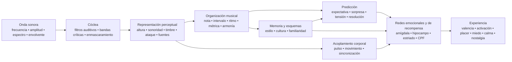

<!-- Translation of: research/sources/author-supplied/sound-expectation-and-emotion.md; source commit: 304d75ed6ff646d311fd9df8b4e2db0d4dee277a -->
# Sonido y emoción: cómo la estructura acústica se convierte en sensación, expectativa y afecto

## Resumen ejecutivo

La relación sonido–emoción **no funciona como un diccionario fijo** en el que una frecuencia, un intervalo o un acorde produzca necesariamente una emoción. Lo que existe es una arquitectura de probabilidades: las características acústicas alteran la activación fisiológica, la prominencia, la expectativa, la segregación de fuentes, el sentido de estabilidad y de movimiento; estas representaciones se combinan después con el aprendizaje cultural, la memoria autobiográfica, la familiaridad, el estilo, el contexto y la intención interpretativa. Los estudios transculturales muestran dos hechos importantes a la vez: algunas señales amplias de emoción musical atraviesan culturas, pero preferencias y significados específicos —p. ej., la preferencia por la consonancia— pueden variar sustancialmente con la experiencia cultural. citeturn22search10turn5search11

La distinción más importante es entre **propiedad física** y **percepción**. La frecuencia no es la altura; la presión sonora no es la sonoridad; la multiplicidad física de voces no es necesariamente el número percibido de voces; el espectro no es el timbre. Un caso particularmente claro es el de la *fundamental ausente*: el oyente puede percibir una altura correspondiente a una frecuencia fundamental físicamente ausente del espectro, y las neuronas sensibles a la altura responden a complejos armónicos con la fundamental ausente. citeturn18search2

Emocionalmente, los efectos más consistentes aparecen en **tempo, intensidad/sonoridad, modo, expectativa armónica, disonancia/rugosidad, timbre e interpretación expresiva**, pero estos parámetros interactúan. En estudios controlados, el tempo y el modo pueden cumplir funciones parcialmente diferentes: el tempo modifica fuertemente la *activación*, mientras que el modo altera las valoraciones de estado de ánimo/valencia; las manipulaciones de altura, intensidad y velocidad temporal también cambian las dimensiones afectivas tanto en música como en habla. citeturn20search4turn21search7

La música también alcanza directamente los sistemas de recompensa. El placer musical intenso se ha asociado con liberación de dopamina en el estriado; en el estudio clásico de Salimpoor y colaboradores, el **caudado** se asoció más con la anticipación y el **núcleo accumbens** con el pico placentero. La música agradable y la desagradable también reclutan diferencialmente el estriado ventral, la amígdala, el hipocampo, el giro parahipocampal, la ínsula y regiones corticales. citeturn18search0turn18search1

Esto ayuda a explicar por qué **la sorpresa no es simplemente «mala»**. La música explota un régimen intermedio entre previsibilidad y novedad: la expectativa construye un modelo; la desviación produce información; la resolución o la confirmación convierten parte de esa tensión en recompensa. Los estudios de progresiones armónicas muestran que la incertidumbre y la sorpresa interactúan al predecir el placer y la actividad en la corteza auditiva, la amígdala y el hipocampo; otros trabajos encuentran una relación no lineal entre previsibilidad y placer. citeturn16search24turn16search1

En términos prácticos, la variable decisiva rara vez es «¿qué acorde es triste?» sino **qué conjunto de claves se organiza en qué trayectoria temporal**. Para producir tristeza, por ejemplo, el modo menor por sí solo es una clave; combinar registro moderado/bajo, tempo lento, intensidad baja, ataques suaves, legato, baja densidad, contornos descendentes e interpretación temporal flexible hace la comunicación mucho más robusta. Los estudios de interpretación muestran precisamente esta redundancia: distintos intérpretes pueden comunicar la misma emoción usando diferentes combinaciones de tempo, intensidad, articulación y timbre. citeturn22search4turn22search8

Una síntesis útil es:

> **La acústica establece posibilidades → la percepción las convierte en objetos y patrones → la predicción y la memoria asignan significado → los sistemas autonómicos, motores, límbicos y de recompensa producen activación, tensión, placer y memoria → la cultura y el contexto determinan gran parte del significado emocional final.**

El diagrama debe leerse como una **red**, no como una cadena neural rígida. Existe procesamiento recurrente entre la corteza auditiva, los sistemas motores, la memoria, la evaluación y la recompensa; además, la familiaridad y la autobiografía pueden alterar profundamente la experiencia de la misma señal acústica. citeturn18search0turn18search1turn15search2

## De la onda sonora al cerebro emocional

### Física: frecuencia, espectro, envolvente y armónicos

Un sonido musical puede describirse aproximadamente por su distribución de energía en el tiempo y la frecuencia. Para una señal periódica, la frecuencia fundamental \(f_0\) corresponde a la tasa de repetición del patrón; los instrumentos acústicos también producen normalmente parciales por encima de ella. En sonidos aproximadamente armónicos, estos parciales aparecen cerca de múltiplos enteros de \(f_0\). Sin embargo, **la altura percibida es una inferencia del sistema auditivo**, no una simple lectura del componente espectral más grave. Por eso eliminar \(f_0\) no elimina necesariamente esa sensación de altura. citeturn18search2

El **espectro** determina gran parte del timbre. Los estudios psicofísicos clásicos del espacio tímbrico encontraron dimensiones relacionadas con el **centroide espectral** —fuertemente asociado con la sensación de brillo—, con la estructura temporal del ataque y con la evolución espectral a lo largo del sonido. Investigaciones posteriores confirman que se necesitan múltiples dimensiones espectrales y temporales para explicar la similitud tímbrica. citeturn21search4turn21search12

La **envolvente** describe cómo varía la energía en el tiempo. El modelo ADSR usado en síntesis —*ataque, decaimiento, sostenimiento, extinción*— es una simplificación útil:

**ataque** = subida inicial de amplitud;  
**decaimiento** = caída tras el pico;  
**sostenimiento** = nivel aproximadamente sostenido mientras la fuente permanece excitada;  
**extinción** = desvanecimiento tras el fin de la excitación.

Los instrumentos reales suelen tener envolventes más complejas que un simple ADSR, pero la velocidad del ataque y la evolución espectro-temporal influyen mucho en la identidad tímbrica y la segmentación perceptual. citeturn21search4turn21search23

Un ataque abrupto produce gran energía transitoria y a menudo más contenido de altas frecuencias; los ataques lentos oscurecen el instante exacto del inicio y pueden producir una percepción más continua. Esta diferencia física fundamenta contrastes musicales como **percusivo ↔ suave**, **staccato ↔ legato**, **agresivo ↔ delicado**, aunque la emoción resultante depende del resto del montaje musical. citeturn21search12turn22search4

### Bandas críticas, enmascaramiento y rugosidad

La cóclea no realiza una transformada de Fourier perfecta: las frecuencias se analizan mediante filtros auditivos de ancho finito. El concepto clásico de **banda crítica** se demostró experimentalmente en fenómenos de suma de sonoridad, umbrales y enmascaramiento: distribuir la energía más allá de un ancho dado cambia cómo se combina perceptualmente. citeturn21search2turn21search25

Esto es clave para entender la consonancia y disonancia sensoriales. Cuando parciales cercanos interactúan dentro de regiones auditivas superpuestas, las fluctuaciones rápidas de amplitud pueden producir **batidos/rugosidad**. El trabajo de Plomp y Levelt estableció un vínculo histórico entre el ancho de banda crítica y la consonancia tonal, aunque la consonancia musical real también depende de la armonicidad, la familiaridad y la cultura. citeturn21search1turn5search17

El **enmascaramiento** significa que un componente puede elevar el umbral de audibilidad de otro. En la producción musical, por tanto, añadir energía no añade necesariamente información percibida: las capas que compiten espectralmente pueden ocultar detalles de articulación, armónicos y transitorios. Ese es un puente directo entre psicoacústica y orquestación/mezcla. citeturn21search2

### De la corteza auditiva al sistema de recompensa

La altura, el timbre, el ritmo y la estructura musical no son procesados por un único «centro de la música». Un ejemplo neurofisiológico particularmente sólido es la identificación de neuronas corticales sensibles a la altura que responden tanto a tonos puros como a complejos armónicos de la misma \(f_0\) percibida, incluso cuando la fundamental está ausente. citeturn18search2

Cuando el sonido adquiere significado emocional, se suman redes adicionales. En fMRI, la música desagradable persistentemente disonante produjo mayor actividad en amígdala, hipocampo, giro parahipocampal y polos temporales, mientras que la música agradable mostró respuestas que implicaban estriado ventral, ínsula, corteza auditiva y regiones frontales/operculares. Esto no significa que una región «sea» una emoción; significa que el estado musical modifica redes también implicadas en evaluación, memoria, motivación y acción. citeturn18search1

El componente de recompensa es especialmente claro en el placer intenso. Salimpoor et al. combinaron neuroimagen funcional y medidas dopaminérgicas y encontraron liberación de dopamina estriatal durante música intensamente placentera, con diferenciación temporal entre anticipación y pico hedónico. citeturn18search0

La **nostalgia** ilustra otra vía. En música autobiográficamente relevante, Janata encontró actividad de la corteza prefrontal medial dorsal que seguía la prominencia autobiográfica, mientras que redes prefrontales y posteriores participaban en la recuperación de recuerdos asociados a la música. Así, ninguna propiedad acústica aislada «contiene nostalgia»; la música funciona como llave de acceso a una red de memoria personal. citeturn15search2turn15search3

Esto también explica una distinción esencial: la **emoción percibida** («esta música suena triste») no es idéntica a la **emoción sentida** («esta música me entristece»). Un intérprete puede comunicar tristeza de forma reconocible mientras el oyente experimenta simultáneamente placer estético. Los estudios de comunicación interpretativa y de recompensa abordan precisamente diferentes niveles de este proceso. citeturn22search4turn18search0

## Altura, frecuencia, notas, intervalos, escalas, modos y armonía

### Altura, frecuencia, nota y registro

| Elemento | Mecanismo físico/perceptual | Tendencia emocional respaldada por evidencia | Manipulación musical y aplicación |
|---|---|---|---|
| **Frecuencia** | Tasa física de repetición; en complejos armónicos se relaciona con \(f_0\) pero no es idéntica a la altura. citeturn18search2 | No existe una función general «X Hz = emoción Y». El efecto emocional surge de relaciones, espectro, nivel, contexto y aprendizaje. | Transposición, diseño de graves, elección de fundamental, síntesis y EQ. Trabajar relaciones y trayectoria, no «frecuencias mágicas». |
| **Altura** | Representación perceptual de periodicidad/fundamental, preservable incluso con *fundamental ausente*. citeturn18search2 | Elevar la altura tiende a elevar la *activación* en manipulaciones controladas; el significado de valencia depende de timbre, contexto y estilo. En notas aisladas de violín, la altura mayor elevó la *activación*. citeturn22search2turn22search6 | Elevar el registro para intensificación, urgencia o ligereza; bajarlo para peso, estabilidad o intimidad, probando siempre la interacción tímbrica. |
| **Nota** | Evento que combina altura, ataque, duración, intensidad y timbre. | El nombre «Do», «Fa♯», etc. no tiene emoción intrínseca demostrada. Hasta una nota aislada cambia emocionalmente cuando cambian altura, vibrato y dinámica. citeturn22search2 | Pensar cada nota como evento multidimensional: la disposición, la envolvente, la articulación y el destino melódico importan tanto como su clase de altura. |
| **Registro** | Colocación de las alturas en bandas graves/agudas, que también altera el espectro instrumental y el enmascaramiento. | Los registros más agudos suelen elevar activación/tensión; los registros graves pueden dar peso/potencia, pero el efecto no es universal ni separable del timbre. citeturn22search2turn21search7 | Reservar los extremos de registro para puntos estructurales; contrastar una sección central con un clímax agudo o un subgrave para ampliar el cambio de estado. |

En composición, es particularmente útil separar la **altura absoluta** del **contorno**. Un salto ascendente, una acumulación progresiva de registro o una línea descendente crean información direccional incluso cuando la tonalidad permanece igual. Afectivamente, la trayectoria suele ser más informativa que una sola nota.

### Intervalos

Un intervalo simultáneo produce un espectro combinado. Cuando los parciales de las dos notas interfieren fuertemente dentro de las mismas regiones críticas, la rugosidad aumenta; cuando comparten alta armonicidad, la fusión perceptual puede aumentar. Este componente acústico ayuda a explicar parte de la disonancia sensorial, pero no agota la experiencia de consonancia musical. citeturn21search1turn5search17

La disonancia también tiene correlatos neurales y afectivos tempranos, y la música persistentemente disonante puede intensificar respuestas en estructuras relacionadas con la prominencia y la valencia negativa. citeturn18search1

Sin embargo, es un error convertir esto en la regla:

> segunda menor = miedo; tercera menor = tristeza; quinta = poder.

Estos pares pueden funcionar estilísticamente, pero el significado de un intervalo cambia con **registro, dirección melódica, duración, posición métrica, timbre, contexto tonal y cultura**. La propia preferencia de la consonancia sobre la disonancia varía entre poblaciones con diferentes grados de exposición a la música occidental. citeturn5search11

**Aplicación:** los pequeños intervalos cromáticos crean fricción eficazmente cuando mantienen los parciales cercanos y desafían la expectativa tonal; los saltos amplios pueden destacar sorpresa, expansión o inestabilidad; las consonancias sostenidas tienden a reducir la tensión sensorial pero pueden permanecer armónicamente «suspendidas» si el contexto exige resolución.

### Escalas y modos

Una escala es una colección de alturas; un modo añade **jerarquía, centro y comportamiento melódico/armónico**. El efecto emocional mayor/menor es uno de los fenómenos más documentados de la tradición tonal occidental: en experimentos que manipulan modo y tempo, el modo altera las valoraciones de estado de ánimo/valencia, mientras que el tempo influye fuertemente en la activación. citeturn20search4turn20search13

De ahí surge la asociación robusta pero no absoluta:

**mayor → valencia relativamente más positiva**  
**menor → valencia relativamente más negativa/triste**

No significa «menor = tristeza». Un modo menor a 170 BPM, con fuerte intensidad, timbre brillante y ritmo motor, puede producir excitación, agresividad o euforia; un modo mayor lento, disperso y con baja dinámica puede sonar contemplativo o melancólico. La configuración multivariada determina el resultado. citeturn20search4turn21search7

Modos como el dórico, frigio, lidio o mixolidio adquieren significado mediante una combinación de **intervalos característicos + centro tonal + repertorio aprendido**. Hay mucha menos evidencia experimental que respalde que «el lidio produce la emoción X» transculturalmente. Los estudios transculturales indican que los oyentes pueden reconocer algunas categorías emocionales en música culturalmente ajena, pero también muestran que el aprendizaje cultural modifica fuertemente los juicios musicales. citeturn22search10turn5search11

**Aplicación:** en lugar de elegir un modo por etiqueta emocional, identifique qué nota lo distingue del mayor/menor esperado y **haga esa nota perceptualmente estructural**. Un ♯4 lidio oculto en un pasaje no produce el mismo efecto que un ♯4 sostenido en posición prominente contra la tónica.

### Armonía, progresiones y cadencias

| Elemento | Mecanismo | Emoción/percepción | Técnicas |
|---|---|---|---|
| **Armonía** | Combinación simultánea de alturas → armonicidad, rugosidad, fusión, bajo virtual y relaciones aprendidas. citeturn21search1turn5search17 | La consonancia tiende a mayor agrado en oyentes familiarizados; la disonancia sostenida puede elevar tensión/valencia negativa. La preferencia no es culturalmente invariante. citeturn18search1turn5search11 | Espaciado, inversión, registro grave, extensiones, clusters, disposiciones y control de preparación/resolución. |
| **Progresión** | La secuencia convierte los acordes en probabilidades condicionales: cada evento actualiza la expectativa del siguiente. | Menor probabilidad puede elevar sorpresa y tensión; el placer puede resultar de combinaciones específicas de incertidumbre-sorpresa. citeturn16search24turn16search1 | Preparar → desviar → resolver; sustituir dominante; prolongar predominante; modulación; acordes pivote; cromatismo. |
| **Cadencia** | Evento de cierre que combina movimiento del bajo, grados, conducción de voces, métrica y expectativa aprendida. | Diferentes cadencias reciben distintas valoraciones de valencia y activación; el cierre fuerte reduce la incertidumbre, mientras que las cadencias interrumpidas preservan la expectativa. citeturn16search2turn16search6 | Cadencia auténtica para cierre; rota para prolongación; semicadencia para suspensión; elisión para mantener el flujo. |

La clave científica aquí es la **predicción**. Una progresión no es emocional solo por sus acordes aislados; construye un espacio de probabilidades. Un acorde neutro en aislamiento puede desencadenar una gran respuesta si ocupa un punto donde el modelo interno predecía otra cosa. Cheung y colaboradores mostraron que **la sorpresa y la incertidumbre interactúan** al predecir el placer musical y modulan la corteza auditiva, la amígdala y el hipocampo. citeturn16search24

Esto ofrece una explicación de primeros principios de la tensión armónica:

\[
\text{Tensión percibida}
\approx
f(\text{disonancia sensorial},
\text{inestabilidad tonal},
\text{improbabilidad},
\text{aplazamiento},
\text{energía},
\text{contexto})
\]

No es una ecuación fisiológica literal; es una descomposición funcional. Dos acordes pueden tener rugosidad similar pero causar tensiones diferentes porque uno es esperado y el otro viola la gramática aprendida.

Para la composición, el principio más potente es controlar **la cantidad y colocación de información inesperada**. La sorpresa constante deja de ser sorpresa; la previsibilidad total reduce la información. El campo de mayor interés emocional tiende a estar entre los extremos, también observado en estudios de placer-previsibilidad. citeturn16search1turn16search24

## Tempo, duración, ritmo, métrica, microtiming y groove

### Tempo y duración

El **tempo** altera la densidad de eventos por unidad de tiempo y, por tanto, la velocidad con que el sistema perceptual debe actualizar predicciones. Es una de las claves emocionales más fuertes. Las manipulaciones experimentales muestran que los cambios de tempo influyen en la *activación*, y la música más rápida tiende a producir mayor activación que la lenta, aunque intensidad, ritmo y preferencia pueden modificar el efecto. citeturn20search4

El efecto también aparece fisiológicamente: estudios con música en diferentes condiciones de tempo observaron cambios cardiovasculares, respiratorios y cerebrovasculares, lo que apoya la idea de que el tempo musical no es meramente una metáfora de «energía»; puede modificar efectivamente el estado autonómico. citeturn7search1

En términos amplios:

| Montaje | Tendencia más probable |
|---|---|
| rápido + fuerte + brillante + articulado | alta activación; alegría enérgica, urgencia, ira o excitación según valencia/contexto |
| lento + suave + oscuro + legato | baja activación; calma, ternura o tristeza |
| lento + fuerte + grave + disonante | amenaza, solemnidad o peso |
| rápido + nivel bajo + irregular | nerviosismo, inestabilidad, inquietud |

Estas combinaciones son probabilísticas, no recetas universales. La evidencia de comunicación interpretativa muestra precisamente que varias claves acústicas son redundantes y pueden sustituirse entre sí. citeturn22search4turn22search8

La **duración** opera en varios niveles: duración de la nota, intervalo entre ataques, duración de la frase y tiempo de permanencia de una armonía. Las notas cortas aumentan la separación de eventos y pueden hacer el pulso más explícito; las notas largas aumentan la continuidad y permiten mayor desarrollo espectral, vibrato y dinámica interna. En estudios de expresión interpretativa, la duración y la articulación se unen a un conjunto mayor de claves, por lo que atribuir una emoción fija a «nota larga» o «nota corta» es peligroso. citeturn22search4

En producción, un cambio de duración puede transformar radicalmente la misma secuencia MIDI sin alterar la altura: acortar *gate* y extinción para elevar definición/transitorios; alargar sostenimiento/extinción para fusionar eventos y reducir la granularidad temporal.

### Ritmo y métrica

El ritmo es la distribución temporal de eventos; la métrica es una estructura de **expectativas de acento**. El cerebro no solo oye «cuánto tiempo pasó»: construye regularidades y predice ataques. Cuando una nota cae donde el modelo métrico no la esperaba, obtenemos desplazamiento, síncopa o sorpresa temporal.

La percepción del pulso está fuertemente ligada al sistema motor, incluso sin movimiento físico explícito; estudios de neuroimagen muestran reclutamiento de áreas motoras durante la escucha de ritmo musical, lo que da base neural al vínculo pulso–impulso de moverse. citeturn7search25turn7search37

La **métrica** por sí sola tiene menos evidencia directa de «emoción específica» que el tempo o el modo. Su principal poder afectivo parece indirecto: define la matriz contra la cual se juzgan síncopa, anticipación, retardo y acentos. Una métrica estable hace legibles las desviaciones; una métrica ya muy imprevisible altera la propia referencia de predicción.

Esto implica una importante regla compositiva:

> **Para producir tensión rítmica, primero debe haber algo temporalmente previsible que tensionar.**

### Síncopa y groove

El resultado experimental más conocido sobre groove es la curva de **U invertida** encontrada por Witek et al.: niveles intermedios de síncopa produjeron mayor placer y mayor impulso de mover el cuerpo que niveles muy bajos o muy altos. citeturn20search2

La lógica se parece a la de la armonía:

**demasiada previsibilidad** → poco desafío;  
**desviación intermedia** → expectativa suficientemente clara + información nueva;  
**caos excesivo** → la predicción del pulso se debilita, reduciendo la posibilidad de «jugar contra» la rejilla.

Esta relación es particularmente relevante para funk, hip-hop, música de baile y otros estilos donde el groove depende de la interacción entre una referencia temporal estable y eventos desplazantes. Witek et al. encontraron la relación tanto para el placer como para el impulso de movimiento. citeturn20search2

### Microtiming

El microtiming es el desplazamiento de eventos por decenas de milisegundos alrededor de una posición métrica nominal. Musicalmente, puede aparecer como *laid-back*, *pushing*, swing, asincronía de bombo, retardo de caja o el timing individual de un intérprete.

Un mito de producción es que «cuantizado = sin groove» e «imperfecto = humano = mejor». Los experimentos no respaldan esta regla general. Frühauf y colaboradores manipularon desviaciones microtemporales en patrones de batería y encontraron que el groove disminuía a medida que las desviaciones artificiales crecían; el timing precisamente alineado podía recibir valoraciones muy altas. citeturn22search5

En otro enfoque, Senn et al. compararon interpretaciones profesionales de bajo/batería, versiones cuantizadas y microtiming exagerado. La interpretación original y la cuantización podían producir niveles comparables de groove, mientras que exagerar las desviaciones perjudicaba la experiencia; los oyentes expertos también eran más sensibles a las diferencias. citeturn22search27

Por tanto:

\[
\text{microtiming eficaz} \neq \text{error aleatorio}
\]

Es **estructura relacional**. El retardo de la caja puede funcionar porque bombo, bajo, hi-hat y subdivisión forman referencias consistentes. Aleatorizar cada nota ±20 ms destruye precisamente las relaciones que hacen reconocible un pocket.

### Mapa temporal comparado

| Elemento | Física/percepción | Emociones más asociadas | Técnicas prácticas |
|---|---|---|---|
| **Tempo** | Tasa global de eventos/pulso. | Rápido → ↑ activación; lento → ↓ activación, en promedio. citeturn20search4 | Automatización de BPM, medio tiempo/doble tiempo perceptual, ritardando, accelerando. |
| **Duración** | Extensión temporal de evento/envolvente. | Corta puede elevar actividad/definición; larga puede favorecer continuidad/calma o tensión sostenida; muy contextual. citeturn22search4 | Gate, longitud de nota, sostenimiento, extinción, fermata. |
| **Ritmo** | Patrones de ataques y duraciones. | La regularidad favorece la predicción; la ruptura produce expectativa/sorpresa. | Ostinato, síncopa, anticipación, silencio, densidad. |
| **Métrica** | Jerarquía de pulsos fuertes/débiles. | Efecto principalmente vía estabilidad y violación de expectativa. | 4/4 estable, métricas aditivas, contraacentos, hemiola. |
| **Microtiming** | Desviaciones de ataque submétricas. | Puede dar pocket/urgencia/relajación; el exceso reduce el groove. citeturn22search5turn22search27 | Retardar caja, anticipar bajo, swing, timing por instrumento. |
| **Groove** | Integración de pulso, síncopa, patrón y acoplamiento motor. | Placer + impulso de moverse; la síncopa intermedia suele maximizar ambos. citeturn20search2 | Capa estable + desviaciones controladas; interlocking; repetición con microvariación. |

## Timbre, intensidad, dinámica, articulación, textura, registro y orquestación

### Timbre

El timbre no es una dimensión simple. Surge de **espectro, distribución armónica y de ruido, ataque, decaimiento, modulaciones, inarmonicidad y evolución temporal**. Psicofísicamente, el centroide espectral y las propiedades del ataque están entre los ejes principales que diferencian sonidos instrumentales. citeturn21search4turn21search12

La consecuencia emocional es profunda: el mismo material melódico puede cambiar de carácter cuando cambia el instrumento. Hailstone et al. mostraron experimentalmente que el timbre afecta los juicios de emoción musical independientemente de varios otros factores musicales controlados. citeturn20search5

Una descripción operativa útil:

**mayor centroide espectral / más energía aguda** → mayor «brillo», penetración, posible mayor activación;  
**más ruido, inarmonicidad y rugosidad** → mayor prominencia, aspereza, posible amenaza/tensión;  
**ataque abrupto** → mayor definición e impulsividad;  
**ataque lento** → menor prominencia del inicio y mayor fusión;  
**componente armónico fuerte y estable** → altura/fusión claras;  
**espectro difuso/ruidoso** → ambigüedad de altura y textura.

Estas dimensiones no tienen valencia fija. El brillo puede significar alegría en una flauta aguda o agresividad en una guitarra distorsionada; el ruido puede representar amenaza, energía, éxtasis o simplemente una convención estilística.

**Aplicación en síntesis:** para elevar la tensión sin alterar la armonía, elevar progresivamente el centroide espectral, aumentar ruido/inarmonicidad, acortar el ataque o introducir modulación espectral. Para disolver la tensión, realizar el movimiento inverso.

### Intensidad y dinámica

Físicamente, la intensidad se relaciona con la energía/presión sonora; perceptualmente, el correlato es la **sonoridad**, cuya relación con el nivel físico depende de frecuencia, duración, contexto y distribución espectral. El concepto de banda crítica muestra que el sistema auditivo suma energía según cómo se distribuya entre filtros auditivos. citeturn21search2turn21search25

En música, la mayor intensidad es una clave clásica de **activación, poder y urgencia**, pero de nuevo interactúa con otras dimensiones. Ilie y Thompson encontraron que la intensidad, la altura y la velocidad temporal modifican las dimensiones afectivas en estímulos musicales y de habla. citeturn21search7

Un estudio reciente con notas aisladas de violín también muestra por qué fallan las reglas simples: en ese conjunto experimental, la altura y el vibrato tuvieron efectos afectivos más fuertes que la dinámica, y los efectos de la dinámica no seguían necesariamente la caricatura de «más fuerte = más activación» en todas las condiciones. citeturn22search2turn22search6

La **dinámica** es más que nivel absoluto:

- **crescendo** crea una derivada positiva de energía, leída a menudo como acercamiento, intensificación o llegada;
- **decrescendo** puede producir retirada/disolución;
- **sforzando/acento** eleva prominencia y sorpresa;
- **subito piano** puede producir fuerte contraste sin ser físicamente intenso;
- **compresión excesiva** reduce el espacio entre estados de intensidad, reduciendo potencialmente una importante dimensión expresiva.

El principio emocional es que el cerebro responde no solo a valores sino también a **cambios**.

### Articulación

La articulación controla la relación temporal y espectral entre notas: longitud efectiva, claridad del ataque, superposición y silencio intermedio.

**staccato**: duraciones cortas, mayor separación, ataques perceptualmente claros;  
**legato**: superposición/conexión, continuidad de energía;  
**marcato/acento**: mayor prominencia del ataque;  
**tenuto**: mantenimiento de duración/energía.

En el experimento de Juslin, músicos profesionales pudieron comunicar ira, tristeza, felicidad y miedo mediante combinaciones de claves acústicas que incluían **tempo, nivel, articulación y timbre**; los oyentes usaron claves compatibles, y diferentes intérpretes pudieron alcanzar resultados similares vía combinaciones distintas. citeturn22search4turn22search8

Esto importa mucho para la composición MIDI: programar solo las notas correctas preserva una fracción del mensaje. **Velocity, longitud de nota, superposición, timing, ataque y dinámica de frase** pueden determinar si la misma secuencia se percibe como mecánica, tierna, agresiva, vacilante o alegre.

### Textura

La textura añade otra variable: **cuántas corrientes perceptuales simultáneas existen y cómo se relacionan**.

En tres experimentos con extractos polifónicos, Broze et al. manipularon/estudiaron la multiplicidad de voces y encontraron que las texturas con más voces se valoraron **más felices, menos tristes, menos solitarias y más orgullosas**. Los juicios siguieron de cerca la numerosidad percibida de las voces. citeturn17view3

Este hallazgo es especialmente interesante porque muestra que la emoción puede surgir de una dimensión estructural que no es «melodía» ni «acorde». Pero los propios mecanismos son contextuales: una masa de cien voces agresivas obviamente no necesita sonar más feliz que una sola voz. El estudio demuestra un efecto en estímulos polifónicos específicos, no una ley universal de densidad. citeturn17view3

En la práctica:

**monofonía** → exposición, vulnerabilidad, claridad, posible soledad;  
**homofonía densa** → masa, poder, comunalidad;  
**polifonía** → actividad, complejidad, independencia;  
**pedal** → estabilidad o suspensión;  
**cluster/masa sonora** → fusión, rugosidad, ambigüedad de fuente.

El efecto emocional depende principalmente de **densidad × timbre × registro × intensidad × movimiento interno**.

### Orquestación

La orquestación manipula simultáneamente espectro, registro, número de fuentes, colocación, ataque, envolvente y dinámica. Es por tanto una especie de «macrocontrol» psicoacústico.

El poder emocional del timbre instrumental encuentra apoyo directo en Hailstone et al.; además, experimentos que comparan versiones instrumentales muestran que la instrumentación puede alterar la activación manteniendo material musical relacionado. citeturn20search5turn10search10

Una lectura práctica:

| Objetivo | Estrategias acústico-orquestales |
|---|---|
| **intimidad** | pocas fuentes, registro cercano, nivel bajo, ataques suaves, ancho espectral estrecho |
| **grandeza** | amplio ámbito de registro, duplicaciones, bajo sólido, alta multiplicidad, construcción dinámica |
| **amenaza** | graves enérgicos + rugosidad + ruido + ataques fuertes + disonancia + baja previsibilidad |
| **ligereza** | menor masa espectral, transitorios delicados, registro medio/agudo, huecos entre eventos |
| **misterio** | altura parcialmente ambigua, ataques lentos, inarmonicidad moderada, pedales, baja densidad de eventos |
| **clímax** | expansión simultánea de intensidad, registro, densidad, brillo y tasa de eventos |

La forma más eficiente de construir un clímax suele no ser maximizar todo desde el inicio; es **preservar grados de libertad acústicos para abrirlos después**.

## Ornamentación y técnicas interpretativas

La interpretación humana introduce movimiento continuo en parámetros que la notación suele representar discretamente. Ahí es donde vibrato, portamento, glissando, trino, rubato, acento y microdinámica convierten «la nota» en conducta expresiva.

### Vibrato

El vibrato es una modulación periódica —mayormente de frecuencia/altura, acompañada a menudo por componentes de amplitud y espectro según el instrumento. Sus parámetros incluyen:

\[
\text{velocidad} \quad+\quad \text{profundidad} \quad+\quad \text{inicio} \quad+\quad \text{regularidad}
\]

En un estudio controlado con sonidos de violín que variaban altura, dinámica y vibrato, el vibrato fue el segundo factor más influyente: mayor vibrato tendió a **reducir la valencia y elevar la activación**, mientras que la altura mayor también elevó la activación. citeturn22search2turn22search6

Esto no implica «vibrato = tristeza». En interpretación real, el vibrato puede comunicar calidez, pasión, tensión, vulnerabilidad, exuberancia o intensidad porque su significado depende de velocidad, amplitud, inicio, nota estructural y tradición estilística.

**Aplicación:** no aplicar vibrato uniforme a cada nota. Controlar su **trayectoria**: empezar sin vibrato y ampliarlo a lo largo de una nota produce una intensificación diferente que empezar con vibrato amplio y reducirlo.

### Portamento y glissando

El **portamento** conecta dos alturas mediante una transición continua perceptualmente expresiva; el **glissando** hace el recorrido más explícitamente audible y puede abarcar un amplio ámbito.

Físicamente, ambos convierten un salto discreto de frecuencia en una **trayectoria continua de \(f_0\)**. Esto eleva la información temporal interna de la nota y puede generar anticipación, acercamiento hacia o alejamiento del objetivo.

La evidencia causal aislada para portamento/glissando, aparte de todos los demás parámetros emocionales, es mucho más escasa que para tempo, modo o vibrato. Por tanto, atribuciones como «portamento = nostalgia» deben tratarse como convenciones estilísticas e interpretativas, no como leyes psicoacústicas.

En la práctica:

**portamento ascendente lento** → enfatiza el acto de llegar;  
**caída de altura** → puede comunicar relajación, lamento o disolución según contexto;  
**glissando rápido** → sorpresa, gesto, comicidad o amenaza según timbre;  
**portamento selectivo** → eleva la expresividad al contrastar con notas sin deslizar.

### Trino y otros ornamentos rápidos

El trino alterna rápidamente dos alturas y, por tanto, eleva densidad temporal, modulación espectral e incertidumbre local. Según la velocidad, el oyente percibe notas alternadas o una textura más fusionada.

Físicamente, hay una transición de un régimen de **eventos discretos** a **modulación temporal/rugosidad** a medida que aumenta la velocidad. Emocionalmente, esto puede producir excitación, ornamentación elegante, inestabilidad o tensión, pero el significado es altamente estilístico.

El mismo razonamiento cubre mordentes, trémolo y flatter:

- más eventos por segundo → generalmente mayor actividad perceptual;
- mayor modulación → mayor prominencia;
- regularidad → previsibilidad;
- irregularidad → inestabilidad;
- acercamiento a notas estructuralmente importantes → mayor expectativa.

### Rubato

El rubato reorganiza el micro- y macro-tiempo sin cambiar necesariamente el tempo medio global. Modifica directamente el campo de predicción: retrasar un punto de llegada prolonga la expectativa; comprimir el tiempo tras el retardo puede crear impulso.

Es mejor pensar el rubato como **curvatura temporal de la frase**, no como imprecisión. La interpretación emocional estudiada por Juslin demuestra que timing, articulación, dinámica y timbre forman un código redundante que los intérpretes usan para comunicar emociones reconocibles. citeturn22search4

Para expresividad:

\[
\text{rubato útil} = \text{desviación relacionada con la estructura}
\]

y no

\[
\text{rubato útil} = \text{fluctuación aleatoria}
\]

Retrasar sistemáticamente un clímax, una apoyatura o una resolución de cadencia comunica intención; desplazar cada nota aleatoriamente simplemente degrada la previsibilidad.

### Técnicas interpretativas comparadas

| Técnica | Principal cambio acústico | Probable efecto emocional | Uso |
|---|---|---|---|
| **Vibrato** | modulación de altura/amplitud/espectro | ↑ activación cuando más intenso en estudio de violín; valencia dependiente de contexto. citeturn22search2 | clímax de nota, calidez, tensión, intensidad |
| **Portamento** | recorrido continuo entre alturas | acercamiento, lamento, sensualidad, nostalgia estilística; evidencia aislada limitada | voces, cuerdas, lead de synth |
| **Glissando** | barrido amplio de altura | gesto, sorpresa, aceleración perceptual, amenaza/comicidad según timbre | transiciones, risers, arpa, cuerdas, synth |
| **Trino** | alternancia rápida entre alturas | excitación/inestabilidad/ornamento | suspense, cadencia, brillantez |
| **Trémolo** | repetición/modulación rápida | activación, expectativa, energía sostenida | cuerdas, guitarra, percusión |
| **Rubato** | deformación temporal estructurada | expectativa, vacilación, expansión, intimidad | fraseo melódico |
| **Acento** | ataque/intensidad local | prominencia, sorpresa, fuerza | métrica, groove, clímax |
| **Legato** | superposición y ataques suavizados | continuidad; a menudo asociado con estados menos abruptos | calma, lirismo, tristeza/ternura contextual |
| **Staccato** | duración reducida y separación | mayor segmentación/actividad; puede señalar ligereza o agresividad | danza, humor, urgencia |
| **Dinámica interna** | envolvente variable dentro de la nota | acercamiento/alejamiento e intensificación | vientos, voz, cuerdas, automatización de synth |

Para portamento, glissando y trino, la literatura experimental específica es considerablemente menos extensa que para tempo, sonoridad, timbre, modo, groove o vibrato; las aplicaciones anteriores son por tanto inferencias acústico-musicales y convenciones interpretativas, no correspondencias emocionales universales.

## Síntesis comparada, aplicaciones y estudios clave

### Mapa completo elemento → mecanismo → emoción → técnica

| Elemento | Mecanismo dominante | Efecto emocional más defendible | Cómo explotarlo |
|---|---|---|---|
| **Altura** | periodicidad percibida | ↑ altura suele ↑ activación. citeturn22search2 | trayectoria de registro, saltos, clímax |
| **Frecuencia** | oscilación física | sin emoción fija por Hz | relaciones armónicas, espectro, subgraves |
| **Timbre** | espectro + envolvente | altera la emoción incluso con material musical controlado. citeturn20search5 | brillo, ruido, ataque, inarmonicidad |
| **Intensidad** | energía/presión → sonoridad | a menudo activación/poder; efecto interactivo. citeturn21search7 | nivel, acento, contraste |
| **Duración** | extensión temporal | modula actividad/continuidad; poco determinista por sí sola | gate, sostenimiento, silencio |
| **Ritmo** | patrones de ataques | predicción, sorpresa, activación motora | síncopa, ostinato, densidad |
| **Métrica** | jerarquía de pulso | estructura la expectativa | desplazamiento, hemiola, métrica aditiva |
| **Tempo** | velocidad global | fuerte determinante de activación. citeturn20search4 | BPM, ritardando, accelerando |
| **Nota** | altura + envolvente + timbre + nivel | ninguna clase de altura tiene emoción intrínseca demostrada | tratar la nota como evento multidimensional |
| **Intervalo** | interacción espectral + relación tonal | rugosidad/disonancia puede elevar tensión; significado dependiente de contexto. citeturn21search1 | espaciamiento, dirección, registro |
| **Escala** | colección/estadística de alturas | significado principalmente relacional/cultural | notas características y jerarquía |
| **Modo** | jerarquía tonal | mayor/menor influye valencia/estado de ánimo en oyentes familiarizados. citeturn20search4 | intercambio modal, mezcla modal |
| **Armonía** | simultaneidad + armonicidad + esquema tonal | consonancia/disonancia y estabilidad influyen placer/tensión. citeturn18search1turn5search11 | disposición, extensiones, cromatismo |
| **Progresión** | predicción secuencial | sorpresa + incertidumbre modulan tensión y placer. citeturn16search24 | preparación/desviación/resolución |
| **Cadencia** | cierre probabilístico/tonal | diferentes cierres alteran valencia/activación y completitud. citeturn16search2 | auténtica, rota, semicadencia |
| **Articulación** | ataque + duración + superposición | se une fuertemente a la comunicación expresiva, con otras claves. citeturn22search4 | legato/staccato/marcato |
| **Dinámica** | trayectoria de sonoridad | crescendo/contraste modulan activación y prominencia | automatización, swell, subito |
| **Ornamentación** | modulaciones locales rápidas | intensifica actividad, prominencia y expectativa; muy dependiente de estilo | trino, mordente, trémolo |
| **Textura** | número/segregación de corrientes | más voces fueron más positivas y menos solitarias en estímulos controlados. citeturn17view3 | monofonía ↔ masa/polifonía |
| **Registro** | posición espectral/de altura | los extremos elevan prominencia; agudo tiende a elevar activación en manipulaciones de altura | expansión/contracción registral |
| **Orquestación** | combinación de timbre, registro y fuentes | la instrumentación altera activación y carácter afectivo. citeturn20search5turn10search10 | densidad, duplicación, contraste tímbrico |
| **Microtiming** | desviaciones de milisegundos | la relación con groove es estructural; más desviación no es automáticamente mejor. citeturn22search5turn22search27 | pocket, laid-back, push |
| **Groove** | pulso + síncopa + predicción motora | placer e impulso de moverse; máximo frecuente en complejidad intermedia. citeturn20search2 | base previsible + síncopa controlada |
| **Interpretación** | combinación continua de timing, nivel, timbre, altura | los intérpretes comunican emociones vía claves redundantes. citeturn22search4 | fraseo y coordinación de claves |

### Cómo componer por emoción sin caer en fórmulas

El método más robusto trabaja en **vectores**, no en elementos individuales.

Para **calma**, bajar la activación en varios ejes a la vez: tempo moderado/lento, baja densidad de ataques, ataques redondeados, poca rugosidad, dinámica estable, registro no extremo, previsibilidad suficiente y extinción más larga. La literatura de tempo, intensidad y expresión apoya estas relaciones como tendencias, no garantías. citeturn20search4turn21search7turn22search4

Para **tristeza**, un modo menor puede reforzar la valencia negativa, pero se vuelve mucho más eficaz con baja activación: tempo lento, articulación conectada, intensidad reducida y menor densidad. citeturn20search4turn22search4

Para **alegría**, elevar valencia y a menudo activación: mayor previsibilidad métrica, tempo más vivo, timbres menos ásperos, articulación clara, modo mayor cuando sea estilísticamente relevante y texturas socialmente «llenas». La influencia positiva de la mayor multiplicidad de voces se demostró en un conjunto controlado de música polifónica. citeturn17view3turn20search4

Para **miedo/amenaza**, combinar alta prominencia con valencia negativa: rugosidad, disonancia, baja previsibilidad, ataques abruptos, extremos de registro, ruido, dinámica súbita y eventos cuyo timing rompe la expectativa. La asociación de disonancia persistente con actividad de amígdala/hipocampo y otras estructuras afectivas da fundamento experimental a parte de este efecto. citeturn18search1

Para **tensión**, la herramienta central es el **aplazamiento**: establecer una expectativa y bloquear temporalmente su cumplimiento. Esto puede ocurrir armónica, rítmica, melódica, dinámica o registralmente. Los estudios de sorpresa musical muestran que expectativa e incertidumbre son centrales en la respuesta afectiva y hedónica. citeturn16search24turn16search1

Para **sorpresa**, primero preservar cierta redundancia. Una ruptura de expectativa es informativa solo si existía un modelo suficientemente estable que romper. citeturn16search24

Para **groove y placer corporal**, no maximizar la complejidad: mantener el pulso recuperable y colocar suficiente síncopa para movilizar predicción y movimiento. La evidencia experimental favorece una zona intermedia de síncopa. citeturn20search2

Para **nostalgia**, no buscar una frecuencia específica. La familiaridad y la asociación autobiográfica importan mucho más. La música ligada a la historia personal recluta redes prefrontales asociadas con memoria autobiográfica y prominencia personal. citeturn15search2

### Aplicación en arreglo y producción

En el **arreglo**, pensar la emoción como gestión de recursos perceptuales. Una sección puede hacerse más grande sin cambiar ningún acorde: duplicar octavas, expandir registro, elevar número de voces, añadir transitorios, elevar brillo y ampliar dinámica. Cada paso modifica dimensiones con distintos correlatos psicoacústicos. citeturn21search4turn17view3

En la **producción**, EQ y síntesis no son meros procesos técnicos. Cambiar el centroide espectral cambia el brillo; un compresor altera envolvente y contraste; la saturación introduce armónicos y potencial rugosidad; la reverb prolonga la energía y reduce la nitidez temporal; el moldeado de transitorios modifica el ataque; la cuantización modifica la expectativa temporal; velocity y automatización alteran sonoridad y timbre simultáneamente. Las dimensiones perceptuales de timbre y envolvente demostradas en psicofísica fundamentan estas manipulaciones. citeturn21search4turn21search12

El **enmascaramiento** introduce otro principio: un arreglo emocionalmente «grande» no necesita tener más elementos, sino perceptualmente distinguibles. Si dos capas ocupan filtros similares y enmascaran mutuamente sus ataques/armónicos, subir ambas puede reducir claridad en lugar de elevar impacto. citeturn21search2

En el **bajo**, espaciamientos y disposiciones merecen atención especial: el ancho de los filtros auditivos, la densidad armónica y las frecuencias de batido hacen que estructuras compactas en registros graves produzcan a menudo más interacción/rugosidad que el mismo intervalo en registros más agudos. El principio deriva de la relación ancho de banda crítica–consonancia sensorial. citeturn21search1

En la **música electrónica**, esto permite construir emoción sin tonalidad compleja: una sola altura puede atravesar estados enteramente diferentes mediante automatización de filtro, envolvente, distorsión, ancho espectral, densidad rítmica, microtiming e intensidad. Timbre, ritmo y expectativa ya proporcionan varios canales afectivos independientes. citeturn20search5turn20search2

### Aplicación en interpretación

Para los intérpretes, el mayor resultado de la literatura es que la emoción no debe «colocarse» exclusivamente en el tempo ni exclusivamente en la dinámica. Los estudios muestran **redundancia de claves**: el oyente combina tempo, intensidad, articulación, timbre y otras variables para inferir la intención emocional. citeturn22search4turn22search8

Esto sugiere una estrategia interpretativa en tres escalas:

**Macro:** elegir la trayectoria de tempo, dinámica y densidad para toda la sección.

**Meso:** dar a cada frase un destino —expansión, suspensión, aceleración, resolución.

**Micro:** determinar ataque, duración, intensidad, vibrato, portamento y timing de las notas estructurales.

Una interpretación expresiva eficaz tiende a apuntar estas escalas en la misma dirección. Un clímax que gana simultáneamente altura, intensidad, densidad, vibrato y urgencia temporal contiene claves redundantes de intensificación; la redundancia eleva la legibilidad emocional, exactamente como se observó experimentalmente en comunicación interpretativa. citeturn22search4

### Lo que la evidencia apoya —y lo que no

La investigación apoya con confianza que las propiedades acústicas y estructurales **alteran sistemáticamente las dimensiones afectivas**. Tempo, modo, intensidad, altura, timbre, expectativa, consonancia/disonancia, densidad de voces, síncopa e interpretación son medibles y manipulables experimentalmente. citeturn20search4turn20search5turn17view3turn20search2

No apoya construir una tabla universal como:

> 440 Hz = emoción A  
> 432 Hz = emoción B  
> tercera menor = tristeza  
> Re dórico = esperanza  
> 120 BPM = felicidad.

La altura ni siquiera es equivalente a la simple frecuencia física, como muestra la *fundamental ausente*; y los efectos de consonancia y emoción varían con exposición y cultura. citeturn18search2turn5search11

Tampoco es apropiado decir «la amígdala es el centro del miedo musical» o «el núcleo accumbens es el centro del placer». Los estudios muestran **redes distribuidas**, en las que regiones auditivas, motoras, mnésicas, evaluativas y de recompensa interactúan dinámicamente. citeturn18search0turn18search1turn15search2

Finalmente, el **acercamiento/evitación** debe usarse con más cautela que valencia y activación. Un sonido de alta activación puede inducir acercamiento cuando es placentero —baile, éxtasis, groove— o vigilancia/evitación cuando es amenazante. La misma energía acústica puede por tanto alimentar estados motivacionales opuestos según valencia, predicción y contexto. La coexistencia de respuestas de recompensa ante música intensamente excitante y respuestas negativas ante disonancia desagradable ilustra este punto. citeturn18search0turn18search1

### Estudios primarios esenciales

Para **altura y representación neural**, Bendor y Wang (2005), *The neuronal representation of pitch in primate auditory cortex*, es fundamental por demostrar neuronas que preservan la altura incluso con la *fundamental ausente*. citeturn18search2

Para **psicoacústica de banda crítica y consonancia**, Zwicker, Flottorp y Stevens (1957), *Critical Band Width in Loudness Summation*, y Plomp y Levelt (1965), *Tonal Consonance and Critical Bandwidth*, siguen siendo referencias fundacionales. citeturn21search2turn21search1

Para **timbre**, McAdams et al. (1995), *Perceptual scaling of synthesized musical timbres*, establece dimensiones perceptuales espectrales y temporales; Hailstone et al. (2009), *Timbre affects perception of emotion in music*, demuestra la contribución del timbre a la emoción percibida. citeturn21search4turn20search5

Para **tempo, modo, altura e intensidad**, Husain, Thompson y Schellenberg (2002) e Ilie y Thompson (2006) son referencias centrales en manipulaciones controladas de claves acústico-musicales y dimensiones afectivas. citeturn20search4turn21search7

Para **interpretación emocional**, Juslin (2000), *Cue Utilization in Communication of Emotion in Music Performance*, muestra empíricamente cómo músicos y oyentes convergen en el uso de múltiples claves expresivas. citeturn22search4

Para **emoción y cerebro**, Koelsch et al. (2006), *Investigating emotion with music: an fMRI study*, muestra respuestas diferenciales ante música consonante/agradable frente a música persistentemente disonante/desagradable. citeturn18search1

Para **placer y dopamina**, Salimpoor et al. (2011), *Anatomically distinct dopamine release during anticipation and experience of peak emotion to music*, vincula el placer musical con liberación dopaminérgica estriatal y diferencia anticipación de pico hedónico. citeturn18search0

Para **sorpresa, expectativa y recompensa**, Cheung et al. (2019), *Uncertainty and Surprise Jointly Predict Musical Pleasure and Amygdala, Hippocampus, and Auditory Cortex Activity*, y Gold et al. (2019), *Predictability and Uncertainty in the Pleasure of Music*, aportan evidencia de que el placer musical depende de la interacción entre predicción e información nueva. citeturn16search24turn16search1

Para **groove**, Witek et al. (2014), *Syncopation, Body-Movement and Pleasure in Groove Music*, demuestra la relación de U invertida entre complejidad sincopada, placer e impulso de moverse. citeturn20search2

Para **microtiming**, Frühauf et al. (2013), *Music on the Timing Grid*, y Senn et al. (2016), *The Effect of Expert Performance Microtiming on Listeners' Experience of Groove*, son particularmente útiles porque refutan la idea simplista de que más desviación temporal significa necesariamente más groove. citeturn22search5turn22search27

Para **textura**, Broze et al. (2014), *Polyphonic Voice Multiplicity, Numerosity, and Musical Emotion Perception*, aporta rara evidencia experimental de que el número percibido de voces altera la emoción percibida. citeturn17view3

Para **nostalgia y memoria autobiográfica**, Janata (2009), *The Neural Architecture of Music-Evoked Autobiographical Memories*, muestra la asociación entre música autobiográficamente prominente y corteza prefrontal medial. citeturn15search2

Para **cultura y universalidad**, Fritz et al. (2009), *Universal Recognition of Three Basic Emotions in Music*, demuestra cierto reconocimiento transcultural de emociones básicas; este resultado debe leerse junto con estudios como McDermott et al., que muestran fuerte influencia cultural en la preferencia por la consonancia. citeturn22search10turn5search11

La síntesis de toda esta literatura es un cambio de perspectiva: **la emoción musical no vive en notas, frecuencias o acordes aislados. Surge de la transformación temporal de la energía acústica en percepción, predicción, movimiento, memoria y valor.** La composición controla las probabilidades; la interpretación da trayectoria a esas probabilidades; el cerebro las interpreta a la luz de un cuerpo, una cultura y una historia personal.
