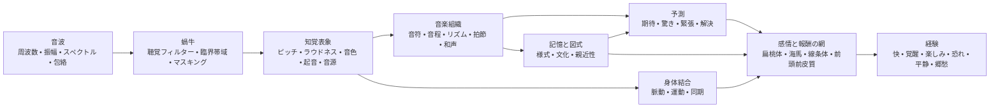

<!-- Translation of: research/sources/author-supplied/sound-expectation-and-emotion.md; source commit: 304d75ed6ff646d311fd9df8b4e2db0d4dee277a -->
# 音と感情:音響構造がいかに感覚、期待、情動に変わるか

## 要旨

音と感情の関係は、周波数、音程、和音が必然的に感情を生む固定的辞書としては**機能しない**。存在するのは確率的構造である。音響特徴は生理的覚醒、顕著性、期待、音源分離、安定と運動の感覚を変え、これらの表象は文化的学習、自伝的記憶、親近性、様式、文脈、演奏意図と結合される。異文化研究は2つの重要な事実を同時に示す。一部の広い音楽=感情信号は文化を越えるが、特定の好みと意味——たとえば協和への好み——は文化的経験により実質的に変わりうる。citeturn22search10turn5search11

最も重要な区別は**物理的性質**と**知覚**の間にある。周波数はピッチではない。音圧はラウドネスではない。声部の物理的多重性は必ずしも知覚される声部数ではない。スペクトルは音色ではない。とりわけ明確な事例は*欠落基音*である。聴き手はスペクトルに物理的に欠ける基底周波数に対応するピッチを知覚しうり、ピッチ感受性ニューロンは欠落基音の倍音複合に応答する。citeturn18search2

感情的には最も一貫した効果は**テンポ、強度/ラウドネス、旋法、和声的期待、不協和/粗さ、音色、表情的演奏**に現れるが、これらパラメータは相互作用する。統制研究ではテンポと旋法は部分的に異なる機能を果たしうる。テンポ変化は*覚醒*に強く影響し、旋法は気分/快評価を変える。ピッチ、強度、時間速度の操作も音楽と言語の双方で情動次元を変える。citeturn20search4turn21search7

音楽は報酬系にも直接届く。強い音楽的快は線条体のドーパミン放出と関連づけられてきた。サリンプアらの古典的研究では**尾状核**は予測により関連し、**側坐核**は快の頂点に関連した。快と不快の音楽は腹側線条体、扁桃体、海馬、海馬傍回、島、皮質領域を異なって動員する。citeturn18search0turn18search1

これは**驚きが単に「悪い」のでない**理由の説明に役立つ。音楽は予測可能性と新奇性の間の中間領域を利用する。期待はモデルを構築する。逸脱は情報を生む。解決または確証はその緊張の一部を報酬に変える。和声進行研究は不確実性と驚きが快と聴覚皮質、扁桃体、海馬の活動の予測に相互作用することを示す。他の研究は予測可能性と快の非線形関係を見出す。citeturn16search24turn16search1

実践的には決定的変数はめったに「どの和音が悲しいか」ではなく、**どの手がかり集合がどの時間軌跡に組織されるか**である。たとえば悲しみを生むには短調だけでは1手がかりである。中/低音域、遅いテンポ、低強度、柔らかいアタック、レガート、低密度、下降輪郭、柔軟な時間演奏を結合すれば伝達ははるかに頑強になる。演奏研究はまさにこの冗長性を示す。異なる演奏家はテンポ、強度、アーティキュレーション、音色の異なる組合せで同じ感情を伝達しうる。citeturn22search4turn22search8

有用な総合は以下である。

> **音響は可能性を設定する→知覚はそれを対象とパターンに変える→予測と記憶は意味を割り当てる→自律、運動、辺縁、報酬系は覚醒、緊張、快、記憶を生む→文化と文脈が最終的感情意味の多くを決定する。**

図は固定的な神経連鎖ではなく**網**として読むべきである。聴覚皮質、運動系、記憶、評価、報酬の間に再帰処理がある。さらに親近性と自伝は同じ音響信号の経験を深く変えうる。citeturn18search0turn18search1turn15search2

## 音波から感情の脳へ

### 物理学:周波数、スペクトル、包絡、倍音

楽音は時間と周波数上のエネルギー分布で概略記述できる。周期的信号では基底周波数\(f_0\)はパターン反復速度に対応する。生楽器は通常その上の部分音も生む。ほぼ倍音的な音ではこれら部分音は\(f_0\)の整数倍近くに現れる。だが**知覚ピッチは聴覚系の推論**であり、最低スペクトル成分の単純読みではない。そのため\(f_0\)の除去は必ずしもそのピッチ感覚を除去しない。citeturn18search2

**スペクトル**は音色の多くを決定する。古典的音色空間精神物理研究は**スペクトル重心**——明るさ感覚と強く関連——、起音時間構造、音を通じたスペクトル進化に関連する次元を見出した。後続研究は音色類似の説明に複数のスペクトル・時間次元が必要と確証する。citeturn21search4turn21search12

**包絡**はエネルギーの時間変化を記述する。合成に用いるADSRモデル——*アタック、ディケイ、サステイン、リリース*——は有用な単純化である。

**アタック**=振幅の初期上昇。  
**ディケイ**=頂点後の下降。  
**サステイン**=音源励起中の概略持続水準。  
**リリース**=励起終了後の減衰。

実楽器は単純ADSRより複雑な包絡を持つことが多いが、起音速度とスペクトル時間進化は音色同一性と知覚分節に大きく影響する。citeturn21search4turn21search23

急峻な起音は大きな過渡エネルギーを生み、しばしばより多くの高周波成分を持つ。遅い起音は正確な起音瞬間を曖昧にし、より連続的知覚を生みうる。この物理的差異は**打撃的↔滑らか**、**スタッカート↔レガート**、**攻撃的↔繊細**といった音楽対照の根拠となるが、結果の感情は音楽設定の残りに依存する。citeturn21search12turn22search4

### 臨界帯域、マスキング、粗さ

蝸牛は完全なフーリエ変換を行わない。周波数は有限幅の聴覚フィルターで分析される。古典的**臨界帯域**概念はラウドネス加算現象、閾値、マスキングで実験的に示された。与えられた帯域幅を超えたエネルギー拡散は知覚的結合のされ方を変える。citeturn21search2turn21search25

これは感覚的協和と不協和の理解の鍵である。近接部分音が重なる聴覚領域内で相互作用するとき、速い振幅変動は**うなり/粗さ**を生みうる。プロンプとレヴェルトの研究は臨界帯域幅と調性協和の歴史的連結を確立したが、実音楽的協和は倍音性、親近性、文化にも依存する。citeturn21search1turn5search17

**マスキング**とは一成分が他成分の可聴閾値を上げうることである。音楽制作ではエネルギー追加は必ずしも知覚情報追加ではない。スペクトル競合層はアーティキュレーション、倍音、過渡の細部を隠しうる。これは精神音響と管弦楽法/混合の直接的橋である。citeturn21search2

### 聴覚皮質から報酬系へ

ピッチ、音色、リズム、音楽構造は単一「音楽中枢」で処理されない。とりわけ強い神経生理学的例は、同じ知覚\(f_0\)の純音と倍音複合の双方に応答するピッチ感受性皮質ニューロンの同定であり、基音欠落時を含む。citeturn18search2

音が感情意味を得るとき追加の網が加わる。fMRIでは持続不協和の不快音楽は扁桃体、海馬、海馬傍回、側頭極でより大きな活動を生み、快音楽は腹側線条体、島、聴覚皮質、前頭/弁蓋領域の応答を示した。これは一領域が感情「である」ことを意味しない。音楽状態が評価、記憶、動機、行為にも関わる網を変えることを意味する。citeturn18search1

報酬成分は強い快でとりわけ明確である。サリンプアらは機能神経画像とドーパミン作動測定を結合し、強い快音楽中の線条体ドーパミン放出を見出し、予測と快頂点の時間分化を伴った。citeturn18search0

**郷愁**は別の経路を例示する。自伝的に関連する音楽ではジャナータは自伝的顕著性を追跡する背側内側前頭前皮質活動を見出し、前頭と後部の網は音楽関連記憶の想起に参加した。ゆえに孤立音響性質が「郷愁を含む」ことはない。音楽は個人記憶網への接近鍵として働く。citeturn15search2turn15search3

これは本質的区別も説明する。**知覚された感情**(「この音楽は悲しく聞こえる」)は**感じられた感情**(「この音楽は私を悲しくさせる」)と同一ではない。演奏家は認識可能に悲しみを伝達しつつ、聴き手は同時に美的快を経験しうる。演奏伝達と報酬の研究はまさにこの過程の異なる水準を扱う。citeturn22search4turn18search0

## ピッチ、周波数、音符、音程、音階、旋法、和声

### ピッチ、周波数、音符、音域

| 要素 | 物理/知覚機構 | 証拠に裏づく感情傾向 | 音楽操作と応用 |
|---|---|---|---|
| **周波数** | 物理的反復速度。倍音複合では\(f_0\)に関連するがピッチと同一ではない。citeturn18search2 | 一般的「X Hz=感情Y」関数はない。感情効果は関係、スペクトル、水準、文脈、学習から生じる。 | 移調、低音設計、基音選択、合成、EQ。関係と軌跡に取り組み、「魔法の周波数」ではない。 |
| **ピッチ** | 周期性/基音の知覚表象、*欠落基音*でも保持可能。citeturn18search2 | ピッチ上昇は統制操作で*覚醒*を上げる傾向がある。快意味は音色、文脈、様式に依存する。孤立ヴァイオリン音では高ピッチは*覚醒*を上げた。citeturn22search2turn22search6 | 強化、切迫、軽さには音域を上げ、重み、安定、親密には下げ、常に音色相互作用を検証する。 |
| **音符** | ピッチ、起音、持続、強度、音色を結合する事象。 | 「ド」「嬰ヘ」等の名に示された内在的感情はない。孤立音符でさえピッチ、ヴィブラート、強弱変化で感情的に変わる。citeturn22search2 | 各音符を多次元事象と考える。声部配置、包絡、アーティキュレーション、旋律目的地は音高クラスと同等に重要である。 |
| **音域** | 低/高帯域のピッチ配置、楽器スペクトルとマスキングも変える。 | 高音域はしばしば活性/緊張を上げる。低音域は重み/力を生みうるが、効果は普遍的でも音色から分離可能でもない。citeturn22search2turn21search7 | 音域極端は構造点に留保する。中央部を鋭い頂点またはサブベースと対照させ状態変化を広げる。 |

作曲では**絶対ピッチ**と**輪郭**の分離がとりわけ有用である。上行跳躍、漸進的音域集積、下降線は調性が同じでも方向情報を作る。情動的には軌跡は通常単一音符より情報量が多い。

### 音程

同時音程は結合スペクトルを生む。2音の部分音が同じ臨界領域内で強く干渉するとき粗さは上がる。高い倍音性を共有するとき知覚融合は増しうる。この音響成分は感覚的不協和の一部説明に役立つが、音楽=協和経験を尽くさない。citeturn21search1turn5search17

不協和は早期の神経・情動相関も持ち、持続不協和音楽は顕著性と負快関連構造の応答を高めうる。citeturn18search1

だがこれを規則に変えるのは誤りである。

> 短2度=恐れ。短3度=悲しみ。5度=力。

これら対は様式的に機能しうるが、音程意味は**音域、旋律方向、持続、拍節位置、音色、調文脈、文化**で変わる。西洋音楽曝露度の異なる集団間で不協和に対する協和好み自体が変わる。citeturn5search11

**応用:**小半音程は部分音を近接に保ち調期待に挑戦するとき摩擦を効果的に作る。広跳躍は驚き、拡張、不安定を際立たせうる。持続協和は感覚緊張を下げる傾向があるが、文脈が解決を要求すれば和声的に「懸留」のままでありうる。

### 音階と旋法

音階はピッチ集合である。旋法は**階層、中心、旋律/和声行動**を加える。長/短の感情効果は西洋調伝統で最も記録された現象の一つである。旋法とテンポ操作実験では旋法は気分/快評価を変え、テンポは覚醒に強く影響する。citeturn20search4turn20search13

これは頑強だが絶対でない連合を生む。

**長調→相対的により正の快**  
**短調→相対的により負/悲の快**

これは「短調=悲しみ」を意味しない。170 BPMの短調は強い強度、明るい音色、運動リズムで興奮、攻撃性、陶酔を生みうる。遅くまばらな長調は低強弱で瞑想的または憂鬱に聞こえうる。多変数配置が結果を決定する。citeturn20search4turn21search7

ドリア、フリギア、リディア、ミクソリディア等の旋法は**特徴音程+調中心+学習済みレパートリー**の組合せで意味を得る。「リディアは感情Xを生む」を異文化的に裏づく実験証拠ははるかに少ない。異文化研究は聴き手が文化的に異質な音楽の一部感情範疇を認識しうるが、文化的学習が音楽判断を強く変えることも示す。citeturn22search10turn5search11

**応用:**感情名で旋法を選ぶ代わりに、期待される長/短と区別する音を同定し、その音を**知覚的に構造的**にする。経過句に隠れたリディア♯4は、主音に対する顕著位置に持続される♯4と同じ効果を生まない。

### 和声、進行、終止

| 要素 | 機構 | 感情/知覚 | 技法 |
|---|---|---|---|
| **和声** | 同時ピッチ結合→倍音性、粗さ、融合、仮想低音、学習関係。citeturn21search1turn5search17 | 親近化した聴き手では協和はより大きな快に傾く。持続不協和は緊張/負快を上げうる。好みは文化不変ではない。citeturn18search1turn5search11 | 配置、転回、低音域、付加音、クラスタ、声部配置、準備/解決制御。 |
| **進行** | 連なりは和音を条件確率に変える。各事象は次の期待を更新する。 | 低確率は驚きと緊張を上げうる。快は特定の不確実性=驚き組合せから生じうる。citeturn16search24turn16search1 | 準備→逸脱→解決。属和音代用。前属和音延長。転調。共通和音。半音階法。 |
| **終止** | 低音進行、音度、声部進行、拍節、学習期待を結合する閉鎖事象。 | 異なる終止は異なる快と覚醒評価を受ける。強い閉鎖は不確実性を下げ、中断終止は期待を保持する。citeturn16search2turn16search6 | 閉鎖に正格終止。延長に偽終止。懸留に半終止。流れ保持に省略。 |

科学的鍵は**予測**である。進行は孤立和音のみで感情的なのではない。確率空間を構築する。孤立で中立の和音は、内部モデルが他を予測した点にあれば大きな応答を引き起こしうる。チャンらは**驚きと不確実性が相互作用**して音楽的快を予測し、聴覚皮質、扁桃体、海馬を変調することを示した。citeturn16search24

これは和声緊張の第一原理からの説明を与える。

\[
\text{Perceived tension}
\approx
f(\text{sensory dissonance},
\text{tonal instability},
\text{improbability},
\text{postponement},
\text{energy},
\text{context})
\]

これは文字通りの生理方程式ではない。機能分解である。2和音は類似の粗さを持ちながら、1つは予測され他が学習文法に違反するため異なる緊張を生じうる。

作曲には最も強力な原理は**予期せぬ情報の量と配置**の制御である。絶えざる驚きは驚きでなくなる。完全な予測可能性は情報を減らす。最大の感情的関心の領域は極端の間に傾き、快=予測可能性研究にも観察される。citeturn16search1turn16search24

## テンポ、持続、リズム、拍節、マイクロタイミング、グルーヴ

### テンポと持続

**テンポ**は単位時間の事象密度を変え、知覚系が予測を更新すべき速度を変える。最強の感情手がかりの一つである。実験操作はテンポ変化が*覚醒*に影響し、速い音楽は遅い音楽より大きな活性を生む傾向があるが、強度、リズム、好みが効果を変えうることを示す。citeturn20search4

効果は生理的にも現れる。異なるテンポ条件の音楽の研究は心血管、呼吸、脳血管の変化を観察し、音楽テンポが単なる「エネルギー」比喩でなく自律状態を効果的に変えうるとの考えを裏づける。citeturn7search1

大まかには以下である。

| 設定 | 最もありそうな傾向 |
|---|---|
| 速い+大きい+明るい+有節 | 高覚醒。快/文脈により精力的喜び、切迫、怒り、興奮 |
| 遅い+小さい+暗い+レガート | 低覚醒。平静、優しさ、悲しみ |
| 遅い+大きい+低い+不協和 | 脅威、厳粛、重み |
| 速い+低水準+不規則 | 神経質、不安定、落ち着かなさ |

これら組合せは確率的であり普遍的処方ではない。演奏伝達の証拠はまさにいくつかの音響手がかりが冗長で相互に代用可能であることを示す。citeturn22search4turn22search8

**持続**はいくつかの水準で働く。音符持続、起音間隔、句持続、和声の滞留時間である。短音は事象分離を増し脈動を明示的にしうる。長音は連続を増し、大きなスペクトル展開、ヴィブラート、内部強弱を許す。表情演奏研究では持続とアーティキュレーションはより大きな手がかり集合に加わり、「長音」や「短音」に固定感情を帰すことが危険な理由である。citeturn22search4

制作では持続変化はピッチを変えずに同じMIDI連なりを根本的に変えうる。*ゲート*とリリースを短縮して明確/過渡性を上げ、サステイン/リリースを延長して事象を融合し時間粒度を下げる。

### リズムと拍節

リズムは事象の時間分布である。拍節は**アクセント期待**の構造である。脳は「どれだけ時間が経ったか」だけを聞くのではない。規則性を構築し起音を予測する。音符が拍節モデルの予測外に落ちるとき、転位、シンコペーション、時間的驚きが生じる。

拍知覚は明示的な身体運動なしでも運動系に強く結びつく。神経画像研究は音楽リズム聴取中の運動野動員を示し、拍=運動欲求連結の神経基盤を与える。citeturn7search25turn7search37

**拍節**単独はテンポや旋法より「特定感情」の直接証拠が少ない。その主要情動的力は間接的に見える。シンコペーション、予期、遅延、アクセントが判断される母体を定める。安定拍節は逸脱を読み取り可能にする。すでに高度に予測不能な拍節は予測参照自体を変える。

これは重要な作曲規則を含意する。

> **リズム緊張を生むには、まず緊張させるべき時間的に予測可能なものがなければならない。**

### シンコペーションとグルーヴ

最も知られた実験的グルーヴ結果はヴィテクらが見出した**逆U**曲線である。中間シンコペーション水準はきわめて低または高水準より大きな快と強い身体運動欲求を生んだ。citeturn20search2

論理は和声に似る。

**過度の予測可能性**→挑戦が少ない。  
**中間的逸脱**→十分明確な期待+新情報。  
**過度の混沌**→拍予測が弱まり、格子に「逆らって演奏する」機会が減る。

この関係はファンク、ヒップホップ、ダンス音楽他、安定時間参照と転位事象の相互作用にグルーヴが依存する様式にとりわけ重要である。ヴィテクらは快と運動欲求の双方に関係を見出した。citeturn20search2

### マイクロタイミング

マイクロタイミングは名目拍節位置周辺の数十ミリ秒の事象転位である。音楽的には*レイドバック*、*プッシング*、スウィング、バスドラム非同期、スネア遅延、演奏家個別タイミングとして現れうる。

制作の神話は「量子化=グルーヴなし」「不完全=人間的=良い」である。実験はこの一般規則を裏づけない。フリューハウフらはドラムパターンの微時間偏差を操作し、人工偏差増大でグルーヴが減少すること、精密に整えたタイミングがきわめて高い評価を受けうることを見出した。citeturn22search5

別の手法ではゼンらは熟練ベース/ドラム演奏、量子化版、誇張マイクロタイミングを比較した。原演奏と量子化は同等のグルーヴ水準を生みうるが、偏差誇張は経験を害した。熟練聴き手は差異により敏感でもあった。citeturn22search27

ゆえに以下である。

\[
\text{effective microtiming} \neq \text{random error}
\]

これは**関係構造**である。スネア遅延が機能しうるのは、キック、ベース、ハイハット、細分が一貫した参照をなすからである。各音符の±20ミリ秒の無作為化はまさにポケットを認識可能にする関係を破壊する。

### 比較時間地図

| 要素 | 物理/知覚 | 最も関連する感情 | 実践技法 |
|---|---|---|---|
| **テンポ** | 全体的事象/脈動速度。 | 速い→↑覚醒。遅い→↓覚醒、平均的に。citeturn20search4 | BPM自動化、知覚的ハーフタイム/ダブルタイム、リタルダンド、アッチェレランド。 |
| **持続** | 事象/包絡の時間範囲。 | 短いと活動/明確を上げうる。長いと連続/平静または持続緊張に有利でありうる。高度に文脈的。citeturn22search4 | ゲート、音符長、サステイン、リリース、フェルマータ。 |
| **リズム** | 起音と持続のパターン。 | 規則性は予測に有利。撹乱は期待/驚きを生む。 | オスティナート、シンコペーション、予期、沈黙、密度。 |
| **拍節** | 強/弱脈動階層。 | 効果は主に安定と期待違反経由。 | 安定4/4、付加拍節、交差アクセント、ヘミオラ。 |
| **マイクロタイミング** | 拍節下の起音偏差。 | ポケット/切迫/弛緩を生みうる。過剰はグルーヴを減らす。citeturn22search5turn22search27 | スネア遅延、ベース予期、スウィング、楽器別タイミング。 |
| **グルーヴ** | 拍、シンコペーション、パターン、運動結合の統合。 | 快+運動欲求。中間シンコペーションがしばしば双方を最大化する。citeturn20search2 | 安定層+制御偏差。連動。微変奏つき反復。 |

## 音色、強度、強弱、アーティキュレーション、織体、音域、管弦楽法

### 音色

音色は単純次元ではない。**スペクトル、倍音と雑音分布、アタック、ディケイ、変調、非倍音性、時間進化**から生じる。精神物理的にはスペクトル重心とアタック性質は楽器音を区別する主要軸である。citeturn21search4turn21search12

感情的帰結は深い。同じ旋律素材は楽器変化で性格を変えうる。ヘイルストーンらは音色が他のいくつかの統制音楽要因と独立に音楽=感情判断に影響することを実験的に示した。citeturn20search5

有用な操作的記述は以下である。

**高スペクトル重心/多い高域エネルギー**→大きな「明るさ」、貫通力、高い覚醒の可能性。  
**多い雑音、非倍音性、粗さ**→大きな顕著性、粗暴さ、脅威/緊張の可能性。  
**急峻なアタック**→大きな明確と衝動性。  
**遅いアタック**→低い起音顕著性と大きな融合。  
**強い安定倍音成分**→明確なピッチ/融合。  
**拡散/雑音スペクトル**→ピッチ曖昧と織体。

これら次元に固定快はない。明るさは鋭いフルートでは喜び、歪みギターでは攻撃性を意味しうる。雑音は脅威、エネルギー、法悦、単なる様式慣習を表しうる。

**合成応用:**和声を変えず緊張を上げるには、スペクトル重心を漸進的に上げ、雑音/非倍音性を増し、アタックを短縮し、スペクトル変調を導入する。緊張を解くには逆運動を行う。

### 強度と強弱

物理的には強度は音響エネルギー/圧力に関連する。知覚的には相関物は**ラウドネス**であり、物理水準との関係は周波数、持続、文脈、スペクトル分布に依存する。臨界帯域概念は聴覚系が聴覚フィルター上の拡散に応じてエネルギーを加算することを示す。citeturn21search2turn21search25

音楽では大強度は**覚醒、力、切迫**の古典的手がかりだが、他の次元と相互作用する。アイリーとトンプソンは強度、ピッチ、時間速度が音楽と言語刺激の情動次元を変えることを見出した。citeturn21search7

最近の孤立ヴァイオリン音研究も単純規則が失敗する理由を示す。その実験集合ではピッチとヴィブラートは強弱より強い情動効果を持ち、強弱効果は全条件で「大きい=高覚醒」戯画に従うとは限らなかった。citeturn22search2turn22search6

**強弱**は絶対水準以上のものである。

- **クレッシェンド**は正のエネルギー導関数を作り、接近、強化、到達と読まれることが多い。
- **デクレッシェンド**は退去/溶解を生みうる。
- **スフォルツァンド/アクセント**は顕著性と驚きを上げる。
- **スビトピアノ**は物理的に強烈でなく強い対照を生みうる。
- **過度の圧縮**は強度状態間の空間を縮め、重要な表情次元を減らしうる。

感情原理は脳が値だけでなく**変化**にも応答することである。

### アーティキュレーション

アーティキュレーションは音符間の時間・スペクトル関係を制御する。実効長、起音明確、重複、中間沈黙である。

**スタッカート**:短持続、大分離、知覚的に明確な起音。  
**レガート**:重複/連結、エネルギー連続。  
**マルカート/アクセント**:大アタック顕著性。  
**テヌート**:持続/エネルギー保持。

ユスリンの実験では熟練演奏家は**テンポ、水準、アーティキュレーション、音色**を含む音響手がかり組合せで怒り、悲しみ、喜び、恐れを伝達できた。聴き手は両立する手がかりを用い、異なる演奏家は異なる組合せで類似の結果に達しえた。citeturn22search4turn22search8

これはMIDI作曲にきわめて重要である。正しい音符だけの打ち込みは伝言の一部を保持する。**ヴェロシティ、音符長、重複、タイミング、アタック、句強弱**は同じ連なりが機械的、優しい、攻撃的、躊躇的、喜ばしいのいずれに知覚されるかを決定しうる。

### 織体

織体は別の変数を加える。**同時知覚流がいくつ存在しどう関係するか**である。

ポリフォニー抜粋の3実験ではブローズらは声部多重性を操作/研究し、多声織体は**より幸福、より悲しくなく、より孤独でなく、より誇らしく**評価されることを見出した。判断は声部の知覚数量を密接に追跡した。citeturn17view3

この所見はとりわけ興味深い。感情が「旋律」でも「和音」でもない構造次元から生じうることを示すからである。だが機構自体は文脈的である。100の攻撃的声部の量が孤独な声部より幸福に聞こえる必要は明らかにはない。研究は特定ポリフォニー刺激の効果を示し、普遍的密度法則ではない。citeturn17view3

実践的には以下である。

**モノフォニー**→露出、脆弱、明確、潜在的孤独。  
**密集ホモフォニー**→量、力、共同性。  
**ポリフォニー**→活動、複雑、独立。  
**ドローン**→安定または懸留。  
**クラスタ/音量**→融合、粗さ、音源曖昧。

感情効果は主に**密度×音色×音域×強度×内部運動**に依存する。

### 管弦楽法

管弦楽法はスペクトル、音域、音源数、配置、アタック、包絡、強弱を同時に操作する。ゆえに精神音響の「マクロ制御」の一種である。

楽器音色の感情的力はヘイルストーンらに直接裏づけられる。さらに楽器版比較実験は、関連音楽素材を保ちつつ楽器法が覚醒を変えうることを示す。citeturn20search5turn10search10

実践的読みは以下である。

| 目標 | 音響=管弦楽戦略 |
|---|---|
| **親密** | 少音源、近接音域、低水準、柔起音、狭スペクトル幅 |
| **壮大** | 広音域幅、重複、堅固低音、高多重、強弱構築 |
| **脅威** | 精力的低音+粗さ+雑音+強アタック+不協和+低予測可能性 |
| **軽さ** | 小スペクトル量、繊細過渡、中/高音域、事象間隙 |
| **神秘** | 部分曖昧ピッチ、遅起音、中等非倍音性、ドローン、低事象密度 |
| **頂点** | 強度、音域、密度、明るさ、事象速度の同時拡張 |

頂点を構築する最も効率的な方法は通常最初から全最大化ではなく、**後に開くべき音響自由度を保持する**ことである。

## 装飾と演奏技法

人間演奏は記譜が通常離散的に表すパラメータに連続運動を導入する。ヴィブラート、ポルタメント、グリッサンド、トリル、ルバート、アクセント、微強弱が「音符」を表情行動に変える場である。

### ヴィブラート

ヴィブラートは周期的変調であり——主として周波数/ピッチ、楽器により振幅とスペクトル成分を伴うことが多い。そのパラメータは以下を含む。

\[
\text{rate} \quad+\quad \text{depth} \quad+\quad \text{onset} \quad+\quad \text{regularity}
\]

ピッチ、強弱、ヴィブラートを変えるヴァイオリン音の統制研究では、ヴィブラートは2番目に影響力ある要因だった。大ヴィブラートは**快を下げ覚醒を上げる**傾向があり、高ピッチも覚醒を上げた。citeturn22search2turn22search6

これは「ヴィブラート=悲しみ」を含意しない。実演奏ではヴィブラートは速度、幅、起音、構造音、様式伝統に意味が依存するため、温かさ、情熱、緊張、脆弱、溢れる生気、強度を伝達しうる。

**応用:**全音符に一様なヴィブラートを適用しない。その**軌跡**を制御する。ヴィブラートなし開始の音符内拡大は、広ヴィブラート開始の縮小と異なる強化を生む。

### ポルタメントとグリッサンド

**ポルタメント**は2ピッチを知覚的に表情豊かな連続遷移で結ぶ。**グリッサンド**は経路をより明示的に可聴にし、広範囲に及びうる。

物理的には双方は離散周波数跳躍を**連続\(f_0\)軌跡**に変える。これは音符内部の時間情報を上げ、目標への予測、接近、離脱を生みうる。

他の全感情パラメータを離れたポルタメント/グリッサンドの孤立因果証拠は、テンポ、旋法、ヴィブラートよりはるかに乏しい。ゆえに「ポルタメント=郷愁」等の帰属は様式的演奏慣習として扱うべきであり、精神音響法則ではない。

実践的には以下である。

**遅い上行ポルタメント**→到達行為を強調する。  
**ピッチ下降**→文脈により弛緩、哀歌、溶解を伝達しうる。  
**速いグリッサンド**→音色により驚き、身振り、喜劇、脅威。  
**選択的ポルタメント**→滑走なし音符との対照で表情を上げる。

### トリル他速い装飾音

トリルは2ピッチを急速に交替させ、時間密度、スペクトル変調、局所不確実性を上げる。速度により聴き手は交替音またはより融合した織体を知覚する。

物理的には速度増大で**離散事象**領域から**時間変調/粗さ**への遷移がある。感情的には興奮、優雅な装飾、不安定、緊張を生みうるが、意味は高度に様式的である。

同じ推論はモルデント、トレモロ、フラッターを覆う。

- 秒間事象増→一般により大きな知覚活動。
- 大変調→大顕著性。
- 規則性→予測可能性。
- 不規則性→不安定。
- 構造重要音への接近→大期待。

### ルバート

ルバートは全体的平均テンポを必ずしも変えず微視と巨視の時間を再組織する。予測場を直接変える。到達点遅延は期待を延長する。遅延後の時間圧縮は推進を作りうる。

ルバートは不精密ではなく**句時間曲率**と考えるべきである。ユスリン研究の感情演奏はタイミング、アーティキュレーション、強弱、音色が認識可能な感情伝達に演奏家が用いる冗長符号をなすことを示す。citeturn22search4

表情のためには以下である。

\[
\text{useful rubato} = \text{structure-related deviation}
\]

以下ではなく、

\[
\text{useful rubato} = \text{random jitter}
\]

頂点、アポッジャトゥーラ、終止解決の組織的遅延は意図を伝達する。各音符の無作為移動は単に予測可能性を劣化させる。

### 演奏技法比較

| 技法 | 主要音響変化 | ありそうな感情効果 | 用途 |
|---|---|---|---|
| **ヴィブラート** | ピッチ/振幅/スペクトル変調 | ヴァイオリン研究で強いほど↑覚醒。文脈依存の快。citeturn22search2 | 音符頂点、温かさ、緊張、強度 |
| **ポルタメント** | ピッチ間の連続経路 | 接近、哀歌、官能、様式的郷愁。限定的孤立証拠 | 声、弦、シンセリード |
| **グリッサンド** | 広ピッチ掃引 | 身振り、驚き、知覚加速、音色により脅威/喜劇 | 遷移、ライザー、ハープ、弦、シンセ |
| **トリル** | ピッチ間の速い交替 | 興奮/不安定/装飾 | 緊迫、終止、華やかさ |
| **トレモロ** | 速い反復/変調 | 覚醒、期待、持続エネルギー | 弦、ギター、打楽器 |
| **ルバート** | 構造化時間変形 | 期待、躊躇、拡張、親密 | 旋律句付け |
| **アクセント** | 局所アタック/強度 | 顕著性、驚き、力 | 拍節、グルーヴ、頂点 |
| **レガート** | 重複と平滑アタック | 連続。しばしばあまり急峻でない状態と関連 | 平静、抒情、文脈的悲しみ/優しさ |
| **スタッカート** | 短縮された持続と分離 | 大分節/活動。軽さや攻撃性を合図しうる | 舞曲、諧謔、切迫 |
| **内部強弱** | 音符内の可変包絡 | 接近/退去と強化 | 管、声、弦、シンセ自動化 |

ポルタメント、グリッサンド、トリルでは特定実験文献はテンポ、ラウドネス、音色、旋法、グルーヴ、ヴィブラートよりかなり乏しい。ゆえに上記応用は音響=音楽推論と演奏慣習であり、普遍的感情対応ではない。

## 比較総合、応用、主要研究

### 全要素→機構→感情→技法地図

| 要素 | 支配的機構 | 最も擁護可能な感情効果 | 活用法 |
|---|---|---|---|
| **ピッチ** | 知覚周期性 | ↑ピッチはしばしば↑覚醒。citeturn22search2 | 音域軌跡、跳躍、頂点 |
| **周波数** | 物理振動 | Hzごとの固定感情なし | 倍音関係、スペクトル、サブベース |
| **音色** | スペクトル+包絡 | 統制音楽素材でも感情を変える。citeturn20search5 | 明るさ、雑音、アタック、非倍音性 |
| **強度** | エネルギー/圧力→ラウドネス | しばしば覚醒/力。相互作用効果。citeturn21search7 | 水準、アクセント、対照 |
| **持続** | 時間範囲 | 活動/連続を変調する。単独ではほとんど決定的でない | ゲート、サステイン、沈黙 |
| **リズム** | 起音パターン | 予測、驚き、運動活性 | シンコペーション、オスティナート、密度 |
| **拍節** | 拍階層 | 期待を構造化する | 転位、ヘミオラ、付加拍節 |
| **テンポ** | 全体速度 | 強い覚醒決定要因。citeturn20search4 | BPM、リタルダンド、アッチェレランド |
| **音符** | ピッチ+包絡+音色+水準 | 示された内在感情の音高クラスなし | 音符を多次元事象として扱う |
| **音程** | スペクトル相互作用+調関係 | 粗さ/不協和は緊張を上げうる。意味は文脈依存。citeturn21search1 | 配置、方向、音域 |
| **音階** | ピッチ集合/統計 | 主に関係/文化意味 | 特徴音と階層 |
| **旋法** | 調階層 | 長/短は親近化聴き手の快/気分に影響する。citeturn20search4 | 旋法交換、旋法混合 |
| **和声** | 同時性+倍音性+調図式 | 協和/不協和と安定は快/緊張に影響する。citeturn18search1turn5search11 | 声部配置、付加音、半音階法 |
| **進行** | 連続予測 | 驚き+不確実性は緊張と快を変調する。citeturn16search24 | 準備/逸脱/解決 |
| **終止** | 確率/調閉鎖 | 異なる閉鎖は快/覚醒と完全性を変える。citeturn16search2 | 正格、偽、半終止 |
| **アーティキュレーション** | 起音+持続+重複 | 他手がかりと共に表情伝達に強く加わる。citeturn22search4 | レガート/スタッカート/マルカート |
| **強弱** | ラウドネス軌跡 | クレッシェンド/対照は覚醒と顕著性を変調する | 自動化、膨らみ、スビト |
| **装飾** | 速い局所変調 | 活動、顕著性、期待を強化する。高度に様式依存 | トリル、モルデント、トレモロ |
| **織体** | 流の数/分離 | 統制刺激では多声ほど肯定的であまり孤独でなかった。citeturn17view3 | モノフォニー↔量/ポリフォニー |
| **音域** | スペクトル/ピッチ位置 | 極端は顕著性を上げる。高いとピッチ操作で覚醒を上げる傾向 | 音域拡張/収縮 |
| **管弦楽法** | 音色、音域、音源組合せ | 楽器法は覚醒と情動性格を変える。citeturn20search5turn10search10 | 密度、重複、音色対照 |
| **マイクロタイミング** | ミリ秒偏差 | グルーヴ関係は構造的である。大偏差は自動的により良いのではない。citeturn22search5turn22search27 | ポケット、レイドバック、プッシュ |
| **グルーヴ** | 拍+シンコペーション+運動予測 | 快と運動欲求。中間複雑さに頻繁な最大。citeturn20search2 | 予測可能基盤+制御シンコペーション |
| **演奏** | 連続タイミング、水準、音色、ピッチ組合せ | 演奏家は冗長手がかりで感情を伝達する。citeturn22search4 | 句付けと手がかり協調 |

### 公式に陥らず感情で作曲する方法

最も頑強な方法は個別要素ではなく**ベクトル**で働く。

**平静**にはいくつかの軸で同時に覚醒を下げる。中/遅テンポ、低起音密度、丸い起音、少粗さ、安定強弱、非極端音域、十分な予測可能性、長いリリースである。テンポ、強度、表情の文献はこれら関係を保証でなく傾向として裏づける。citeturn20search4turn21search7turn22search4

**悲しみ**には短調が負快を強めうるが、低覚醒ではるかに効果的になる。遅テンポ、連結アーティキュレーション、低減された強度、より低い密度である。citeturn20search4turn22search4

**喜び**には快を上げしばしば覚醒を上げる。大拍節予測可能性、活発テンポ、あまり粗くない音色、明確アーティキュレーション、様式的に適切な長調、社会的「充実」織体である。多声の肯定的影響は統制ポリフォニー集合で示された。citeturn17view3turn20search4

**恐れ/脅威**には高顕著性と負快を結合する。粗さ、不協和、低予測可能性、急峻なアタック、音域極端、雑音、突発強弱、タイミングが期待を破る事象である。持続不協和と扁桃体/海馬活動他情動構造の連合はこの効果の一部に実験的根拠を与える。citeturn18search1

**緊張**には中心的道具は**延期**である。期待を確立し完成を一時遮断する。和声的、リズム的、旋律的、強弱的、音域的に起こりうる。音楽驚き研究は期待と不確実性が情動と快楽応答に中心的であることを示す。citeturn16search24turn16search1

**驚き**にはまず冗長性を保持する。期待破綻は破るべき十分安定したモデルが存在して初めて有益である。citeturn16search24

**グルーヴと身体的快**には複雑さを最大化しない。拍を回復可能に保ち、予測と運動を動員する十分なシンコペーションを置く。実験証拠は中間シンコペーション帯を支持する。citeturn20search2

**郷愁**には特定周波数を求めない。親近性と自伝的連合がはるかに重要である。個人史に結ばれた音楽は自伝記憶と個人顕著性関連の前頭網を動員する。citeturn15search2

### 編曲と制作への応用

**編曲**では感情を知覚資源管理と考える。和音を変えず部を大きくしうる。オクターブ重複、音域拡大、声部数増加、過渡追加、明るさ上昇、強弱拡大である。各段階は異なる精神音響相関の次元を変える。citeturn21search4turn17view3

**制作**ではEQと合成は単なる技術過程ではない。スペクトル重心変化は明るさを変える。圧縮器は包絡と対照を変える。飽和は倍音と潜在粗さを導入する。残響はエネルギーを延長し時間鋭さを減らす。過渡整形はアタックを変える。量子化は時間期待を変える。ヴェロシティと自動化はラウドネスと音色を同時に変える。精神物理に示された知覚音色と包絡次元はこれら操作を根拠づける。citeturn21search4turn21search12

**マスキング**は別の原理を導入する。感情的に「大きい」編曲は多くの要素を必要とせず、知覚的に区別可能なものを必要とする。2層が類似フィルターを占め相互にアタック/倍音を隠せば、双方上昇は衝撃上昇の代わりに明確を減らしうる。citeturn21search2

**低音**では配置と声部書法は特別な注意に値する。聴覚フィルター幅、倍音密度、うなり周波数は低音域の密集構造をしばしば高音域の同音程より相互作用/粗さの多い生産者にする。原理は臨界帯域=感覚協和関係から導かれる。citeturn21search1

**電子音楽**では複雑調性なしに感情構築を可能にする。単一ピッチはフィルター自動化、包絡、歪み、スペクトル幅、リズム密度、マイクロタイミング、強度で全く異なる状態を横断しうる。音色、リズム、期待はすでにいくつかの独立情動経路を与える。citeturn20search5turn20search2

### 演奏への応用

演奏家には文献の最大の結果は、感情をテンポだけにも強弱だけにも「置く」べきでないことである。研究は**手がかり冗長**を示す。聴き手はテンポ、強度、アーティキュレーション、音色他変数を結合し感情意図を推論する。citeturn22search4turn22search8

これは3尺度演奏戦略を示唆する。

**マクロ:**部全体のテンポ、強弱、密度軌跡を選ぶ。

**メゾ:**各句に目的地を与える——拡張、懸留、加速、解決。

**ミクロ:**構造音の起音、持続、強度、ヴィブラート、ポルタメント、タイミングを定める。

効果的表情解釈はこれら尺度を同じ方向に向ける傾向がある。ピッチ、強度、密度、ヴィブラート、時間切迫を同時に得る頂点は冗長強化手がかりを含む。冗長は感情可読性を上げ、演奏伝達に実験観察通りである。citeturn22search4

### 証拠が裏づけること——裏づけないこと

研究は音響と構造性質が**情動次元を組織的に変える**ことを確信裏づける。テンポ、旋法、強度、ピッチ、音色、期待、協和/不協和、声部密度、シンコペーション、演奏は測定可能で実験操作可能である。citeturn20search4turn20search5turn17view3turn20search2

普遍表の構築は裏づけない。以下のようなものである。

> 440 Hz=感情A  
> 432 Hz=感情B  
> 短3度=悲しみ  
> ドリアのレ=希望  
> 120 BPM=幸福。

ピッチは*欠落基音*が示すように単純物理周波数と等価でもない。協和と感情効果は曝露と文化で変わる。citeturn18search2turn5search11

「扁桃体は音楽=恐怖中枢」「側坐核は快中枢」と言うのも適切でない。研究は**分散網**を示し、聴覚、運動、記憶、評価、報酬領域が動的に相互作用する。citeturn18search0turn18search1turn15search2

最後に**接近/回避**は快と覚醒より慎重に用いるべきである。高覚醒音は快なとき接近を誘発しうる——舞踊、法悦、グルーヴ——脅威なとき警戒/回避を誘発しうる。同じ音響エネルギーは快、予測、文脈により反対の動機状態を養いうる。強い興奮音楽への報酬応答と不快不協和への負応答の共存はこの点を示す。citeturn18search0turn18search1

### 必須一次研究

**ピッチと神経表象**にはベンダー&ワン(2005)、*The neuronal representation of pitch in primate auditory cortex*が*欠落基音*でもピッチを保持するニューロンの示範に基本的である。citeturn18search2

**臨界帯域と協和精神音響**にはツヴィッカー、フロットープ&スティーヴンス(1957)、*Critical Band Width in Loudness Summation*とプロンプ&レヴェルト(1965)、*Tonal Consonance and Critical Bandwidth*が基礎的参照であり続ける。citeturn21search2turn21search1

**音色**にはマカダムスら(1995)、*Perceptual scaling of synthesized musical timbres*が知覚スペクトル・時間次元を確立する。ヘイルストーンら(2009)、*Timbre affects perception of emotion in music*が知覚感情への音色寄与を示す。citeturn21search4turn20search5

**テンポ、旋法、ピッチ、強度**にはフセイン、トンプソン&シェレンバーグ(2002)とアイリー&トンプソン(2006)が音響=音楽手がかりと情動次元の統制操作の中心的参照である。citeturn20search4turn21search7

**感情演奏**にはユスリン(2000)、*Cue Utilization in Communication of Emotion in Music Performance*が演奏家と聴き手が複数表情手がかり使用に収束する様を実証する。citeturn22search4

**感情と脳**にはケルシュら(2006)、*Investigating emotion with music: an fMRI study*が協和/快対持続不協和/不快音楽への差異的応答を示す。citeturn18search1

**快とドーパミン**にはサリンプアら(2011)、*Anatomically distinct dopamine release during anticipation and experience of peak emotion to music*が音楽的快を線条体ドーパミン作動放出に結びつけ予測と快頂点を区別する。citeturn18search0

**驚き、期待、報酬**にはチャンら(2019)、*Uncertainty and Surprise Jointly Predict Musical Pleasure and Amygdala, Hippocampus, and Auditory Cortex Activity*とゴールドら(2019)、*Predictability and Uncertainty in the Pleasure of Music*が音楽的快が予測と新情報の相互作用に依存する証拠を与える。citeturn16search24turn16search1

**グルーヴ**にはヴィテクら(2014)、*Syncopation, Body-Movement and Pleasure in Groove Music*がシンコペーション複雑さ、快、運動欲求の逆U関係を示す。citeturn20search2

**マイクロタイミング**にはフリューハウフら(2013)、*Music on the Timing Grid*とゼンら(2016)、*The Effect of Expert Performance Microtiming on Listeners' Experience of Groove*が、大時間偏差が必ずしも大グルーヴを意味しない単純考えに反論するためとりわけ有用である。citeturn22search5turn22search27

**織体**にはブローズら(2014)、*Polyphonic Voice Multiplicity, Numerosity, and Musical Emotion Perception*が知覚声部数が知覚感情を変える希少な実験証拠を与える。citeturn17view3

**郷愁と自伝記憶**にはジャナータ(2009)、*The Neural Architecture of Music-Evoked Autobiographical Memories*が自伝的顕著音楽と内側前頭前皮質の連合を示す。citeturn15search2

**文化と普遍性**にはフリッツら(2009)、*Universal Recognition of Three Basic Emotions in Music*が基本感情の一部異文化認識を示す。この結果はマクダーモットらの協和好みへの強い文化影響を示す研究と共に読むべきである。citeturn22search10turn5search11

全文献の総合は視点転換である。**音楽的感情は孤立音符、周波数、和音に宿らない。音響エネルギーの時間変容から知覚、予測、運動、記憶、価値に生じる。**作曲は確率を制御する。演奏は確率に軌跡を与える。脳は身体、文化、個人史に照らして解釈する。
