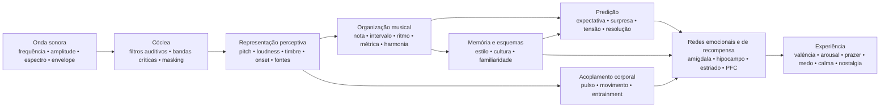

# Som e emoção: como a estrutura acústica se transforma em sensação, expectativa e afeto

## Resumo executivo

A relação entre som e emoção **não funciona como um dicionário fixo** em que uma frequência, um intervalo ou um acorde produz necessariamente uma emoção. O que existe é uma arquitetura de probabilidades: características acústicas alteram excitação fisiológica, saliência, expectativa, segregação de fontes, sensação de estabilidade e movimento; essas representações são então combinadas com aprendizado cultural, memória autobiográfica, familiaridade, estilo, contexto e intenção performativa. Estudos interculturais mostram simultaneamente dois fatos importantes: alguns sinais amplos de emoção musical atravessam culturas, mas preferências e significados específicos — por exemplo, a preferência por consonância — podem variar substancialmente com a experiência cultural. citeturn22search10turn5search11

A distinção mais importante é entre **propriedade física** e **percepção**. Frequência não é pitch; pressão sonora não é loudness; multiplicidade física de vozes não é necessariamente a quantidade de vozes percebidas; espectro não é timbre. Um caso particularmente claro é o *missing fundamental*: o ouvinte pode perceber uma altura correspondente a uma frequência fundamental que fisicamente não está presente no espectro, e neurônios sensíveis a pitch respondem a complexos harmônicos com a fundamental ausente. citeturn18search2

Do ponto de vista emocional, os efeitos mais consistentes aparecem em **tempo, intensidade/loudness, modo, expectativa harmônica, dissonância/roughness, timbre e performance expressiva**, mas esses parâmetros interagem. Em estudos controlados, tempo e modo podem exercer funções parcialmente diferentes: mudanças de tempo afetam fortemente *arousal*, enquanto modo altera avaliações de humor/valência; manipulações de pitch, intensidade e taxa temporal também mudam dimensões afetivas tanto em música quanto em fala. citeturn20search4turn21search7

A música também alcança diretamente sistemas de recompensa. Prazer musical intenso foi associado a liberação de dopamina no estriado; no estudo clássico de Salimpoor e colegas, o **caudado** esteve mais associado à antecipação e o **núcleo accumbens** ao pico prazeroso. Música agradável e desagradável também recruta diferencialmente estriado ventral, amígdala, hipocampo, giro para-hipocampal, ínsula e regiões corticais. citeturn18search0turn18search1

Isso ajuda a explicar por que **surpresa não é simplesmente “ruim”**. A música explora um regime intermediário entre previsibilidade e novidade: expectativa cria um modelo; desvio produz informação; resolução ou confirmação transforma parte dessa tensão em recompensa. Estudos de progressões harmônicas mostram que incerteza e surpresa interagem na previsão de prazer e de atividade em córtex auditivo, amígdala e hipocampo; outros trabalhos encontram relação não linear entre previsibilidade e prazer. citeturn16search24turn16search1

Em termos práticos, a variável decisiva raramente é “qual acorde é triste?”, mas **qual conjunto de pistas está sendo organizado em qual trajetória temporal**. Para produzir tristeza, por exemplo, modo menor isoladamente é uma pista; combinar registro moderado/grave, andamento lento, intensidade baixa, ataques suaves, legato, baixa densidade, contornos descendentes e performance temporal flexível torna a comunicação muito mais robusta. Estudos de performance mostram precisamente essa redundância: intérpretes diferentes podem comunicar a mesma emoção usando combinações diferentes de tempo, intensidade, articulação e timbre. citeturn22search4turn22search8

Uma síntese útil é:

> **A acústica estabelece possibilidades → a percepção transforma-as em objetos e padrões → previsão e memória atribuem significado → sistemas autonômicos, motores, límbicos e de recompensa produzem arousal, tensão, prazer e memória → cultura e contexto determinam grande parte do significado emocional final.**

O diagrama deve ser entendido como uma **rede**, não como uma cadeia neural rígida. Há processamento recorrente entre córtex auditivo, sistemas motores, memória, avaliação e recompensa; além disso, familiaridade e autobiografia podem alterar profundamente a experiência do mesmo sinal acústico. citeturn18search0turn18search1turn15search2

## Da onda sonora ao cérebro emocional

### Física: frequência, espectro, envelope e harmônicos

Um som musical pode ser descrito aproximadamente por sua distribuição de energia no tempo e na frequência. Para um sinal periódico, a frequência fundamental \(f_0\) corresponde à taxa de repetição do padrão; instrumentos acústicos normalmente produzem também parciais acima dela. Em sons aproximadamente harmônicos, esses parciais aparecem próximos a múltiplos inteiros de \(f_0\). Entretanto, o **pitch percebido é uma inferência do sistema auditivo**, e não uma simples leitura da componente espectral mais baixa. É por isso que remover \(f_0\) não necessariamente remove a sensação daquela altura. citeturn18search2

O **espectro** determina parte importante do timbre. Estudos psicofísicos clássicos de espaços de timbre encontraram dimensões relacionadas ao **centroide espectral** — fortemente associado à sensação de brilho —, à estrutura temporal do ataque e à evolução espectral ao longo do som. Pesquisas posteriores confirmam que múltiplas dimensões espectrais e temporais são necessárias para explicar similaridade tímbrica. citeturn21search4turn21search12

O **envelope** descreve como a energia varia no tempo. O modelo ADSR usado em síntese — *attack, decay, sustain, release* — é uma simplificação útil:

**attack** = subida inicial da amplitude;  
**decay** = queda após o pico;  
**sustain** = nível aproximadamente sustentado enquanto a fonte permanece excitada;  
**release** = desaparecimento depois do término da excitação.

Instrumentos reais frequentemente têm envelopes mais complexos que um ADSR simples, mas a velocidade do ataque e a evolução espectro-temporal exercem grande influência sobre identidade tímbrica e segmentação perceptiva. citeturn21search4turn21search23

Um ataque abrupto produz grande energia transitória e frequentemente maior conteúdo de alta frequência; ataques lentos obscurecem o instante exato de onset e podem produzir uma percepção mais contínua. Essa diferença física constitui uma das bases para contrastes musicais como **percussivo ↔ suave**, **staccato ↔ legato**, **agressivo ↔ delicado**, embora a emoção resultante dependa do restante da configuração musical. citeturn21search12turn22search4

### Bandas críticas, masking e roughness

A cóclea não executa uma transformada de Fourier perfeita: frequências são analisadas por filtros auditivos de largura finita. O conceito clássico de **banda crítica** foi demonstrado experimentalmente em fenômenos de somação de loudness, limiares e masking: espalhar energia além de determinada largura de banda modifica como ela é perceptualmente combinada. citeturn21search2turn21search25

Isso é fundamental para compreender consonância e dissonância sensorial. Quando parciais próximos interagem dentro de regiões auditivas sobrepostas, flutuações rápidas de amplitude podem produzir **beating/roughness**. O trabalho de Plomp e Levelt estabeleceu uma ligação histórica entre largura crítica e consonância tonal, embora consonância musical real também dependa de harmonicidade, familiaridade e cultura. citeturn21search1turn5search17

**Masking** significa que um componente pode elevar o limiar de audibilidade de outro. Em produção musical, portanto, acrescentar energia não significa necessariamente acrescentar informação percebida: camadas espectralmente concorrentes podem esconder detalhes de articulação, harmônicos e transientes. Essa é uma ponte direta entre psicoacústica e orquestração/mixagem. citeturn21search2

### Do córtex auditivo ao sistema de recompensa

Pitch, timbre, ritmo e estrutura musical não são processados por um único “centro da música”. Um exemplo neurofisiológico particularmente forte é a identificação de neurônios corticais sensíveis a pitch que respondem tanto a tons puros quanto a complexos harmônicos de mesma \(f_0\) percebida, inclusive quando a fundamental está ausente. citeturn18search2

Quando o som adquire significado emocional, redes adicionais entram em jogo. Em fMRI, música desagradável tornada persistentemente dissonante produziu maior atividade em amígdala, hipocampo, giro para-hipocampal e polos temporais, enquanto música agradável mostrou respostas envolvendo estriado ventral, ínsula, córtex auditivo e regiões frontais/operculares. Isso não significa que uma região “seja” uma emoção; significa que o estado musical modifica redes que também participam de avaliação, memória, motivação e ação. citeturn18search1

O componente de recompensa é especialmente claro no prazer intenso. Salimpoor et al. combinaram neuroimagem funcional e medidas dopaminérgicas e encontraram liberação de dopamina estriatal durante música intensamente prazerosa, com diferenciação temporal entre antecipação e pico hedônico. citeturn18search0

A **nostalgia** ilustra outro caminho. Em músicas autobiograficamente relevantes, Janata encontrou que a atividade no córtex pré-frontal medial dorsal acompanhava a saliência autobiográfica, enquanto redes pré-frontais e posteriores participavam da recuperação de memórias associadas à música. Assim, nenhuma propriedade acústica isolada “contém nostalgia”; a música funciona como chave de acesso a uma rede de memória pessoal. citeturn15search2turn15search3

Isso também explica uma distinção essencial: **emoção percebida** (“esta música soa triste”) não é idêntica a **emoção sentida** (“esta música me deixa triste”). Um intérprete pode comunicar tristeza de maneira reconhecível e o ouvinte, ao mesmo tempo, experimentar prazer estético. Estudos de comunicação performativa e de recompensa tratam justamente de níveis diferentes desse processo. citeturn22search4turn18search0

## Altura, frequência, notas, intervalos, escalas, modos e harmonia

### Pitch, frequência, nota e registro

| Elemento | Mecanismo físico/perceptivo | Tendência emocional sustentada pela evidência | Manipulação musical e aplicação |
|---|---|---|---|
| **Frequência** | Taxa física de repetição; em complexos harmônicos relaciona-se a \(f_0\), mas não é idêntica ao pitch. citeturn18search2 | Não há uma função geral “X Hz = emoção Y”. O efeito emocional emerge de relações, espectro, nível, contexto e aprendizado. | Transposição, desenho de baixo, escolha de fundamental, síntese e EQ. Trabalhe relações e trajetória, não “frequências mágicas”. |
| **Pitch / tom** | Representação perceptiva de periodicidade/fundamental, preservável mesmo com *missing fundamental*. citeturn18search2 | Elevar pitch tende a aumentar *arousal* em manipulações controladas; o significado de valência depende de timbre, contexto e estilo. Em notas isoladas de violino, pitch mais alto elevou *arousal*. citeturn22search2turn22search6 | Subir registro para intensificação, urgência ou leveza; descer para peso, estabilidade ou intimidade, sempre testando a interação tímbrica. |
| **Nota** | Evento que combina pitch, onset, duração, intensidade e timbre. | O nome “Dó”, “Fá♯” etc. não possui emoção intrínseca demonstrada. Mesmo uma nota isolada muda emocionalmente quando pitch, vibrato e dinâmica mudam. citeturn22search2 | Pensar cada nota como evento multidimensional: voicing, envelope, articulação e destino melódico importam tanto quanto sua classe de altura. |
| **Registro** | Localização de pitches em faixas graves/agudas, alterando também espectro instrumental e mascaramento. | Registros mais altos frequentemente aumentam ativação/tensão; registros baixos podem gerar peso/potência, mas o efeito não é universal nem separável do timbre. citeturn22search2turn21search7 | Reserve extremos de registro para pontos estruturais; contraste uma seção central com clímax agudo ou subgrave para ampliar a mudança de estado. |

Em composição, é particularmente útil separar **pitch absoluto** de **contorno**. Um salto ascendente, uma acumulação progressiva de registro ou uma linha descendente criam informação direcional mesmo quando a tonalidade permanece a mesma. Em termos afetivos, a trajetória costuma ser mais informativa que uma única nota.

### Intervalos

Um intervalo simultâneo produz um espectro combinado. Quando os parciais das duas notas criam grande interferência dentro das mesmas regiões críticas, aumenta a roughness; quando apresentam alta harmonicidade compartilhada, a fusão perceptiva pode aumentar. Esse componente acústico ajuda a explicar parte da dissonância sensorial, mas não esgota a experiência de consonância musical. citeturn21search1turn5search17

Dissonância também possui correlatos neurais precoces e afetivos, e música persistentemente dissonante pode aumentar respostas em estruturas relacionadas a saliência e valência negativa. citeturn18search1

Entretanto, é um erro transformar isso na regra:

> segunda menor = medo; terça menor = tristeza; quinta = poder.

Esses pares podem funcionar estilisticamente, mas o significado de um intervalo muda com **registro, direção melódica, duração, posição métrica, timbre, contexto tonal e cultura**. A própria preferência por consonância versus dissonância varia entre populações com diferentes graus de exposição à música ocidental. citeturn5search11

**Aplicação:** intervalos pequenos e cromáticos são eficazes para criar fricção quando mantêm parciais próximos e quando desafiam uma expectativa tonal; saltos largos podem salientar surpresa, expansão ou instabilidade; consonâncias sustentadas tendem a diminuir a tensão sensorial, mas podem continuar harmonicamente “suspensas” se o contexto exigir resolução.

### Escalas e modos

Escala é uma coleção de alturas; modo acrescenta **hierarquia, centro e comportamento melódico/harmônico**. O efeito emocional de maior/menor é um dos fenômenos mais documentados da tradição tonal ocidental: em experimentos que manipulam modo e tempo, o modo altera avaliações de humor/valência, enquanto tempo exerce forte influência sobre arousal. citeturn20search4turn20search13

Isso produz a associação robusta, mas não absoluta:

**maior → valência relativamente mais positiva**  
**menor → valência relativamente mais negativa/triste**

Não significa que “menor = tristeza”. Um modo menor em 170 BPM, com forte intensidade, timbre brilhante e ritmo motor, pode produzir excitação, agressividade ou euforia; um modo maior lento, rarefeito e com dinâmica baixa pode soar contemplativo ou melancólico. É a configuração multivariada que determina o resultado. citeturn20search4turn21search7

Modos como dórico, frígio, lídio ou mixolídio adquirem significado por uma combinação de **intervalos característicos + centro tonal + repertório aprendido**. Há muito menos evidência experimental que permita afirmar “lídio produz emoção X” de modo intercultural. Estudos transculturais indicam que ouvintes conseguem reconhecer algumas categorias emocionais em músicas culturalmente estranhas, mas também mostram que aprendizado cultural modifica fortemente julgamentos musicais. citeturn22search10turn5search11

**Aplicação:** em vez de escolher um modo pelo rótulo emocional, identifique qual nota o distingue do maior/menor esperado e **torne essa nota perceptualmente estrutural**. Um ♯4 lídio escondido numa passagem não produz o mesmo efeito que um ♯4 sustentado em posição salientada contra a tônica.

### Harmonia, progressões e cadências

| Elemento | Mecanismo | Emoção/percepção | Técnicas |
|---|---|---|---|
| **Harmonia** | Combinação simultânea de pitches → harmonicidade, roughness, fusão, baixo virtual e relações aprendidas. citeturn21search1turn5search17 | Consonância tende a maior agradabilidade em ouvintes familiarizados; dissonância sustentada pode aumentar tensão/valência negativa. A preferência não é culturalmente invariável. citeturn18search1turn5search11 | Controle de espaçamento, inversão, registro grave, extensões, clusters, voicings e preparação/resolução. |
| **Progressão** | Sequência transforma acordes em probabilidades condicionais: cada evento atualiza a expectativa do próximo. | Menor probabilidade pode aumentar surpresa e tensão; o prazer pode resultar de combinações específicas de incerteza e surpresa. citeturn16search24turn16search1 | Preparar → desviar → resolver; substituir dominante; prolongar predominante; modulação; acordes-pivô; cromatismo. |
| **Cadência** | Evento de fechamento que combina movimento de baixo, graus tonais, condução de vozes, métrica e expectativa aprendida. | Diferentes cadências recebem avaliações distintas de valência e arousal; fechamento forte reduz incerteza, enquanto cadências interrompidas conservam expectativa. citeturn16search2turn16search6 | Cadência autêntica para fechamento; deceptiva para prolongamento; meia-cadência para suspensão; elisão para manter fluxo. |

A chave científica aqui é **predição**. Uma progressão não é emocional apenas por seus acordes isolados; ela constrói um espaço de probabilidades. Um acorde que seria neutro isoladamente pode gerar grande resposta se ocupa um ponto em que o modelo interno previa outra coisa. Cheung e colegas mostraram que **surpresa e incerteza interagem** na previsão de prazer musical e modulam córtex auditivo, amígdala e hipocampo. citeturn16search24

Isso oferece uma explicação de primeiros princípios para tensão harmônica:

\[
\text{Tensão percebida}
\approx
f(\text{dissonância sensorial},
\text{instabilidade tonal},
\text{improbabilidade},
\text{adiamento},
\text{energia},
\text{contexto})
\]

Não é uma equação fisiológica literal; é uma decomposição funcional. Dois acordes podem ter roughness semelhante e provocar tensões diferentes porque um é esperado e o outro viola a gramática aprendida.

Para composição, o princípio mais poderoso é controlar **a quantidade e a posição da informação inesperada**. Surpresa constante deixa de ser surpresa; previsibilidade total reduz informação. O campo de maior interesse emocional tende a ficar entre os extremos, algo também observado em estudos de prazer e previsibilidade. citeturn16search1turn16search24

## Tempo, duração, ritmo, métrica, microtiming e groove

### Tempo e duração

O **tempo** altera a densidade de eventos por unidade de tempo e, consequentemente, a velocidade com que o sistema perceptivo precisa atualizar previsões. É uma das pistas emocionais mais fortes. Manipulações experimentais mostram que mudanças de tempo influenciam *arousal*, e música mais rápida tende a produzir maior ativação do que música lenta, embora intensidade, ritmo e preferência possam modificar o efeito. citeturn20search4

O efeito também aparece fisiologicamente: estudos com música em diferentes condições de tempo observaram alterações cardiovasculares, respiratórias e cerebrovasculares, sustentando a ideia de que tempo musical não é apenas uma metáfora de “energia”; ele pode modificar efetivamente o estado autonômico. citeturn7search1

Em termos gerais:

| Configuração | Tendência mais provável |
|---|---|
| rápido + forte + brilhante + articulado | alto arousal; alegria energética, urgência, raiva ou excitação conforme valência/contexto |
| lento + suave + escuro + legato | baixo arousal; calma, ternura ou tristeza |
| lento + forte + grave + dissonante | ameaça, solenidade ou peso |
| rápido + baixo nível + irregular | nervosismo, instabilidade, inquietação |

Essas combinações são probabilísticas, não receitas universais. A evidência de comunicação performativa mostra precisamente que várias pistas acústicas são redundantes e podem substituir umas às outras. citeturn22search4turn22search8

**Duração** opera em vários níveis: duração de nota, intervalo entre onsets, duração de frase e permanência de uma harmonia. Notas curtas aumentam separação de eventos e podem tornar o pulso mais explícito; notas longas aumentam continuidade e permitem maior desenvolvimento espectral, vibrato e dinâmica interna. Em estudos de expressão performativa, duração e articulação participam de um conjunto maior de pistas, razão pela qual é perigoso atribuir uma emoção fixa a “nota longa” ou “nota curta”. citeturn22search4

Em produção, uma mudança de duração pode transformar radicalmente a mesma sequência MIDI sem alterar pitch: encurte *gate* e release para aumentar definição/transiência; alongue sustain/release para fundir eventos e reduzir granularidade temporal.

### Ritmo e métrica

Ritmo é a distribuição temporal de eventos; métrica é uma estrutura de **expectativas de acento**. O cérebro não escuta apenas “quanto tempo passou”: ele constrói regularidades e prevê onsets. Quando uma nota aparece onde o modelo métrico não a esperava, temos deslocamento, síncope ou surpresa temporal.

A percepção de beat está fortemente ligada ao sistema motor, mesmo sem movimento físico explícito; estudos de neuroimagem mostram recrutamento de áreas motoras durante escuta de ritmos musicais, fornecendo uma base neural para a ligação entre beat e vontade de mover-se. citeturn7search25turn7search37

A **métrica**, por si só, possui evidência menos direta de “emoção específica” do que tempo ou modo. Seu principal poder afetivo parece ser indireto: ela define a matriz contra a qual síncope, antecipação, atraso e acentos são avaliados. Uma métrica estável torna desvios legíveis; uma métrica já altamente imprevisível altera a própria referência de previsão.

Isso implica uma regra composicional importante:

> **Para produzir tensão rítmica, é necessário primeiro haver alguma coisa temporalmente previsível para tensionar.**

### Síncope e groove

O resultado experimental mais conhecido sobre groove é a curva em **U invertido** encontrada por Witek et al.: níveis intermediários de síncope produziram maior prazer e maior desejo de mover o corpo do que níveis muito baixos ou muito altos. citeturn20search2

A lógica é semelhante à da harmonia:

**previsibilidade demais** → pouco desafio;  
**desvio intermediário** → expectativa suficientemente clara + informação nova;  
**caos excessivo** → previsão do beat enfraquece, reduzindo a possibilidade de “brincar contra” a grade.

Essa relação é particularmente relevante para funk, hip-hop, dance music e outros estilos em que groove depende da interação entre uma referência temporal estável e eventos que a deslocam. Witek et al. encontraram a relação tanto com prazer quanto com desejo de movimento. citeturn20search2

### Microtiming

Microtiming é o deslocamento de eventos por dezenas de milissegundos em torno de uma posição métrica nominal. Musicalmente, pode aparecer como *laid-back*, *pushing*, swing, assincronia entre baixo e bateria, atraso de caixa ou timing individual de performer.

Um mito de produção é que “quantizado = sem groove” e “imperfeito = humano = melhor”. Experimentos não sustentam essa regra geral. Frühauf e colegas manipularam desvios microtemporais em padrões de bateria e encontraram redução de groove conforme desvios artificiais se tornavam maiores; timing precisamente alinhado podia receber avaliações muito altas. citeturn22search5

Em outra abordagem, Senn et al. compararam performances profissionais de baixo/bateria, versões quantizadas e microtiming exagerado. Performance original e quantização podiam gerar níveis comparáveis de groove, enquanto exagerar os desvios prejudicava a experiência; ouvintes especializados também eram mais sensíveis às diferenças. citeturn22search27

Portanto:

\[
\text{microtiming eficaz} \neq \text{erro aleatório}
\]

Ele é **estrutura relacional**. O atraso da caixa pode funcionar porque kick, baixo, hi-hat e subdivisão formam referências consistentes. Randomizar todas as notas ±20 ms destrói justamente as relações que tornam um pocket reconhecível.

### Mapa comparativo temporal

| Elemento | Física/percepção | Emoções mais associadas | Técnicas práticas |
|---|---|---|---|
| **Tempo** | Taxa global de eventos/pulso. | Rápido → ↑ arousal; lento → ↓ arousal, em média. citeturn20search4 | Automação de BPM, half-time/double-time perceptual, ritardando, accelerando. |
| **Duração** | Extensão temporal de evento/envelope. | Curto pode aumentar atividade/definição; longo pode favorecer continuidade/calma ou tensão sustentada; muito contextual. citeturn22search4 | Gate, note length, sustain, release, fermata. |
| **Ritmo** | Padrões de onset e duração. | Regularidade favorece previsão; perturbação gera expectativa/surpresa. | Ostinato, síncope, antecipação, silêncio, densidade. |
| **Métrica** | Hierarquia de pulsos fortes/fracos. | Efeito principalmente via estabilidade e violação de expectativa. | 4/4 estável, métricas aditivas, acentos cruzados, hemiola. |
| **Microtiming** | Desvios submétricos dos onsets. | Pode produzir pocket/urgência/relaxamento; excesso reduz groove. citeturn22search5turn22search27 | atrasar caixa, antecipar baixo, swing, timing por instrumento. |
| **Groove** | Integração de beat, síncope, padrão e acoplamento motor. | Prazer + vontade de mover; síncope intermediária frequentemente maximiza ambos. citeturn20search2 | camada estável + desvios controlados; interlocking; repetição com microvariação. |

## Timbre, intensidade, dinâmica, articulação, textura, registro e orquestração

### Timbre

Timbre não é uma dimensão simples. Ele emerge de **espectro, distribuição de harmônicos e ruído, ataque, decaimento, modulações, inarmonicidade e evolução temporal**. Psicofisicamente, centroide espectral e propriedades do ataque estão entre os principais eixos que diferenciam sons instrumentais. citeturn21search4turn21search12

A consequência emocional é profunda: o mesmo material melódico pode mudar de caráter quando muda o instrumento. Hailstone et al. mostraram experimentalmente que timbre afeta julgamentos de emoção musical independentemente de vários outros fatores musicais controlados. citeturn20search5

Uma descrição operacional útil:

**maior centroide espectral / mais energia alta** → maior “brilho”, penetração, possibilidade de maior arousal;  
**mais ruído, inarmonicidade e roughness** → maior saliência, aspereza, possível ameaça/tensão;  
**ataque abrupto** → maior definição e impulsividade;  
**ataque lento** → menor saliência de onset e maior fusão;  
**forte componente harmônica estável** → pitch/fusão claros;  
**espectro difuso/ruidoso** → ambiguidade de pitch e textura.

Essas dimensões não têm valência fixa. Brilho pode significar alegria numa flauta aguda ou agressividade numa guitarra distorcida; ruído pode representar ameaça, energia, êxtase ou simplesmente uma convenção estilística.

**Aplicação em síntese:** para aumentar tensão sem alterar harmonia, elevar progressivamente centroide espectral, aumentar ruído/inharmonicidade, encurtar attack ou introduzir modulação espectral. Para dissolver tensão, realizar o movimento inverso.

### Intensidade e dinâmica

Fisicamente, intensidade relaciona-se à energia/pressão sonora; perceptualmente, o correlato é **loudness**, cuja relação com nível físico depende de frequência, duração, contexto e distribuição espectral. O conceito de banda crítica mostra que o sistema auditivo soma energia de maneira dependente de como ela se distribui entre filtros auditivos. citeturn21search2turn21search25

Na música, maior intensidade é uma das pistas clássicas de **arousal, potência e urgência**, mas novamente interage com outras dimensões. Ilie e Thompson encontraram que intensidade, pitch e taxa temporal modificam dimensões afetivas em estímulos musicais e de fala. citeturn21search7

Um estudo recente de notas isoladas de violino também mostra por que regras simples falham: nesse conjunto experimental, pitch e vibrato tiveram efeitos afetivos mais fortes que dinâmica, e os efeitos da dinâmica não seguiram necessariamente a caricatura “mais forte = mais arousal” em todas as condições. citeturn22search2turn22search6

**Dinâmica** é mais do que o nível absoluto:

- **crescendo** cria uma derivada positiva de energia, frequentemente interpretada como aproximação, intensificação ou chegada;
- **decrescendo** pode produzir afastamento/dissolução;
- **sforzando/acento** aumenta saliência e surpresa;
- **subito piano** pode produzir contraste forte sem ser fisicamente intenso;
- **compressão excessiva** reduz o espaço entre estados de intensidade, podendo diminuir uma importante dimensão expressiva.

O princípio emocional é que o cérebro responde não só a valores, mas também a **mudanças**.

### Articulação

Articulação controla a relação temporal e espectral entre notas: comprimento efetivo, clareza de onset, overlap e silêncio intermediário.

**staccato**: durações curtas, maior separação, onsets perceptualmente claros;  
**legato**: overlap/conexão, continuidade de energia;  
**marcato/accent**: maior saliência do ataque;  
**tenuto**: manutenção da duração/energia.

No experimento de Juslin, músicos profissionais foram capazes de comunicar raiva, tristeza, felicidade e medo por meio de combinações de pistas acústicas incluindo **tempo, nível, articulação e timbre**; ouvintes usaram pistas compatíveis, e diferentes performers podiam chegar a resultados semelhantes por combinações distintas. citeturn22search4turn22search8

Isso é muito importante para composição MIDI: programar apenas as notas corretas preserva uma fração da mensagem. **Velocity, note length, overlap, timing, attack e dinâmica de frase** podem determinar se a mesma sequência é percebida como mecânica, terna, agressiva, hesitante ou alegre.

### Textura

Textura acrescenta outra variável: **quantos fluxos perceptivos simultâneos existem e como eles se relacionam**.

Em três experimentos com excertos polifônicos, Broze et al. manipularam/estudaram multiplicidade de vozes e encontraram que texturas com maior número de vozes foram avaliadas como **mais felizes, menos tristes, menos solitárias e mais orgulhosas**. Os julgamentos acompanharam de perto a numerosity percebida das vozes. citeturn17view3

Esse achado é especialmente interessante porque mostra que a emoção pode emergir de uma dimensão estrutural que não é “melodia” nem “acorde”. Contudo, os próprios mecanismos são contextuais: uma massa de cem vozes agressivas obviamente não precisa soar mais feliz que uma voz solitária. O estudo demonstra um efeito em estímulos polifônicos específicos, não uma lei universal de densidade. citeturn17view3

Na prática:

**monofonia** → exposição, vulnerabilidade, clareza, solidão potencial;  
**homofonia densa** → massa, potência, comunalidade;  
**polifonia** → atividade, complexidade, independência;  
**drone** → estabilidade ou suspensão;  
**cluster/massa sonora** → fusão, roughness, ambiguidade de fonte.

O efeito emocional depende principalmente de **densidade × timbre × registro × intensidade × movimento interno**.

### Orquestração

Orquestração manipula simultaneamente espectro, registro, número de fontes, localização, ataque, envelope e dinâmica. É, portanto, uma espécie de “macrocontrole” psicoacústico.

O poder emocional do timbre instrumental encontra sustentação direta em Hailstone et al.; além disso, experimentos comparando versões instrumentais mostram que a instrumentação pode alterar arousal mesmo mantendo material musical relacionado. citeturn20search5turn10search10

Uma leitura prática:

| Objetivo | Estratégias acústico-orquestrais |
|---|---|
| **intimidade** | poucas fontes, registro próximo, baixo nível, ataques suaves, pouca largura espectral |
| **grandeza** | ampla extensão de registro, duplicações, baixo sólido, alta multiplicidade, aumento dinâmico |
| **ameaça** | graves energéticos + roughness + ruído + ataques fortes + dissonância + baixa previsibilidade |
| **leveza** | menor massa espectral, transientes delicados, registro médio/agudo, espaços entre eventos |
| **mistério** | pitch parcialmente ambíguo, ataques lentos, inarmonicidade moderada, drones, baixa densidade de eventos |
| **clímax** | expansão simultânea de intensidade, registro, densidade, brilho e taxa de eventos |

A maneira mais eficiente de construir clímax geralmente não é maximizar tudo desde o início; é **preservar graus de liberdade acústicos para serem abertos posteriormente**.

## Ornamentação e técnicas performativas

A performance humana introduz movimentos contínuos em parâmetros que a notação costuma representar discretamente. É aí que vibrato, portamento, glissando, trinado, rubato, acento e microdinâmica transformam “a nota” em comportamento expressivo.

### Vibrato

Vibrato é uma modulação periódica — sobretudo de frequência/pitch, frequentemente acompanhada por componentes de amplitude e espectro dependendo do instrumento. Seus parâmetros incluem:

\[
\text{taxa} \quad+\quad \text{profundidade} \quad+\quad \text{onset} \quad+\quad \text{regularidade}
\]

Em um estudo controlado com sons de violino variando pitch, dinâmica e vibrato, vibrato foi o segundo fator mais influente: maior vibrato tendeu a **reduzir valência e elevar arousal**, enquanto pitch mais alto também elevou arousal. citeturn22search2turn22search6

Isso não implica “vibrato = tristeza”. Em performance real, vibrato pode comunicar calor, paixão, tensão, vulnerabilidade, exuberância ou intensidade porque seu significado depende de taxa, largura, início, nota estrutural e tradição estilística.

**Aplicação:** não aplique vibrato uniforme a todas as notas. Controle sua **trajetória**: começar sem vibrato e aumentar a largura ao longo de uma nota produz intensificação diferente de iniciar com vibrato largo e reduzi-lo.

### Portamento e glissando

**Portamento** conecta dois pitches por uma transição contínua perceptualmente expressiva; **glissando** torna o percurso mais explicitamente audível e pode atravessar ampla extensão.

Fisicamente, ambos transformam um salto discreto de frequência numa **trajetória contínua de \(f_0\)**. Isso aumenta informação temporal interna à nota e pode gerar antecipação, aproximação ou afastamento do alvo.

A evidência causal isolando portamento/glissando de todos os demais parâmetros emocionais é muito menor que a existente para tempo, modo ou vibrato. Por isso, atribuições como “portamento = nostalgia” devem ser tratadas como convenções estilísticas e performativas, não como leis psicoacústicas.

Na prática:

**portamento lento para cima** → enfatiza o ato de chegar;  
**queda de pitch** → pode comunicar relaxamento, lamento ou dissolução conforme contexto;  
**glissando rápido** → surpresa, gesto, comicidade ou ameaça conforme timbre;  
**portamento seletivo** → aumenta expressividade porque contrasta com notas sem deslizamento.

### Trinado e outras ornamentações rápidas

Trinado alterna rapidamente duas alturas e, portanto, aumenta densidade temporal, modulação espectral e incerteza local. A depender da velocidade, o ouvinte percebe notas alternantes ou uma textura mais fundida.

Fisicamente, há transição de um regime de **eventos discretos** para **modulação/roughness temporal** conforme a taxa cresce. Emocionalmente, isso pode produzir excitação, ornamentação elegante, instabilidade ou tensão, mas o significado é altamente estilístico.

O mesmo raciocínio vale para mordentes, tremolo e flutter:

- mais eventos por segundo → geralmente maior atividade perceptiva;
- maior modulação → maior saliência;
- regularidade → previsibilidade;
- irregularidade → instabilidade;
- aproximação de notas estruturalmente importantes → maior expectativa.

### Rubato

Rubato reorganiza micro e macrotempo sem necessariamente mudar o tempo médio global. Ele modifica diretamente o campo de previsão: atrasar um ponto de chegada prolonga expectativa; comprimir o tempo após o atraso pode criar impulso.

É melhor pensar rubato como **curvatura temporal da frase**, não como imprecisão. A performance emocional estudada por Juslin demonstra que timing, articulação, dinâmica e timbre formam um código redundante que performers utilizam para comunicar emoções reconhecíveis. citeturn22search4

Para obter expressividade:

\[
\text{rubato útil} = \text{desvio relacionado à estrutura}
\]

e não

\[
\text{rubato útil} = \text{jitter aleatório}
\]

Atrasar sistematicamente um clímax, uma appoggiatura ou a resolução de uma cadência comunica intenção; deslocar todas as notas aleatoriamente simplesmente degrada previsibilidade.

### Técnicas performativas comparadas

| Técnica | Alteração acústica principal | Efeito emocional provável | Uso |
|---|---|---|---|
| **Vibrato** | modulação de pitch/amplitude/espectro | ↑ arousal quando mais intenso em estudo de violino; valência dependente do contexto. citeturn22search2 | clímax de nota, calor, tensão, intensidade |
| **Portamento** | trajetória contínua entre pitches | aproximação, lamento, sensualidade, nostalgia estilística; evidência isolada limitada | vozes, cordas, synth lead |
| **Glissando** | varredura ampla de pitch | gesto, surpresa, aceleração perceptiva, ameaça/comicidade conforme timbre | transições, risers, harpa, cordas, synth |
| **Trinado** | alternância rápida entre alturas | excitação/instabilidade/ornamento | suspense, cadência, brilho |
| **Tremolo** | repetição/modulação rápida | arousal, expectativa, energia sustentada | cordas, guitarra, percussão |
| **Rubato** | deformação estruturada de timing | expectativa, hesitação, expansão, intimidade | fraseado melódico |
| **Acento** | ataque/intensidade local | saliência, surpresa, força | métrica, groove, clímax |
| **Legato** | overlap e ataques suavizados | continuidade; frequentemente associado a estados menos abruptos | calma, lirismo, tristeza/ternura contextual |
| **Staccato** | duração reduzida e separação | maior segmentação/atividade; pode sinalizar leveza ou agressividade | dança, humor, urgência |
| **Dinâmica interna** | envelope variável dentro da nota | aproximação/afastamento e intensificação | sopros, voz, cordas, synth automation |

Para portamento, glissando e trinado, a literatura experimental específica é consideravelmente menos extensa que para tempo, loudness, timbre, modo, groove ou vibrato; as aplicações acima são, portanto, inferências acústico-musicais e convenções performativas, não correspondências emocionais universais.

## Síntese comparativa, aplicações e estudos-chave

### Mapa completo elemento → mecanismo → emoção → técnica

| Elemento | Mecanismo dominante | Efeito emocional mais defensável | Como explorar |
|---|---|---|---|
| **Pitch** | periodicidade percebida | ↑ pitch frequentemente ↑ arousal. citeturn22search2 | trajetória de registro, saltos, clímax |
| **Frequência** | oscilação física | sem emoção fixa por Hz | relações harmônicas, espectro, subgrave |
| **Timbre** | espectro + envelope | altera emoção mesmo com material musical controlado. citeturn20search5 | brilho, ruído, attack, inarmonicidade |
| **Intensidade** | energia/pressão → loudness | frequentemente arousal/potência; efeito interativo. citeturn21search7 | nível, acento, contraste |
| **Duração** | extensão temporal | modula atividade/continuidade; pouco determinística isoladamente | gate, sustain, silêncio |
| **Ritmo** | padrões de onset | previsão, surpresa, ativação motora | síncope, ostinato, densidade |
| **Métrica** | hierarquia de beats | estrutura a expectativa | deslocamento, hemiola, métrica aditiva |
| **Tempo** | velocidade global | forte determinante de arousal. citeturn20search4 | BPM, ritardando, accelerando |
| **Nota** | pitch + envelope + timbre + nível | nenhuma classe de altura possui emoção intrínseca demonstrada | tratar a nota como evento multidimensional |
| **Intervalo** | interação espectral + relação tonal | roughness/dissonância pode elevar tensão; significado depende do contexto. citeturn21search1 | spacing, direção, registro |
| **Escala** | coleção/estatística de pitches | significado principalmente relacional/cultural | notas características e hierarquia |
| **Modo** | hierarquia tonal | maior/menor influencia valência/humor em ouvintes familiarizados. citeturn20search4 | modal interchange, modal mixture |
| **Harmonia** | simultaneidade + harmonicidade + esquema tonal | consonância/dissonância e estabilidade influenciam prazer/tensão. citeturn18search1turn5search11 | voicing, extensões, cromatismo |
| **Progressão** | previsão sequencial | surpresa + incerteza modulam tensão e prazer. citeturn16search24 | preparação/desvio/resolução |
| **Cadência** | fechamento probabilístico/tonal | diferentes fechamentos alteram valência/arousal e completude. citeturn16search2 | autêntica, deceptiva, meia-cadência |
| **Articulação** | onset + duração + overlap | participa fortemente da comunicação expressiva, junto de outras pistas. citeturn22search4 | legato/staccato/marcato |
| **Dinâmica** | trajetória de loudness | crescendo/contraste modulam arousal e saliência | automação, swell, subito |
| **Ornamentação** | modulações locais rápidas | intensifica atividade, saliência e expectativa; muito dependente do estilo | trill, mordent, tremolo |
| **Textura** | número/segregação de fluxos | mais vozes foram mais positivas e menos solitárias em estímulos controlados. citeturn17view3 | monofonia ↔ massa/polifonia |
| **Registro** | posição espectral/pitch | extremos aumentam saliência; alto tende a elevar arousal em manipulações de pitch | expansão/contração registral |
| **Orquestração** | combinação de timbre, registro e fontes | instrumentação altera arousal e caráter afetivo. citeturn20search5turn10search10 | densidade, duplicação, contraste tímbrico |
| **Microtiming** | desvios milissegundos | relação com groove é estrutural; mais desvio não é automaticamente melhor. citeturn22search5turn22search27 | pocket, laid-back, push |
| **Groove** | beat + síncope + motor prediction | prazer e vontade de mover; máximo frequente em complexidade intermediária. citeturn20search2 | base previsível + síncope controlada |
| **Performance** | combinação contínua de timing, nível, timbre, pitch | performers comunicam emoções por pistas redundantes. citeturn22search4 | fraseado e coordenação das pistas |

### Como compor por emoção sem cair em fórmulas

O método mais robusto é trabalhar em **vetores**, não em elementos individuais.

Para **calma**, reduza arousal em vários eixos simultaneamente: andamento moderado/lento, baixa densidade de onset, ataques arredondados, pouca roughness, dinâmica estável, registro não extremo, previsibilidade suficiente e release mais longo. A literatura sobre tempo, intensidade e expressão apoia essas relações como tendências, não como garantias. citeturn20search4turn21search7turn22search4

Para **tristeza**, um modo menor pode reforçar valência negativa, mas torna-se muito mais eficaz quando acompanhado por baixo arousal: tempo lento, articulação conectada, intensidade reduzida e menor densidade. citeturn20search4turn22search4

Para **alegria**, aumente valência e frequentemente arousal: maior previsibilidade métrica, tempo mais vivo, timbres menos ásperos, articulação clara, modo maior quando estilisticamente pertinente e texturas socialmente “cheias”. A influência positiva de maior multiplicidade de vozes foi demonstrada em um conjunto controlado de música polifônica. citeturn17view3turn20search4

Para **medo/ameaça**, combine alta saliência com valência negativa: roughness, dissonância, baixa previsibilidade, ataques abruptos, extremos de registro, ruído, dinâmica súbita e eventos cujo timing quebra a expectativa. A associação de dissonância persistente com atividade de amígdala/hipocampo e outras estruturas afetivas fornece uma base experimental para parte desse efeito. citeturn18search1

Para **tensão**, a ferramenta central é **adiamento**: estabeleça uma expectativa e impeça temporariamente sua conclusão. Isso pode ocorrer harmonicamente, ritmicamente, melodicamente, dinamicamente ou por registro. Estudos de surpresa musical mostram que expectativa e incerteza são centrais para a resposta afetiva e hedônica. citeturn16search24turn16search1

Para **surpresa**, preserve antes algum grau de redundância. Uma quebra de expectativa só é informativa se havia um modelo suficientemente estável para ser quebrado. citeturn16search24

Para **groove e prazer corporal**, não maximize complexidade: mantenha o beat recuperável e coloque síncope suficiente para mobilizar previsão e movimento. A evidência experimental favorece uma zona intermediária de síncope. citeturn20search2

Para **nostalgia**, não procure uma frequência específica. Familiaridade e associação autobiográfica são muito mais importantes. Música ligada à história pessoal recruta redes pré-frontais associadas a memória autobiográfica e saliência pessoal. citeturn15search2

### Aplicação em arranjo e produção

Em **arranjo**, pense em emoção como gerenciamento de recursos perceptivos. Uma seção pode ser tornada maior sem mudar acorde algum: dobre oitavas, expanda registro, aumente número de vozes, adicione transientes, eleve brilho e amplie dinâmica. Cada passo modifica dimensões que possuem correlatos psicoacústicos distintos. citeturn21search4turn17view3

Em **produção**, EQ e síntese não são apenas processos técnicos. Mudar centroide espectral muda brilho; compressor altera envelope e contraste; saturação introduz harmônicos e potencial roughness; reverb prolonga energia e reduz nitidez temporal; transient shaping modifica attack; quantização modifica expectativa temporal; velocity e automação alteram loudness e timbre simultaneamente. As dimensões perceptuais de timbre e envelope demonstradas em psicofísica fornecem a base para essas manipulações. citeturn21search4turn21search12

O **masking** introduz outro princípio: um arranjo emocionalmente “grande” não precisa ter mais elementos, mas elementos perceptualmente distinguíveis. Se duas camadas ocupam filtros semelhantes e mascaram mutuamente seus ataques/harmônicos, aumentar ambas pode diminuir clareza em vez de aumentar impacto. citeturn21search2

No **baixo**, espaçamentos e voicings merecem atenção especial: a largura dos filtros auditivos, a densidade de harmônicos e as frequências de batimento fazem com que estruturas compactas em registros graves frequentemente produzam mais interação/roughness que o mesmo intervalo em registros mais altos. O princípio deriva da relação entre critical bandwidth e consonância sensorial. citeturn21search1

Em **música eletrônica**, isso permite construir emoção sem tonalidade complexa: um único pitch pode atravessar estados completamente diferentes por automação de filtro, envelope, distorção, largura espectral, densidade rítmica, microtiming e intensidade. Timbre, ritmo e expectativa já fornecem vários canais afetivos independentes. citeturn20search5turn20search2

### Aplicação em performance

Para intérpretes, o maior resultado da literatura é que emoção não deve ser “colocada” exclusivamente no tempo ou exclusivamente na dinâmica. Estudos mostram **redundância de pistas**: o ouvinte combina tempo, intensidade, articulação, timbre e outras variáveis para inferir intenção emocional. citeturn22search4turn22search8

Isso sugere uma estratégia de performance em três escalas:

**Macro:** escolha trajetória de tempo, dinâmica e densidade para a seção inteira.

**Meso:** faça cada frase ter destino — expansão, suspensão, aceleração, resolução.

**Micro:** determine onset, duração, intensidade, vibrato, portamento e timing de notas estruturais.

Uma interpretação expressiva eficaz tende a fazer essas escalas apontarem na mesma direção. Um clímax que ganha pitch, intensidade, densidade, vibrato e urgência temporal simultaneamente contém pistas redundantes de intensificação; a redundância aumenta a legibilidade emocional, exatamente como observado experimentalmente na comunicação performativa. citeturn22search4

### O que a evidência permite afirmar — e o que não permite

A pesquisa permite afirmar com confiança que propriedades acústicas e estruturais **alteram sistematicamente dimensões afetivas**. Tempo, modo, intensidade, pitch, timbre, expectativa, consonância/dissonância, densidade de vozes, síncope e performance são mensuráveis e experimentalmente manipuláveis. citeturn20search4turn20search5turn17view3turn20search2

Ela não permite construir uma tabela universal do tipo:

> 440 Hz = emoção A  
> 432 Hz = emoção B  
> terça menor = tristeza  
> Ré dórico = esperança  
> 120 BPM = felicidade.

Pitch não é sequer equivalente a frequência física simples, como mostra o *missing fundamental*; e efeitos de consonância e emoção variam com exposição e cultura. citeturn18search2turn5search11

Também não é apropriado dizer que “a amígdala é o centro do medo musical” ou que “o nucleus accumbens é o centro do prazer”. Os estudos mostram **redes distribuídas**, nas quais regiões auditivas, motoras, mnêmicas, avaliativas e de recompensa interagem dinamicamente. citeturn18search0turn18search1turn15search2

Finalmente, **aproximação/evitamento** deve ser usado com mais cautela que valência e arousal. Um som de alto arousal pode induzir aproximação quando prazeroso — dança, êxtase, groove — ou vigilância/evitamento quando ameaçador. A mesma energia acústica pode, portanto, alimentar estados motivacionais opostos dependendo de valência, previsão e contexto. A coexistência de respostas de recompensa a música intensamente excitante e de respostas negativas a dissonância desagradável ilustra esse ponto. citeturn18search0turn18search1

### Estudos primários essenciais

Para **pitch e representação neural**, Bendor & Wang (2005), *The neuronal representation of pitch in primate auditory cortex*, é fundamental pela demonstração de neurônios que preservam pitch mesmo diante do *missing fundamental*. citeturn18search2

Para **psicoacústica de bandas críticas e consonância**, Zwicker, Flottorp & Stevens (1957), *Critical Band Width in Loudness Summation*, e Plomp & Levelt (1965), *Tonal Consonance and Critical Bandwidth*, permanecem referências fundacionais. citeturn21search2turn21search1

Para **timbre**, McAdams et al. (1995), *Perceptual scaling of synthesized musical timbres*, estabelece dimensões perceptuais espectrais e temporais; Hailstone et al. (2009), *Timbre affects perception of emotion in music*, demonstra a contribuição do timbre para emoção percebida. citeturn21search4turn20search5

Para **tempo, modo, pitch e intensidade**, Husain, Thompson & Schellenberg (2002) e Ilie & Thompson (2006) são referências centrais em manipulações controladas de pistas acústico-musicais e dimensões afetivas. citeturn20search4turn21search7

Para **performance emocional**, Juslin (2000), *Cue Utilization in Communication of Emotion in Music Performance*, mostra empiricamente como músicos e ouvintes convergem no uso de múltiplas pistas expressivas. citeturn22search4

Para **emoção e cérebro**, Koelsch et al. (2006), *Investigating emotion with music: an fMRI study*, mostra respostas diferenciais a música consonante/agradável e persistentemente dissonante/desagradável. citeturn18search1

Para **prazer e dopamina**, Salimpoor et al. (2011), *Anatomically distinct dopamine release during anticipation and experience of peak emotion to music*, conecta prazer musical a liberação dopaminérgica estriatal e diferencia antecipação de pico hedônico. citeturn18search0

Para **surpresa, expectativa e recompensa**, Cheung et al. (2019), *Uncertainty and Surprise Jointly Predict Musical Pleasure and Amygdala, Hippocampus, and Auditory Cortex Activity*, e Gold et al. (2019), *Predictability and Uncertainty in the Pleasure of Music*, fornecem evidência de que prazer musical depende da interação entre previsão e informação nova. citeturn16search24turn16search1

Para **groove**, Witek et al. (2014), *Syncopation, Body-Movement and Pleasure in Groove Music*, demonstra a relação em U invertido entre complexidade sincopada, prazer e vontade de mover. citeturn20search2

Para **microtiming**, Frühauf et al. (2013), *Music on the Timing Grid*, e Senn et al. (2016), *The Effect of Expert Performance Microtiming on Listeners' Experience of Groove*, são particularmente úteis porque contrariam a ideia simplista de que mais desvio temporal necessariamente significa mais groove. citeturn22search5turn22search27

Para **textura**, Broze et al. (2014), *Polyphonic Voice Multiplicity, Numerosity, and Musical Emotion Perception*, fornece evidência experimental rara de que a quantidade percebida de vozes altera emoção percebida. citeturn17view3

Para **nostalgia e memória autobiográfica**, Janata (2009), *The Neural Architecture of Music-Evoked Autobiographical Memories*, mostra a associação entre música autobiograficamente saliente e córtex pré-frontal medial. citeturn15search2

Para **cultura e universalidade**, Fritz et al. (2009), *Universal Recognition of Three Basic Emotions in Music*, demonstra algum reconhecimento transcultural de emoções básicas; esse resultado deve ser lido em conjunto com estudos como McDermott et al., que mostram forte influência cultural na preferência por consonância. citeturn22search10turn5search11

A síntese de toda essa literatura é uma mudança de perspectiva: **emoção musical não mora em notas, frequências ou acordes isolados. Ela emerge da transformação temporal de energia acústica em percepção, previsão, movimento, memória e valor.** A composição controla as probabilidades; a performance dá trajetória a essas probabilidades; o cérebro as interpreta à luz de um corpo, uma cultura e uma história pessoal.