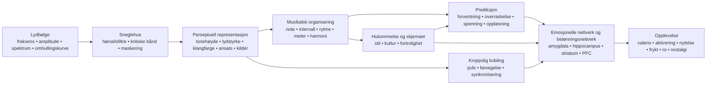

<!-- Translation of: research/sources/author-supplied/sound-expectation-and-emotion.md; source commit: 304d75ed6ff646d311fd9df8b4e2db0d4dee277a -->
# Lyd og følelse: hvordan akustisk struktur blir til fornemmelse, forventning og affekt

## Sammendrag

Relasjonen lyd–følelse **fungerer ikke som en fast ordbok** der en frekvens, et intervall eller en akkord nødvendigvis fremkaller en følelse. Det som finnes, er en sannsynlighetsarkitektur: akustiske egenskaper endrer fysiologisk aktivering, fremtredende trekk, forventning, kildeseparasjon, følelsen av stabilitet og bevegelse; disse representasjonene kombineres deretter med kulturell læring, selvbiografisk hukommelse, fortrolighet, stil, kontekst og interpretativ intensjon. Tverrkulturelle studier viser to viktige fakta på én gang: noen brede musikalsk-emosjonelle signaler krysser kulturer, men spesifikke preferanser og betydninger — f.eks. preferansen for konsonans — kan variere betydelig med kulturell erfaring. citeturn22search10turn5search11

Den viktigste distinksjonen er den mellom **fysisk egenskap** og **persepsjon**. Frekvens er ikke tonehøyde; lydtrykk er ikke lydstyrke; fysisk stemmemangfold er ikke nødvendigvis det opplevde antallet stemmer; spektrum er ikke klangfarge. Et særlig tydelig tilfelle er den *manglende grunntonen*: lytteren kan oppleve en tonehøyde som tilsvarer en grunnfrekvens som fysisk mangler i spekteret, og tonehøydefølsomme nevroner svarer på harmoniske komplekser med manglende grunntone. citeturn18search2

Emosjonelt opptrer de mest konsistente effektene i **tempo, intensitet/lydstyrke, modus, harmonisk forventning, dissonans/ruhet, klangfarge og ekspressiv fremføring**, men disse parametrene samvirker. I kontrollerte studier kan tempo og modus fylle delvis ulike funksjoner: tempoet endrer sterkt *aktiveringen*, mens moduset endrer stemnings-/valensvurderinger; manipulasjoner av tonehøyde, intensitet og temporal hastighet endrer også affektive dimensjoner i både musikk og tale. citeturn20search4turn21search7

Musikk når også belønningssystemer direkte. Intens musikalsk nytelse har vært koblet til dopaminfrigjøring i striatum; i Salimpoors og kollegers klassiske studie var **caudatus** mer assosiert med anticipasjon og **nucleus accumbens** med den nytelsesfulle toppen. Behagelig og ubehagelig musikk rekrutterer også differensielt ventralt striatum, amygdala, hippocampus, gyrus parahippocampalis, insula og kortikale regioner. citeturn18search0turn18search1

Dette bidrar til å forklare hvorfor **overraskelse ikke rett og slett er «dårlig»**. Musikk utnytter et mellomleie mellom forutsigbarhet og nyhet: forventning bygger en modell; avvik produserer informasjon; oppløsning eller bekreftelse forvandler en del av den spenningen til belønning. Studier av harmoniske progresjoner viser at usikkerhet og overraskelse samvirker ved prediksjon av nytelse og aktivitet i auditiv cortex, amygdala og hippocampus; andre arbeider finner en ikke-lineær relasjon mellom forutsigbarhet og nytelse. citeturn16search24turn16search1

Praktisk sett er den avgjørende variabelen sjelden «hvilken akkord er trist?» men **hvilket sett av ledetråder som organiseres til hvilken temporal bane**. For å fremkalle tristhet er f.eks. mollmodus alene én ledetråd; å kombinere moderat/lavt register, langsomt tempo, lav intensitet, myke ansatser, legato, lav tetthet, fallende konturer og fleksibel temporal fremføring gjør kommunikasjonen langt mer robust. Fremføringsstudier viser nettopp denne redundansen: ulike utøvere kan kommunisere samme følelse med ulike kombinasjoner av tempo, intensitet, artikulasjon og klangfarge. citeturn22search4turn22search8

En nyttig syntese er:

> **Akustikken setter muligheter → persepsjonen forvandler dem til objekter og mønstre → prediksjon og hukommelse tildeler betydning → autonome, motoriske, limbiske og belønningssystemer produserer aktivering, spenning, nytelse og hukommelse → kultur og kontekst bestemmer mye av den endelige emosjonelle betydningen.**

Diagrammet bør leses som et **nettverk**, ikke som en stiv nevral kjede. Det finnes tilbakevendende bearbeiding mellom auditiv cortex, motoriske systemer, hukommelse, vurdering og belønning; dessuten kan fortrolighet og selvbiografi dypt endre opplevelsen av samme akustiske signal. citeturn18search0turn18search1turn15search2

## Fra lydbølge til emosjonell hjerne

### Fysikk: frekvens, spektrum, omhullingskurve og overtoner

En musikalsk lyd kan grovt beskrives gjennom sin energifordeling over tid og frekvens. For et periodisk signal tilsvarer grunnfrekvensen \(f_0\) mønsterets repetisjonsfrekvens; akustiske instrumenter produserer normalt også deltoner over den. I tilnærmet harmoniske lyder opptrer disse deltonene nær heltallsmultipler av \(f_0\). Men **den opplevde tonehøyden er en inferens fra hørselssystemet**, ikke en enkel avlesning av den laveste spektralkomponenten. Derfor fjerner ikke fjerningen av \(f_0\) nødvendigvis den tonehøydeopplevelsen. citeturn18search2

**Spekteret** bestemmer mye av klangfargen. Klassiske psykofysiske studier av klangfargerom fant dimensjoner relatert til **spektralsentroiden** — sterkt assosiert med lyshetsopplevelsen —, til ansatsens temporale struktur og til spektral utvikling over lyden. Senere forskning bekrefter at flere spektrale og temporale dimensjoner trengs for å forklare klangfargelikhet. citeturn21search4turn21search12

**Omhullingskurven** beskriver hvordan energien varierer over tid. ADSR-modellen som brukes i syntese — *attack, decay, sustain, release* — er en nyttig forenkling:

**attack** = initiell amplitudestigning;  
**decay** = fall etter toppen;  
**sustain** = tilnærmet opprettholdt nivå mens kilden forblir eksitert;  
**release** = utklingning etter at eksitasjonen er opphørt.

Virkelige instrumenter har ofte mer komplekse omhullingskurver enn et enkelt ADSR, men ansatshastighet og spektro-temporal utvikling påvirker sterkt klangfargeidentitet og perseptuell segmentering. citeturn21search4turn21search23

En brå ansats produserer stor transient energi og ofte mer høyfrekvent innhold; langsomme ansatser skjuler det eksakte ansatstidspunktet og kan gi en mer kontinuerlig persepsjon. Denne fysiske forskjellen grunner musikalske kontraster som **perkusiv ↔ myk**, **staccato ↔ legato**, **aggressiv ↔ delikat**, selv om den resulterende følelsen avhenger av resten av det musikalske opplegget. citeturn21search12turn22search4

### Kritiske bånd, maskering og ruhet

Sneglehuset utfører ingen perfekt Fouriertransform: frekvenser analyseres av hørselsfiltre med endelig bredde. Det klassiske begrepet **kritisk bånd** ble demonstrert eksperimentelt i fenomener som lydstyrkesummering, terskler og maskering: å spre energi utenfor en gitt båndbredde endrer hvordan den kombineres perseptuelt. citeturn21search2turn21search25

Dette er nøkkelen til å forstå sensorisk konsonans og dissonans. Når nærliggende deltoner samvirker innen overlappende hørselsregioner, kan raske amplitudefluktuasjoner produsere **svevninger/ruhet**. Plomps og Levelts arbeid etablerte en historisk kobling mellom kritisk båndbredde og tonal konsonans, selv om virkelig musikalsk konsonans også avhenger av harmonisitet, fortrolighet og kultur. citeturn21search1turn5search17

**Maskering** betyr at én komponent kan heve en annens hørbarhetsterskel. I musikkproduksjon tilfører derfor tilført energi ikke nødvendigvis opplevd informasjon: spektralt konkurrerende lag kan skjule artikulasjons-, overtone- og transientdetaljer. Det er en direkte bro mellom psykoakustikk og orkestrering/miksing. citeturn21search2

### Fra auditiv cortex til belønningssystem

Tonehøyde, klangfarge, rytme og musikalsk struktur bearbeides ikke av ett enkelt «musikksenter». Et særlig sterkt nevrofysiologisk eksempel er identifiseringen av tonehøydefølsomme kortikale nevroner som svarer på både rene toner og harmoniske komplekser med samme opplevde \(f_0\), selv når grunntonen mangler. citeturn18search2

Når lyd får emosjonell betydning, kommer ytterligere nettverk til. I fMRI produserte vedvarende dissonant ubehagelig musikk større aktivitet i amygdala, hippocampus, gyrus parahippocampalis og temporalpoler, mens behagelig musikk viste svar som involverte ventralt striatum, insula, auditiv cortex og frontale/operkulære regioner. Dette betyr ikke at én region «er» en følelse; det betyr at den musikalske tilstanden modifiserer nettverk som også er involvert i vurdering, hukommelse, motivasjon og handling. citeturn18search1

Belønningskomponenten er særlig tydelig ved intens nytelse. Salimpoor m.fl. kombinerte funksjonell nevroavbildning og dopaminerge mål og fant striatal dopaminfrigjøring under intenst nytelsesfull musikk, med temporal differensiering mellom anticipasjon og hedonisk topp. citeturn18search0

**Nostalgi** illustrerer en annen vei. I selvbiografisk relevant musikk fant Janata aktivitet i dorsal medial prefrontal cortex som fulgte selvbiografisk fremtredenhet, mens prefrontale og posteriore nettverk deltok i gjenkallingen av musikkassosierte minner. Slik «inneholder» ingen isolert akustisk egenskap nostalgi; musikk fungerer som en tilgangsnøkkel til et personlig minnenettverk. citeturn15search2turn15search3

Dette forklarer også en vesentlig distinksjon: **opplevd følelse** («denne musikken høres trist ut») er ikke identisk med **følt følelse** («denne musikken gjør meg trist»). En utøver kan kommunisere tristhet gjenkjennelig mens lytteren samtidig opplever estetisk nytelse. Studier av fremføringskommunikasjon og belønning adresserer nettopp ulike nivåer av denne prosessen. citeturn22search4turn18search0

## Tonehøyde, frekvens, noter, intervaller, skalaer, modi og harmoni

### Tonehøyde, frekvens, note og register

| Element | Fysisk/perseptuell mekanisme | Evidensstøttet emosjonell tendens | Musikalsk manipulasjon og anvendelse |
|---|---|---|---|
| **Frekvens** | Fysisk repetisjonsfrekvens; relaterer i harmoniske komplekser til \(f_0\) men er ikke identisk med tonehøyde. citeturn18search2 | Det finnes ingen generell funksjon «X Hz = følelse Y». Den emosjonelle effekten oppstår av relasjoner, spektrum, nivå, kontekst og læring. | Transponering, bassdesign, grunntonevalg, syntese og EQ. Arbeid med relasjoner og bane, ikke «magiske frekvenser». |
| **Tonehøyde** | Perseptuell representasjon av periodisitet/grunntone, bevarbar selv med *manglende grunntone*. citeturn18search2 | Hevet tonehøyde tenderer til å heve *aktiveringen* i kontrollerte manipulasjoner; valensbetydningen avhenger av klangfarge, kontekst og stil. I isolerte fiolintoner hevet høyere tonehøyde *aktiveringen*. citeturn22search2turn22search6 | Hev registeret for intensivering, hastverk eller letthet; senk for tyngde, stabilitet eller intimitet, og test alltid klangfargesamspillet. |
| **Note** | Hendelse som kombinerer tonehøyde, ansats, durasjon, intensitet og klangfarge. | Navnet «C», «Fiss» osv. har ingen påvist egenfølelse. Selv en isolert note endres emosjonelt når tonehøyde, vibrato og dynamikk endres. citeturn22search2 | Tenk hver note som en multidimensjonal hendelse: stemmeføring, omhullingskurve, artikulasjon og melodisk mål betyr like mye som dens tonehøydeklasse. |
| **Register** | Plassering av tonehøyder i lave/høye bånd, som også endrer instrumentspektrum og maskering. | Høyere registre hever ofte aktivering/spenning; lave registre kan gi tyngde/kraft, men effekten er verken universell eller separerbar fra klangfargen. citeturn22search2turn21search7 | Reserver registerekstremer for strukturelle punkter; kontraster en sentral seksjon med et høyt klimaks eller subbass for å utvide tilstandsendringen. |

I komposisjon er det særlig nyttig å separere **absolutt tonehøyde** fra **kontur**. Et oppadgående sprang, progressiv registerakkumulasjon eller en fallende linje skaper retningsinformasjon selv når tonaliteten forblir den samme. Affektivt er banen vanligvis mer informativ enn en enkelt note.

### Intervaller

Et simultant intervall produserer et kombinert spektrum. Når de to tonenes deltoner interfererer kraftig innen samme kritiske regioner, stiger ruheten; når de deler høy harmonisitet, kan den perseptuelle fusjonen øke. Denne akustiske komponenten bidrar til å forklare en del av sensorisk dissonans, men uttømmer ikke den musikalske konsonansopplevelsen. citeturn21search1turn5search17

Dissonans har også tidlige nevrale og affektive korrelater, og vedvarende dissonant musikk kan forsterke svar i strukturer relatert til fremtredenhet og negativ valens. citeturn18search1

Det er imidlertid en feil å forvandle dette til regelen:

> liten sekund = frykt; liten ters = tristhet; kvint = kraft.

Disse parene kan fungere stilistisk, men et intervalls betydning endres med **register, melodisk retning, durasjon, metrisk posisjon, klangfarge, tonal kontekst og kultur**. Selve preferansen for konsonans fremfor dissonans varierer mellom populasjoner med ulike grader av vestlig musikkeksponering. citeturn5search11

**Anvendelse:** små kromatiske intervaller skaper effektivt friksjon når de holder deltoner nær og utfordrer den tonale forventningen; vide sprang kan fremheve overraskelse, ekspansjon eller instabilitet; utholdte konsonanser tenderer til å senke sensorisk spenning men kan forbli harmonisk «svevende» hvis konteksten krever oppløsning.

### Skalaer og modi

En skala er en tonehøydesamling; et modus legger til **hierarki, sentrum og melodisk/harmonisk atferd**. Dur/moll-effekten er ett av den vestlige tonale tradisjonens mest dokumenterte fenomener: i eksperimenter som manipulerer modus og tempo endrer moduset stemnings-/valensvurderinger, mens tempoet sterkt påvirker aktiveringen. citeturn20search4turn20search13

Dette gir den robuste, men ikke absolutte assosiasjonen:

**dur → relativt mer positiv valens**  
**moll → relativt mer negativ/trist valens**

Det betyr ikke «moll = tristhet». Et mollmodus i 170 BPM, med sterk intensitet, lys klangfarge og motorisk rytme, kan produsere opphetelse, aggressivitet eller eufori; et langsomt, glissent durmodus med lav dynamikk kan høres kontemplativt eller melankolsk ut. Den multivariate konfigurasjonen bestemmer utfallet. citeturn20search4turn21search7

Modi som dorisk, frygisk, lydisk eller mixolydisk får betydning gjennom en kombinasjon av **karakteristiske intervaller + tonalt sentrum + innlært repertoar**. Det finnes langt mindre eksperimentell evidens som støtter at «lydisk fremkaller følelse X» tverrkulturelt. Tverrkulturelle studier indikerer at lyttere kan gjenkjenne noen følelseskategorier i kulturelt fremmed musikk, men viser også at kulturell læring sterkt modifiserer musikalske vurderinger. citeturn22search10turn5search11

**Anvendelse:** i stedet for å velge et modus etter emosjonell etikett, identifiser hvilken tone som skiller det fra forventet dur/moll og **gjør den tonen perseptuelt strukturell**. En lydisk ♯4 skjult i en passasje produserer ikke samme effekt som en ♯4 utholdt i fremtredende posisjon mot tonikaen.

### Harmoni, progresjoner og kadenser

| Element | Mekanisme | Følelse/persepsjon | Teknikker |
|---|---|---|---|
| **Harmoni** | Simultan tonehøydekombinasjon → harmonisitet, ruhet, fusjon, virtuell bass og innlærte relasjoner. citeturn21search1turn5search17 | Konsonans tenderer mot større behag hos fortrolige lyttere; utholdt dissonans kan heve spenning/negativ valens. Preferansen er ikke kulturelt invariant. citeturn18search1turn5search11 | Spacing, omvending, lavt register, ekstensjoner, klustre, stemmeføringer og kontroll av forberedelse/oppløsning. |
| **Progresjon** | Sekvensen forvandler akkorder til betingede sannsynligheter: hver hendelse oppdaterer nestes forventning. | Lavere sannsynlighet kan heve overraskelse og spenning; nytelse kan resultere fra spesifikke usikkerhets-overraskelseskombinasjoner. citeturn16search24turn16search1 | Forbered → avvik → oppløs; dominantsubstitutt; forlenget subdominant; modulasjon; pivotakkorder; kromatikk. |
| **Kadens** | Avslutningshendelse som kombinerer bassbevegelse, skalatrinn, stemmeføring, meter og innlært forventning. | Ulike kadenser får distinkte valens- og aktiveringsvurderinger; sterk avslutning reduserer usikkerhet, mens avbrutte kadenser bevarer forventning. citeturn16search2turn16search6 | Autentisk kadens for avslutning; bedragersk for forlengelse; halvkadens for sveving; elisjon for flyt. |

Den vitenskapelige nøkkelen her er **prediksjon**. En progresjon er ikke emosjonell bare gjennom sine isolerte akkorder; den bygger et sannsynlighetsrom. En isolert nøytral akkord kan utløse et stort svar hvis den inntar et punkt der den interne modellen predikerte noe annet. Cheung og kolleger viste at **overraskelse og usikkerhet samvirker** ved prediksjon av musikalsk nytelse og modulerer auditiv cortex, amygdala og hippocampus. citeturn16search24

Dette gir en forklaring fra første prinsipper av harmonisk spenning:

\[
\text{Opplevd spenning}
\approx
f(\text{sensorisk dissonans},
\text{tonal instabilitet},
\text{usannsynlighet},
\text{utsettelse},
\text{energi},
\text{kontekst})
\]

Det er ingen bokstavelig fysiologisk ligning; det er en funksjonell dekomposisjon. To akkorder kan ha liknende ruhet men likevel forårsake ulike spenninger fordi den ene er forventet og den andre bryter med den innlærte grammatikken.

For komposisjon er det kraftigste prinsippet å kontrollere **mengden og plasseringen av uventet informasjon**. Konstant overraskelse opphører å være overraskelse; total forutsigbarhet reduserer informasjonen. Feltet med størst emosjonell interesse tenderer til å ligge mellom ekstremene, også observert i nytelses–forutsigbarhetsstudier. citeturn16search1turn16search24

## Tempo, durasjon, rytme, meter, mikrotiming og groove

### Tempo og durasjon

**Tempoet** endrer hendelsestettheten per tidsenhet og dermed hastigheten hvormed persepsjonssystemet må oppdatere prediksjoner. Det er en av de sterkeste emosjonelle ledetrådene. Eksperimentelle manipulasjoner viser at tempoendringer påvirker *aktiveringen*, og raskere musikk tenderer til å produsere større aktivering enn langsom, selv om intensitet, rytme og preferanse kan modifisere effekten. citeturn20search4

Effekten opptrer også fysiologisk: studier med musikk under ulike tempobetingelser observerte kardiovaskulære, respiratoriske og cerebrovaskulære endringer, noe som støtter ideen om at musikalsk tempo ikke bare er en «energi»-metafor; det kan effektivt modifisere den autonome tilstanden. citeturn7search1

Grovt sett:

| Opplegg | Mest sannsynlige tendens |
|---|---|
| raskt + sterkt + lyst + artikulert | høy aktivering; energisk glede, hastverk, sinne eller opphetelse per valens/kontekst |
| langsomt + svakt + mørkt + legato | lav aktivering; ro, ømhet eller tristhet |
| langsomt + sterkt + lavt + dissonant | trussel, høytidelighet eller tyngde |
| raskt + lavt nivå + uregelmessig | nervøsitet, instabilitet, uro |

Disse kombinasjonene er probabilistiske, ikke universelle oppskrifter. Evidensen om fremføringskommunikasjon viser nettopp at flere akustiske ledetråder er redundante og kan erstatte hverandre. citeturn22search4turn22search8

**Durasjonen** virker på flere nivåer: notedurasjon, ansatsintervall, frasedurasjon og en harmonis oppholdstid. Korte noter øker hendelsesseparasjonen og kan gjøre pulsen mer eksplisitt; lange noter øker kontinuiteten og tillater større spektral utvikling, vibrato og indre dynamikk. I studier av ekspressiv fremføring slutter durasjon og artikulasjon seg til et større ledetrådssett, derfor er det farlig å tilskrive «lang note» eller «kort note» en fast følelse. citeturn22search4

I produksjon kan en durasjonsendring radikalt transformere samme MIDI-sekvens uten å endre tonehøyde: forkort *gate* og release for å heve definisjon/transienter; forleng sustain/release for å fusjonere hendelser og redusere temporal granularitet.

### Rytme og meter

Rytme er den temporale fordelingen av hendelser; meter er en struktur av **aksentforventninger**. Hjernen hører ikke bare «hvor mye tid som gikk»: den bygger regulariteter og predikerer ansatser. Når en note lander der den metriske modellen ikke forventet den, får vi forskyvning, synkopering eller temporal overraskelse.

Pulsersepsjonen er sterkt knyttet til det motoriske systemet, selv uten eksplisitt fysisk bevegelse; nevroavbildningsstudier viser rekruttering av motoriske områder under lytting til musikalsk rytme, noe som gir et nevralt grunnlag for koblingen puls–bevegelsesimpuls. citeturn7search25turn7search37

**Meteret** alene har mindre direkte evidens for «spesifikk følelse» enn tempo eller modus. Dets hovedsakelige affektive kraft virker indirekte: det definerer matrisen som synkopering, anticipasjon, forsinkelse og aksenter vurderes mot. Et stabilt meter gjør avvik lesbare; et allerede høygradig uforutsigbart meter endrer selve prediksjonsreferansen.

Dette impliserer en viktig komposisjonsregel:

> **For å produsere rytmisk spenning må det først finnes noe temporalt forutsigbart å spenne.**

### Synkopering og groove

Det mest kjente eksperimentelle grooveresultatet er den **inverterte U**-kurven som Witek m.fl. fant: intermediære synkoperingsnivåer produserte større nytelse og sterkere impuls til å bevege kroppen enn svært lave eller svært høye nivåer. citeturn20search2

Logikken likner harmoniens:

**for mye forutsigbarhet** → liten utfordring;  
**intermediært avvik** → tilstrekkelig tydelig forventning + ny informasjon;  
**eksessivt kaos** → pulsprediksjonen svekkes, noe som reduserer sjansen til å «spille mot» rutenettet.

Denne relasjonen er særlig relevant for funk, hiphop, dansemusikk og andre stiler der grooven avhenger av samspillet mellom en stabil temporal referanse og forskyvende hendelser. Witek m.fl. fant relasjonen for både nytelse og bevegelsesimpuls. citeturn20search2

### Mikrotiming

Mikrotiming er forskyvning av hendelser med titalls millisekunder rundt en nominell metrisk posisjon. Musikalsk kan det opptre som *laid-back*, *pushing*, swing, basstromme­asynkroni, skarptrommeforsinkelse eller en utøvers individuelle timing.

En produksjonsmyte er at «kvantisert = grooveløst» og «imperfekt = menneskelig = bedre». Eksperimenter støtter ikke denne generelle regelen. Frühauf og kolleger manipulerte mikrotemporale avvik i trommepattern og fant at grooven minket jo større de kunstige avvikene ble; presist justert timing kunne få svært høye vurderinger. citeturn22search5

I en annen tilnærming sammenlignet Senn m.fl. profesjonelle bass/trommefremføringer, kvantiserte versjoner og overdrevet mikrotiming. Originalfremføring og kvantisering kunne gi sammenlignbare groovenivåer, mens overdrevne avvik skadet opplevelsen; ekspertlyttere var også mer følsomme for forskjellene. citeturn22search27

Derfor:

\[
\text{effektiv mikrotiming} \neq \text{tilfeldig feil}
\]

Det er **relasjonell struktur**. Skarptrommeforsinkelsen kan fungere fordi kick, bass, hi-hat og subdivision danner konsistente referanser. Å randomisere hver note ±20 ms ødelegger nettopp de relasjonene som gjør en pocket gjenkjennelig.

### Sammenlignende temporalt kart

| Element | Fysikk/persepsjon | Mest assosierte følelser | Praktiske teknikker |
|---|---|---|---|
| **Tempo** | Global hendelse/puls-hastighet. | Raskt → ↑ aktivering; langsomt → ↓ aktivering, i gjennomsnitt. citeturn20search4 | BPM-automasjon, perseptuell halvtid/dobbelttid, ritardando, accelerando. |
| **Durasjon** | Temporal utstrekning av hendelse/omhullingskurve. | Kort kan heve aktivitet/definisjon; lang kan favorisere kontinuitet/ro eller utholdt spenning; høygradig kontekstuell. citeturn22search4 | Gate, notelengde, sustain, release, fermat. |
| **Rytme** | Ansats- og durasjonsmønstre. | Regularitet favoriserer prediksjon; forstyrrelse gir forventning/overraskelse. | Ostinat, synkopering, anticipasjon, stillhet, tetthet. |
| **Meter** | Hierarki av sterke/svake pulser. | Effekt hovedsakelig via stabilitet og forventningsbrudd. | Stabilt 4/4, additive metre, motaksenter, hemiole. |
| **Mikrotiming** | Submetriske ansatsavvik. | Kan gi pocket/hastverk/avslapning; eksess reduserer grooven. citeturn22search5turn22search27 | Forsink skarptromme, anticipér bass, swing, timing per instrument. |
| **Groove** | Integrasjon av puls, synkopering, pattern og motorisk kobling. | Nytelse + bevegelsesimpuls; intermediær synkopering maksimerer ofte begge. citeturn20search2 | Stabilt lag + kontrollerte avvik; interlocking; repetisjon med mikrovariasjon. |

## Klangfarge, intensitet, dynamikk, artikulasjon, tekstur, register og orkestrering

### Klangfarge

Klangfarge er ingen enkel dimensjon. Den oppstår av **spektrum, harmonisk og støyfordeling, ansats, avklingning, modulasjoner, inharmonisitet og temporal utvikling**. Psykofysisk hører spektralsentroid og ansatsegenskaper til hovedaksene som differensierer instrumentale lyder. citeturn21search4turn21search12

Den emosjonelle konsekvensen er dyptgripende: samme melodiske materiale kan skifte karakter når instrumentet byttes. Hailstone m.fl. viste eksperimentelt at klangfarge påvirker musikalsk-følelsesvurderinger uavhengig av flere andre kontrollerte musikalske faktorer. citeturn20search5

En nyttig operasjonell beskrivelse:

**høyere spektralsentroid / mer høy energi** → større «lyshet», penetrasjon, mulig høyere aktivering;  
**mer støy, inharmonisitet og ruhet** → større fremtredenhet, hardhet, mulig trussel/spenning;  
**brå ansats** → større definisjon og impulsivitet;  
**langsom ansats** → lavere ansatsfremtredenhet og større fusjon;  
**sterk stabil harmonisk komponent** → tydelig tonehøyde/fusjon;  
**diffust/støyete spektrum** → tonehøydeambiguitet og tekstur.

Disse dimensjonene har ingen fast valens. Lyshet kan bety glede på en høy fløyte eller aggressivitet på en forvrengt gitar; støy kan representere trussel, energi, ekstase eller rett og slett en stilistisk konvensjon.

**Synteseanvendelse:** for å heve spenningen uten å endre harmonien, hev progressivt spektralsentroiden, øk støy/inharmonisitet, forkort ansatsen eller introduser spektral modulasjon. For å oppløse spenningen, utfør den omvendte bevegelsen.

### Intensitet og dynamikk

Fysisk relaterer intensitet til lydenergi/trykk; perseptuelt er korrelatet **lydstyrke**, hvis relasjon til fysisk nivå avhenger av frekvens, durasjon, kontekst og spektral fordeling. Begrepet kritisk bånd viser at hørselssystemet summerer energi avhengig av hvordan den spres over hørselsfiltre. citeturn21search2turn21search25

I musikk er større intensitet en klassisk ledetråd for **aktivering, kraft og hastverk**, men samvirker igjen med andre dimensjoner. Ilie og Thompson fant at intensitet, tonehøyde og temporal hastighet modifiserer affektive dimensjoner i musikalske og talestimuli. citeturn21search7

En nyere studie med isolerte fiolintoner viser også hvorfor enkle regler svikter: i det eksperimentelle opplegget hadde tonehøyde og vibrato sterkere affektive effekter enn dynamikk, og dynamikkeffektene fulgte ikke nødvendigvis karikaturen «sterkere = mer aktivering» i alle betingelser. citeturn22search2turn22search6

**Dynamikk** er mer enn absolutt nivå:

- **crescendo** skaper en positiv energiderivert, ofte lest som nærming, intensivering eller ankomst;
- **decrescendo** kan produsere tilbaketrekning/oppløsning;
- **sforzando/aksent** hever fremtredenhet og overraskelse;
- **subito piano** kan produsere sterk kontrast uten å være fysisk intenst;
- **eksessiv kompresjon** krymper rommet mellom intensitetstilstander og reduserer potensielt en viktig ekspressiv dimensjon.

Det emosjonelle prinsippet er at hjernen svarer ikke bare på verdier, men også på **endringer**.

### Artikulasjon

Artikulasjon kontrollerer den temporale og spektrale relasjonen mellom noter: effektiv lengde, ansatsklarhet, overlapp og mellomstillhet.

**staccato**: korte durasjoner, større separasjon, perseptuelt tydelige ansatser;  
**legato**: overlapp/forbindelse, energikontinuitet;  
**marcato/aksent**: større ansatsfremtredenhet;  
**tenuto**: opprettholdelse av durasjon/energi.

I Juslins eksperiment kunne profesjonelle musikere kommunisere sinne, tristhet, glede og frykt gjennom akustiske ledetrådskombinasjoner som inkluderte **tempo, nivå, artikulasjon og klangfarge**; lyttere brukte kompatible ledetråder, og ulike utøvere kunne nå liknende resultater via distinkte kombinasjoner. citeturn22search4turn22search8

Dette er svært viktig for MIDI-komposisjon: å programmere bare riktige noter bevarer en brøkdel av budskapet. **Velocity, notelengde, overlapp, timing, ansats og frasedynamikk** kan avgjøre om samme sekvens oppleves som mekanisk, øm, aggressiv, nølende eller glad.

### Tekstur

Tekstur legger til ytterligere en variabel: **hvor mange simultane perseptuelle strømmer som finnes og hvordan de forholder seg til hverandre**.

I tre eksperimenter med polyfone utdrag manipulerte/studerte Broze m.fl. stemmemangfold og fant at teksturer med flere stemmer ble vurdert **gladere, mindre triste, mindre ensomme og stoltere**. Vurderingene fulgte tett stemmenes opplevde numerositet. citeturn17view3

Dette funnet er særlig interessant fordi det viser at følelse kan oppstå av en strukturell dimensjon som verken er «melodi» eller «akkord». Men mekanismene selv er kontekstuelle: en masse av hundre aggressive stemmer trenger åpenbart ikke høres gladere ut enn en enslig stemme. Studien demonstrerer en effekt i spesifikke polyfone stimuli, ikke en universell tetthetslov. citeturn17view3

I praksis:

**monofoni** → eksponering, sårbarhet, klarhet, potensiell ensomhet;  
**tett homofoni** → masse, kraft, fellesskap;  
**polyfoni** → aktivitet, kompleksitet, uavhengighet;  
**bordun** → stabilitet eller sveving;  
**kluster/lydmasse** → fusjon, ruhet, kildeambiguitet.

Den emosjonelle effekten avhenger hovedsakelig av **tetthet × klangfarge × register × intensitet × indre bevegelse**.

### Orkestrering

Orkestrering manipulerer simultant spektrum, register, kildeantall, plassering, ansats, omhullingskurve og dynamikk. Den er således et slags psykoakustisk «makrokontroll».

Den instrumentale klangfargens emosjonelle kraft finner direkte støtte i Hailstone m.fl.; dessuten viser eksperimenter som sammenligner instrumentale versjoner at instrumentering kan endre aktiveringen mens relatert musikalsk materiale beholdes. citeturn20search5turn10search10

En praktisk lesning:

| Mål | Akustisk-orkestrale strategier |
|---|---|
| **intimitet** | få kilder, nært register, lavt nivå, myke ansatser, smal spektral bredde |
| **storhet** | vidt registerspenn, fordoblinger, solid bass, høyt mangfold, dynamisk oppbygging |
| **trussel** | energirike lave toner + ruhet + støy + sterke ansatser + dissonans + lav forutsigbarhet |
| **letthet** | mindre spektral masse, delikate transienter, mellom/høyt register, luker mellom hendelser |
| **mysterium** | delvis ambig tonehøyde, langsomme ansatser, moderat inharmonisitet, borduner, lav hendelsestetthet |
| **klimaks** | simultan ekspansjon av intensitet, register, tetthet, lyshet og hendelsesfrekvens |

Den effektivste måten å bygge et klimaks på er vanligvis ikke å maksimere alt fra starten; det er å **bevare akustiske frihetsgrader for å åpne dem senere**.

## Ornamentikk og fremføringsteknikker

Menneskelig fremføring introduserer kontinuerlig bevegelse i parametre som notasjon vanligvis representerer diskret. Det er der vibrato, portamento, glissando, trille, rubato, aksent og mikrodynamikk forvandler «noten» til ekspressiv atferd.

### Vibrato

Vibrato er en periodisk modulasjon — mest av frekvens/tonehøyde, ofte ledsaget av amplitude- og spektrumkomponenter avhengig av instrument. Dets parametre inkluderer:

\[
\text{hastighet} \quad+\quad \text{dybde} \quad+\quad \text{start} \quad+\quad \text{regularitet}
\]

I en kontrollert studie med fiolinlyder som varierte tonehøyde, dynamikk og vibrato var vibrato den nest mest innflytelsesrike faktoren: større vibrato tenderte til å **senke valensen og heve aktiveringen**, mens høyere tonehøyde også hevet aktiveringen. citeturn22search2turn22search6

Dette impliserer ikke «vibrato = tristhet». I virkelig fremføring kan vibrato kommunisere varme, lidenskap, spenning, sårbarhet, ysterhet eller intensitet fordi dets betydning avhenger av hastighet, bredde, start, strukturell note og stilistisk tradisjon.

**Anvendelse:** ikke appliser uniformt vibrato på hver note. Kontroller dets **bane**: å begynne uten vibrato og utvide det over en note produserer en annen intensivering enn å begynne med bredt vibrato og redusere det.

### Portamento og glissando

**Portamento** forbinder to tonehøyder gjennom en perseptuelt ekspressiv kontinuerlig overgang; **glissando** gjør veien mer eksplisitt hørbar og kan spenne over et vidt omfang.

Fysisk forvandler begge et diskret frekvenssprang til en **kontinuerlig \(f_0\)-bane**. Dette hever den temporale informasjonen inni noten og kan generere anticipasjon, nærming mot eller avvik fra målet.

Isolert kausal evidens for portamento/glissando, bortsett fra alle andre emosjonelle parametre, er mye knappere enn for tempo, modus eller vibrato. Derfor bør tilskrivninger som «portamento = nostalgi» behandles som stilistiske og fremføringsmessige konvensjoner, ikke psykoakustiske lover.

I praksis:

**langsomt oppadgående portamento** → betoner akten å ankomme;  
**tonehøydefall** → kan kommunisere avslapning, klage eller oppløsning per kontekst;  
**raskt glissando** → overraskelse, gest, komikk eller trussel per klangfarge;  
**selektivt portamento** → hever ekspressiviteten gjennom kontrast mot oglidde noter.

### Trille og andre raske ornamenter

Trillen alternerer raskt to tonehøyder og hever dermed temporal tetthet, spektral modulasjon og lokal usikkerhet. Avhengig av hastighet opplever lytteren alternerende noter eller en mer fusjonert tekstur.

Fysisk finnes en overgang fra et **diskret-hendelse**-regime til **temporal modulasjon/ruhet** når hastigheten vokser. Emosjonelt kan dette gi opphetelse, elegant ornamentikk, instabilitet eller spenning, men betydningen er høygradig stilistisk.

Samme resonnement dekker mordenter, tremolo og flutter:

- flere hendelser per sekund → generelt større perseptuell aktivitet;
- større modulasjon → større fremtredenhet;
- regularitet → forutsigbarhet;
- irregularitet → instabilitet;
- nærming til strukturelt viktige noter → større forventning.

### Rubato

Rubato omorganiserer mikro- og makrotid uten nødvendigvis å endre det globale middeltempoet. Det modifiserer direkte prediksjonsfeltet: å forsinke et ankomstpunkt forlenger forventningen; å komprimere tiden etter forsinkelsen kan skape driv.

Rubato tenkes bedre som **frasens temporale krumning**, ikke upresisjon. Den emosjonelle fremføringen som Juslin studerte, demonstrerer at timing, artikulasjon, dynamikk og klangfarge danner en redundant kode som utøvere bruker for å kommunisere gjenkjennelige følelser. citeturn22search4

For ekspressivitet:

\[
\text{nyttig rubato} = \text{strukturrelatert avvik}
\]

og ikke

\[
\text{nyttig rubato} = \text{tilfeldig jitter}
\]

Å systematisk forsinke et klimaks, en appoggiatura eller en kadensoppløsning kommuniserer intensjon; å tilfeldig forskyve hver note degraderer rett og slett forutsigbarheten.

### Sammenlignede fremføringsteknikker

| Teknikk | Hovedsakelig akustisk endring | Sannsynlig emosjonell effekt | Bruk |
|---|---|---|---|
| **Vibrato** | tonehøyde/amplitude/spektrum-modulasjon | ↑ aktivering ved intensere vibrato i fiolinstudie; kontekst avhengig valens. citeturn22search2 | noteklimaks, varme, spenning, intensitet |
| **Portamento** | kontinuerlig vei mellom tonehøyder | nærming, klage, sensualitet, stilistisk nostalgi; begrenset isolert evidens | stemmer, strykere, synthlead |
| **Glissando** | vidt tonehøydesveip | gest, overraskelse, perseptuell akselerasjon, trussel/komikk per klangfarge | overganger, risers, harpe, strykere, synth |
| **Trille** | rask alternering mellom tonehøyder | opphetelse/instabilitet/ornament | suspense, kadens, briljans |
| **Tremolo** | rask repetisjon/modulasjon | aktivering, forventning, utholdt energi | strykere, gitar, perkusjon |
| **Rubato** | strukturert tidsdeformasjon | forventning, nøling, ekspansjon, intimitet | melodisk frasering |
| **Aksent** | lokal ansats/intensitet | fremtredenhet, overraskelse, kraft | meter, groove, klimaks |
| **Legato** | overlapp og utjevnede ansatser | kontinuitet; ofte assosiert med mindre abrupte tilstander | ro, lyrikk, kontekstuell tristhet/ømhet |
| **Staccato** | redusert durasjon og separasjon | større segmentering/aktivitet; kan signalisere letthet eller aggressivitet | dans, humor, hastverk |
| **Indre dynamikk** | variabel omhullingskurve innen noten | nærming/tilbaketrekning og intensivering | blåsere, stemme, strykere, synthautomasjon |

For portamento, glissando og trille er den spesifikke eksperimentelle litteraturen betydelig mindre omfattende enn for tempo, lydstyrke, klangfarge, modus, groove eller vibrato; ovenstående anvendelser er derfor akustisk-musikalske inferenser og fremføringskonvensjoner, ikke universelle emosjonelle motsvarigheter.

## Sammenlignende syntese, anvendelser og nøkkelstudier

### Fullstendig kart element → mekanisme → følelse → teknikk

| Element | Dominerende mekanisme | Mest forsvarbare emosjonelle effekt | Hvordan utnytte |
|---|---|---|---|
| **Tonehøyde** | opplevd periodisitet | ↑ tonehøyde ofte ↑ aktivering. citeturn22search2 | registerbane, sprang, klimaks |
| **Frekvens** | fysisk oscillasjon | ingen fast følelse per Hz | harmoniske relasjoner, spektrum, subbass |
| **Klangfarge** | spektrum + omhullingskurve | endrer følelse selv med kontrollert musikalsk materiale. citeturn20search5 | lyshet, støy, ansats, inharmonisitet |
| **Intensitet** | energi/trykk → lydstyrke | ofte aktivering/kraft; interaktiv effekt. citeturn21search7 | nivå, aksent, kontrast |
| **Durasjon** | temporal utstrekning | modulerer aktivitet/kontinuitet; lite deterministisk alene | gate, sustain, stillhet |
| **Rytme** | ansatsmønstre | prediksjon, overraskelse, motorisk aktivering | synkopering, ostinat, tetthet |
| **Meter** | pulshierarki | strukturerer forventning | forskyvning, hemiole, additivt meter |
| **Tempo** | global hastighet | sterk aktiveringsdeterminant. citeturn20search4 | BPM, ritardando, accelerando |
| **Note** | tonehøyde + omhullingskurve + klangfarge + nivå | ingen tonehøydeklasse har påvist egenfølelse | behandle noten som en multidimensjonal hendelse |
| **Intervall** | spektral interaksjon + tonal relasjon | ruhet/dissonans kan heve spenning; betydningskontekstavhengig. citeturn21search1 | spacing, retning, register |
| **Skala** | tonehøydesamling/statistikk | hovedsakelig relasjonell/kulturell betydning | karakteristiske toner og hierarki |
| **Modus** | tonal hierarki | dur/moll påvirker valens/stemning hos fortrolige lyttere. citeturn20search4 | modalinterchange, modal blanding |
| **Harmoni** | simultanitet + harmonisitet + tonalt skjema | konsonans/dissonans og stabilitet påvirker nytelse/spenning. citeturn18search1turn5search11 | stemmeføringer, ekstensjoner, kromatikk |
| **Progresjon** | sekvensiell prediksjon | overraskelse + usikkerhet modulerer spenning og nytelse. citeturn16search24 | forberedelse/avvik/oppløsning |
| **Kadens** | probabilistisk/tonal avslutning | ulike avslutninger endrer valens/aktivering og fullstendighet. citeturn16search2 | autentisk, bedragersk, halvkadens |
| **Artikulasjon** | ansats + durasjon + overlapp | slutter seg sterkt til ekspressiv kommunikasjon, med andre ledetråder. citeturn22search4 | legato/staccato/marcato |
| **Dynamikk** | lydstyrkebane | crescendo/kontrast modulerer aktivering og fremtredenhet | automasjon, swell, subito |
| **Ornamentikk** | raske lokale modulasjoner | intensiverer aktivitet, fremtredenhet og forventning; høygradig stilavhengig | trille, mordent, tremolo |
| **Tekstur** | antall/separasjon av strømmer | flere stemmer var mer positive og mindre ensomme i kontrollerte stimuli. citeturn17view3 | monofoni ↔ masse/polyfoni |
| **Register** | spektral/tonehøyde-posisjon | ekstremer hever fremtredenhet; høyt tenderer til å heve aktivering i tonehøydemanipulasjoner | registerekspansjon/kontraksjon |
| **Orkestrering** | kombinasjon av klangfarge, register og kilder | instrumentering endrer aktivering og affektiv karakter. citeturn20search5turn10search10 | tetthet, fordobling, klangfargekontrast |
| **Mikrotiming** | millisekundavvik | grooverelasjonen er strukturell; mer avvik er ikke automatisk bedre. citeturn22search5turn22search27 | pocket, laid-back, push |
| **Groove** | puls + synkopering + motorisk prediksjon | nytelse og bevegelsesimpuls; hyppig maksimum ved intermediær kompleksitet. citeturn20search2 | forutsigbar base + kontrollert synkopering |
| **Fremføring** | kontinuerlig kombinasjon av timing, nivå, klangfarge, tonehøyde | utøvere kommuniserer følelser via redundante ledetråder. citeturn22search4 | frasering og ledetrådskoordinasjon |

### Hvordan komponere etter følelse uten å falle i formler

Den robusteste metoden arbeider i **vektorer**, ikke enkeltvise elementer.

For **ro**, senk aktiveringen på flere akser på én gang: moderat/langsomt tempo, lav ansatstetthet, avrundede ansatser, liten ruhet, stabil dynamikk, ikke-ekstremt register, tilstrekkelig forutsigbarhet og lengre release. Litteraturen om tempo, intensitet og uttrykk støtter disse relasjonene som tendenser, ikke garantier. citeturn20search4turn21search7turn22search4

For **tristhet** kan et mollmodus forsterke negativ valens, men blir langt mer effektivt med lav aktivering: langsomt tempo, forbundet artikulasjon, redusert intensitet og lavere tetthet. citeturn20search4turn22search4

For **glede**, hev valens og ofte aktivering: større metrisk forutsigbarhet, livligere tempo, mindre harde klangfarger, tydelig artikulasjon, durmodus der stilistisk relevant, og sosialt «fulle» teksturer. Den positive innflytelsen av større stemmemangfold ble demonstrert i et kontrollert polyfont musikksett. citeturn17view3turn20search4

For **frykt/trussel**, kombiner høy fremtredenhet med negativ valens: ruhet, dissonans, lav forutsigbarhet, brå ansatser, registerekstremer, støy, plutselig dynamikk og hendelser hvis timing bryter forventningen. Assosiasjonen av vedvarende dissonans med amygdala/hippocampus-aktivitet og andre affektive strukturer gir eksperimentelt grunnlag for en del av denne effekten. citeturn18search1

For **spenning** er det sentrale verktøyet **utsettelsen**: etabler en forventning og blokker midlertidig dens oppfyllelse. Dette kan skje harmonisk, rytmisk, melodisk, dynamisk eller registralt. Studier av musikalsk overraskelse viser at forventning og usikkerhet er sentrale for affektiv og hedonisk respons. citeturn16search24turn16search1

For **overraskelse**, bevar først viss redundans. Et forventningsbrudd er informativt bare hvis det fantes en tilstrekkelig stabil modell å bryte. citeturn16search24

For **groove og kroppslig nytelse**, maksimer ikke kompleksiteten: hold pulsen gjenopprettbar og plasser nok synkopering til å mobilisere prediksjon og bevegelse. Den eksperimentelle evidensen favoriserer en intermediær synkoperingssone. citeturn20search2

For **nostalgi**, søk ikke en spesifikk frekvens. Fortrolighet og selvbiografisk assosiasjon betyr langt mer. Musikk bundet til personlig historie rekrutterer prefrontale nettverk assosiert med selvbiografisk hukommelse og personlig fremtredenhet. citeturn15search2

### Anvendelse i arrangement og produksjon

I **arrangementet**, tenk følelsen som perseptuell ressurshåndtering. En seksjon kan gjøres større uten å endre noen akkord: fordoble oktaver, ekspander register, hev stemmeantallet, legg til transienter, hev lysheten og utvid dynamikken. Hvert steg modifiserer dimensjoner med distinkte psykoakustiske korrelater. citeturn21search4turn17view3

I **produksjonen** er EQ og syntese ikke bare tekniske prosesser. Å endre spektralsentroiden endrer lysheten; en kompressor endrer omhullingskurve og kontrast; metning introduserer overtoner og potensiell ruhet; romklang forlenger energien og reduserer temporal skarphet; transientforming modifiserer ansatsen; kvantisering modifiserer temporal forventning; velocity og automasjon endrer lydstyrke og klangfarge simultant. De perseptuelle klangfarge- og omhullingskurvedimensjonene som er demonstrert i psykofysikk, grunner disse manipulasjonene. citeturn21search4turn21search12

**Maskering** introduserer ytterligere et prinsipp: et emosjonelt «stort» arrangement trenger ikke ha flere elementer, men perseptuelt atskillbare. Hvis to lag inntar liknende filtre og gjensidig maskerer sine ansatser/overtoner, kan heving av begge redusere klarheten i stedet for å heve effekten. citeturn21search2

I **bassen** fortjener spacings og stemmeføringer særlig oppmerksomhet: hørselsfilterbredde, harmonisk tetthet og svevningsfrekvenser gjør at kompakte strukturer i lave registre ofte produserer mer interaksjon/ruhet enn samme intervall i høyere registre. Prinsippet utledes fra relasjonen kritisk-båndbredde–sensorisk-konsonans. citeturn21search1

I **elektronisk musikk** tillater dette å bygge følelse uten kompleks tonalitet: en enkelt tonehøyde kan gjennomløpe helt ulike tilstander gjennom filterautomasjon, omhullingskurve, forvrengning, spektral bredde, rytmisk tetthet, mikrotiming og intensitet. Klangfarge, rytme og forventning gir allerede flere uavhengige affektive kanaler. citeturn20search5turn20search2

### Anvendelse i fremføring

For utøvere er litteraturens største resultat at følelsen ikke bør «legges» utelukkende i tempoet eller utelukkende i dynamikken. Studier viser **ledetrådsredundans**: lytteren kombinerer tempo, intensitet, artikulasjon, klangfarge og andre variabler for å inferere den emosjonelle intensjonen. citeturn22search4turn22search8

Dette foreslår en fremføringsstrategi på tre skalaer:

**Makro:** velg tempo-, dynamikk- og tetthetsbanen for hele seksjonen.

**Meso:** gi hver frase et mål — ekspansjon, sveving, akselerasjon, oppløsning.

**Mikro:** bestem ansats, durasjon, intensitet, vibrato, portamento og timing for strukturelle noter.

En effektiv ekspressiv interpretasjon tenderer til å peke disse skalaene i samme retning. Et klimaks som simultant vinner tonehøyde, intensitet, tetthet, vibrato og temporalt hastverk inneholder redundante intensiveringsledetråder; redundans hever emosjonell lesbarhet, nøyaktig som eksperimentelt observert i fremføringskommunikasjon. citeturn22search4

### Hva evidensen støtter — og hva den ikke støtter

Forskningen støtter med tiltro at akustiske og strukturelle egenskaper **systematisk endrer affektive dimensjoner**. Tempo, modus, intensitet, tonehøyde, klangfarge, forventning, konsonans/dissonans, stemmetetthet, synkopering og fremføring er målbare og eksperimentelt manipulerbare. citeturn20search4turn20search5turn17view3turn20search2

Den støtter ikke å bygge en universell tabell som:

> 440 Hz = følelse A  
> 432 Hz = følelse B  
> liten ters = tristhet  
> D-dorisk = håp  
> 120 BPM = glede.

Tonehøyde er ikke engang ekvivalent med enkel fysisk frekvens, som den *manglende grunntonen* viser; og konsonans- og følelseseffekter varierer med eksponering og kultur. citeturn18search2turn5search11

Det er heller ikke passende å si «amygdalaen er det musikalske fryktsenteret» eller «nucleus accumbens er nytelsessenteret». Studier viser **distribuerte nettverk**, der auditoriske, motoriske, mnestiske, evaluative og belønningsregioner dynamisk samvirker. citeturn18search0turn18search1turn15search2

Til slutt bør **nærming/unngåelse** brukes mer forsiktig enn valens og aktivering. En høyaktivert lyd kan indusere nærming når den er nytelsesfull — dans, ekstase, groove — eller vaktsomhet/unngåelse når den er truende. Samme akustiske energi kan derfor nære motsatte motivasjonstilstander avhengig av valens, prediksjon og kontekst. Sameksistensen av belønningssvar på intenst opphetende musikk og negative svar på ubehagelig dissonans illustrerer dette punktet. citeturn18search0turn18search1

### Vesentlige primærstudier

For **tonehøyde og nevral representasjon** er Bendor & Wang (2005), *The neuronal representation of pitch in primate auditory cortex*, fundamental for å påvise nevroner som bevarer tonehøyde selv med *manglende grunntone*. citeturn18search2

For **kritisk-bånd- og konsonanspsykoakustikk** forblir Zwicker, Flottorp & Stevens (1957), *Critical Band Width in Loudness Summation*, og Plomp & Levelt (1965), *Tonal Consonance and Critical Bandwidth*, grunnleggende referanser. citeturn21search2turn21search1

For **klangfarge** etablerer McAdams m.fl. (1995), *Perceptual scaling of synthesized musical timbres*, perseptuelle spektrale og temporale dimensjoner; Hailstone m.fl. (2009), *Timbre affects perception of emotion in music*, demonstrerer klangfargens bidrag til opplevd følelse. citeturn21search4turn20search5

For **tempo, modus, tonehøyde og intensitet** er Husain, Thompson & Schellenberg (2002) og Ilie & Thompson (2006) sentrale referanser i kontrollerte manipulasjoner av akustisk-musikalske ledetråder og affektive dimensjoner. citeturn20search4turn21search7

For **emosjonell fremføring** viser Juslin (2000), *Cue Utilization in Communication of Emotion in Music Performance*, empirisk hvordan musikere og lyttere konvergerer i bruken av multiple ekspressive ledetråder. citeturn22search4

For **følelse og hjerne** viser Koelsch m.fl. (2006), *Investigating emotion with music: an fMRI study*, differensielle svar på konsonant/behagelig vs. vedvarende dissonant/ubehagelig musikk. citeturn18search1

For **nytelse og dopamin** kobler Salimpoor m.fl. (2011), *Anatomically distinct dopamine release during anticipation and experience of peak emotion to music*, musikalsk nytelse til striatal dopaminerg frigjøring og differensierer anticipasjon fra hedonisk topp. citeturn18search0

For **overraskelse, forventning og belønning** gir Cheung m.fl. (2019), *Uncertainty and Surprise Jointly Predict Musical Pleasure and Amygdala, Hippocampus, and Auditory Cortex Activity*, og Gold m.fl. (2019), *Predictability and Uncertainty in the Pleasure of Music*, evidens for at musikalsk nytelse avhenger av samspillet mellom prediksjon og ny informasjon. citeturn16search24turn16search1

For **groove** demonstrerer Witek m.fl. (2014), *Syncopation, Body-Movement and Pleasure in Groove Music*, den inverterte U-relasjonen mellom synkopert kompleksitet, nytelse og bevegelsesimpuls. citeturn20search2

For **mikrotiming** er Frühauf m.fl. (2013), *Music on the Timing Grid*, og Senn m.fl. (2016), *The Effect of Expert Performance Microtiming on Listeners' Experience of Groove*, særlig nyttige fordi de motsier den forenklede ideen om at mer temporalt avvik nødvendigvis betyr mer groove. citeturn22search5turn22search27

For **tekstur** gir Broze m.fl. (2014), *Polyphonic Voice Multiplicity, Numerosity, and Musical Emotion Perception*, sjelden eksperimentell evidens for at det opplevde stemmeantallet endrer den opplevde følelsen. citeturn17view3

For **nostalgi og selvbiografisk hukommelse** viser Janata (2009), *The Neural Architecture of Music-Evoked Autobiographical Memories*, assosiasjonen mellom selvbiografisk fremtredende musikk og medial prefrontal cortex. citeturn15search2

For **kultur og universalitet** demonstrerer Fritz m.fl. (2009), *Universal Recognition of Three Basic Emotions in Music*, viss tverrkulturell gjenkjenning av basale følelser; dette resultatet bør leses sammen med studier som McDermott m.fl., som viser sterkt kulturelt innflytelse på konsonanspreferansen. citeturn22search10turn5search11

Syntesen av all denne litteraturen er et perspektivskifte: **musikalsk følelse lever ikke i isolerte noter, frekvenser eller akkorder. Den oppstår av den temporale transformasjonen av akustisk energi til persepsjon, prediksjon, bevegelse, hukommelse og verdi.** Komposisjon kontrollerer sannsynlighetene; fremføring gir disse sannsynlighetene bane; hjernen tolker dem i lyset av en kropp, en kultur og en personlig historie.
