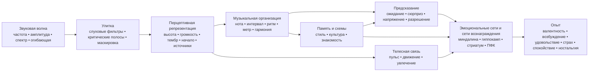

<!-- Translation of: research/sources/author-supplied/sound-expectation-and-emotion.md; source commit: 304d75ed6ff646d311fd9df8b4e2db0d4dee277a -->
# Звук и эмоции: как акустическая структура превращается в ощущение, ожидание и аффект

## Резюме

Отношение звука и эмоций **не работает как фиксированный словарь**, в котором частота, интервал или аккорд необходимо производят эмоцию. Существует вероятностная архитектура: акустические признаки меняют физиологическое возбуждение, салиентность, ожидание, сегрегацию источников, чувство стабильности и движения; эти репрезентации затем комбинируются с культурным научением, автобиографической памятью, знакомостью, стилем, контекстом и исполнительским намерением. Кросс-культурные исследования показывают сразу два важных факта: некоторые широкие музыкально-эмоциональные сигналы пересекают культуры, но конкретные предпочтения и значения — например, предпочтение консонанса — могут существенно варьировать с культурным опытом.citeturn22search10turn5search11

Важнейшее различие — между **физическим свойством** и **восприятием**. Частота — не высота; звуковое давление — не громкость; физическая множественность голосов — не обязательно воспринимаемое число голосов; спектр — не тембр. Особенно ясный случай — *отсутствующая основная частота*: слушатель может воспринимать высоту, соответствующую основной частоте, физически отсутствующей в спектре, и чувствительные к высоте нейроны отвечают на гармонические комплексы с отсутствующей основной частотой.citeturn18search2

Эмоционально наиболее последовательные эффекты проявляются в **темпе, интенсивности/громкости, ладе, гармоническом ожидании, диссонансе/шероховатости, тембре и экспрессивном исполнении**, но эти параметры взаимодействуют. В контролируемых исследованиях темп и лад могут служить частично разным функциям: темп сильно влияет на *возбуждение*, тогда как лад меняет оценки настроения/валентности; манипуляции высотой, интенсивностью и временной скоростью также меняют аффективные измерения и в музыке, и в речи.citeturn20search4turn21search7

Музыка также достигает систем вознаграждения напрямую. Интенсивное музыкальное удовольствие связывают с выбросом дофамина в стриатуме; в классическом исследовании Салимпур и коллег **хвостатое ядро** было больше связано с предвкушением, а **прилежащее ядро** — с пиком удовольствия. Приятная и неприятная музыка также дифференциально рекрутируют вентральный стриатум, миндалину, гиппокамп, парагиппокампальную извилину, инсулу и корковые области.citeturn18search0turn18search1

Это помогает объяснить, почему **сюрприз — не просто «плохо»**. Музыка эксплуатирует промежуточный режим между предсказуемостью и новизной: ожидание строит модель; отклонение производит информацию; разрешение или подтверждение превращают часть этого напряжения в вознаграждение. Исследования гармонических прогрессий показывают, что неопределённость и сюрприз взаимодействуют в предсказании удовольствия и активности в слуховой коре, миндалине и гиппокампе; другие работы находят нелинейное отношение между предсказуемостью и удовольствием.citeturn16search24turn16search1

В практическом плане решающая переменная редко «какой аккорд грустный?», а **какой набор признаков организуется в какую временную траекторию**. Чтобы произвести грусть, например, один минорный лад — один признак; сочетание умеренно низкого/низкого регистра, медленного темпа, низкой интенсивности, мягких атак, легато, низкой плотности, нисходящих контуров и гибкого временного исполнения делает коммуникацию гораздо более робастной. Исследования исполнения показывают ровно эту избыточность: разные исполнители могут коммуницировать одну эмоцию, используя разные сочетания темпа, интенсивности, артикуляции и тембра.citeturn22search4turn22search8

Полезный синтез таков:

> **Акустика задаёт возможности → восприятие превращает их в объекты и паттерны → предсказание и память приписывают значение → автономные, моторные, лимбические системы и системы вознаграждения производят возбуждение, напряжение, удовольствие и память → культура и контекст определяют большую часть финального эмоционального значения.**

Диаграмму следует читать как **сеть**, а не как жёсткую нейронную цепь. Существует рекуррентная обработка между слуховой корой, моторными системами, памятью, оценкой и вознаграждением; более того, знакомость и автобиография могут глубоко менять опыт от того же акустического сигнала.citeturn18search0turn18search1turn15search2

## От звуковой волны к эмоциональному мозгу

### Физика: частота, спектр, огибающая и гармоники

Музыкальный звук можно грубо описать распределением энергии по времени и частоте. Для периодического сигнала основная частота \(f_0\) соответствует скорости повторения паттерна; акустические инструменты обычно также производят парциальные тоны выше неё. В приблизительно гармонических звуках эти парциальные тоны появляются вблизи целых кратных \(f_0\). Однако **воспринимаемая высота — вывод слуховой системы**, а не простое считывание низшего спектрального компонента. Поэтому удаление \(f_0\) не обязательно удаляет это ощущение высоты.citeturn18search2

**Спектр** определяет большую часть тембра. Классические психофизические исследования тембрового пространства нашли измерения, связанные со **спектральным центроидом** — сильно ассоциированным с ощущением яркости —, с временной структурой атаки и со спектральной эволюцией по ходу звука. Поздние исследования подтверждают, что для объяснения тембрового сходства нужны множественные спектральные и временные измерения.citeturn21search4turn21search12

**Огибающая** описывает, как энергия меняется со временем. Модель ADSR, используемая в синтезе — *атака, спад, поддержка, затухание* — полезное упрощение:

**атака** = начальный подъём амплитуды;  
**спад** = падение после пика;  
**поддержка** = приблизительно удерживаемый уровень, пока источник остаётся возбуждённым;  
**затухание** = угасание после конца возбуждения.

Реальные инструменты часто имеют более сложные огибающие, чем простой ADSR, но скорость атаки и спектрально-временная эволюция сильно влияют на тембровую идентичность и перцептивную сегментацию.citeturn21search4turn21search23

Резкая атака производит большую переходную энергию и часто больше высокочастотного содержания; медленные атаки затемняют точный момент начала и могут давать более непрерывное восприятие. Это физическое различие обосновывает музыкальные контрасты вроде **ударный ↔ гладкий**, **стаккато ↔ легато**, **агрессивный ↔ деликатный**, хотя итоговая эмоция зависит от остальной музыкальной установки.citeturn21search12turn22search4

### Критические полосы, маскировка и шероховатость

Улитка не выполняет совершенное преобразование Фурье: частоты анализируются слуховыми фильтрами конечной ширины. Классическая концепция **критической полосы** была экспериментально продемонстрирована в явлениях суммирования громкости, порогах и маскировке: распределение энергии за пределы данной полосы меняет то, как она перцептивно комбинируется.citeturn21search2turn21search25

Это ключ к пониманию сенсорного консонанса и диссонанса. Когда близкие парциальные тоны взаимодействуют внутри перекрывающихся слуховых областей, быстрые флуктуации амплитуды могут производить **биения/шероховатость**. Работа Пломпа и Левелта установила историческую связь между критической полосой и тональным консонансом, хотя реальный музыкальный консонанс также зависит от гармоничности, знакомости и культуры.citeturn21search1turn5search17

**Маскировка** означает, что один компонент может повышать порог слышимости другого. В музыкальном производстве поэтому добавление энергии не обязательно добавляет воспринимаемую информацию: спектрально конкурирующие слои могут скрывать детали артикуляции, гармоники и переходных процессов. Это прямой мост между психоакустикой и оркестровкой/микшированием.citeturn21search2

### От слуховой коры к системе вознаграждения

Высота, тембр, ритм и музыкальная структура обрабатываются не одним «музыкальным центром». Один особенно сильный нейрофизиологический пример — идентификация чувствительных к высоте корковых нейронов, отвечающих и на чистые тоны, и на гармонические комплексы с тем же воспринимаемым \(f_0\), включая случай отсутствия основной частоты.citeturn18search2

Когда звук приобретает эмоциональное значение, присоединяются дополнительные сети. В фМРТ персистентно диссонантная неприятная музыка производила большую активность в миндалине, гиппокампе, парагиппокампальной извилине и височных полюсах, тогда как приятная музыка показывала ответы с вовлечением вентрального стриатума, инсулы, слуховой коры и фронтальных/оперкулярных областей. Это не означает, что одна область «есть» эмоция; это означает, что музыкальное состояние модифицирует сети, также вовлечённые в оценку, память, мотивацию и действие.citeturn18search1

Компонент вознаграждения особенно ясен при интенсивном удовольствии. Салимпур и др. сочетали функциональную нейровизуализацию и дофаминергические измерения и нашли выброс дофамина в стриатуме во время интенсивно приятной музыки, с временной дифференциацией между предвкушением и гедоническим пиком.citeturn18search0

**Ностальгия** иллюстрирует другой путь. В автобиографически релевантной музыке Джаната нашёл активность дорсальной медиальной префронтальной коры, отслеживающую автобиографическую салиентность, тогда как префронтальные и задние сети участвовали в извлечении ассоциированных с музыкой воспоминаний. Таким образом, никакое изолированное акустическое свойство «не содержит ностальгию»; музыка работает как ключ доступа к сети личной памяти.citeturn15search2turn15search3

Это также объясняет существенное различие: **воспринимаемая эмоция** («эта музыка звучит грустно») не тождественна **чувствуемой эмоции** («эта музыка делает меня грустным»). Исполнитель может узнаваемо коммуницировать грусть, тогда как слушатель одновременно испытывает эстетическое удовольствие. Исследования исполнительской коммуникации и вознаграждения адресуют ровно разные уровни этого процесса.citeturn22search4turn18search0

## Высота, частота, ноты, интервалы, гаммы, лады и гармония

### Высота, частота, нота и регистр

| Элемент | Физический/перцептивный механизм | Подтверждаемая свидетельствами эмоциональная тенденция | Музыкальная манипуляция и применение |
|---|---|---|---|
| **Частота** | Физическая скорость повторения; в гармонических комплексах связана с \(f_0\), но не тождественна высоте.citeturn18search2 | Нет общей функции «X Гц = эмоция Y». Эмоциональный эффект возникает из отношений, спектра, уровня, контекста и научения. | Транспозиция, дизайн баса, выбор основного тона, синтез и эквализация. Работайте с отношениями и траекторией, а не с «магическими частотами». |
| **Высота** | Перцептивная репрезентация периодичности/основного тона, сохраняемая даже при *отсутствующей основной частоте*.citeturn18search2 | Повышение высоты, как правило, повышает *возбуждение* в контролируемых манипуляциях; валентное значение зависит от тембра, контекста и стиля. В изолированных скрипичных нотах более высокая высота повышала *возбуждение*.citeturn22search2turn22search6 | Повышайте регистр для интенсификации, срочности или лёгкости; понижайте для веса, стабильности или интимности, всегда проверяя тембровое взаимодействие. |
| **Нота** | Событие, сочетающее высоту, начало, длительность, интенсивность и тембр. | Название «до», «фа-диез» и т.д. не имеет продемонстрированной внутренней эмоции. Даже изолированная нота эмоционально меняется, когда меняются высота, вибрато и динамика.citeturn22search2 | Мыслите каждую ноту как многомерное событие: голосоведение, огибающая, артикуляция и мелодический пункт назначения значат не меньше, чем её звуковысотный класс. |
| **Регистр** | Размещение высот в низких/высоких полосах, также меняющее инструментальный спектр и маскировку. | Более высокие регистры часто повышают активацию/напряжение; низкие регистры могут давать вес/мощь, но эффект ни универсален, ни отделим от тембра.citeturn22search2turn21search7 | Резервируйте крайности регистра для структурных точек; контрастируйте центральный раздел с острым кульминационным или суббасовым, чтобы расширить смену состояния. |

В композиции особенно полезно разделять **абсолютную высоту** и **контур**. Восходящий скачок, прогрессивное накопление регистра или нисходящая линия создают направленную информацию, даже когда тональность остаётся той же. Аффективно траектория обычно информативнее одиночной ноты.

### Интервалы

Одновременный интервал производит комбинированный спектр. Когда парциальные тоны двух нот сильно интерферируют внутри одних критических областей, шероховатость растёт; когда они разделяют высокую гармоничность, перцептивное слияние может возрастать. Этот акустический компонент помогает объяснить часть сенсорного диссонанса, но не исчерпывает опыт музыкального консонанса.citeturn21search1turn5search17

Диссонанс также имеет ранние нейронные и аффективные корреляты, и персистентно диссонантная музыка может усиливать ответы в структурах, связанных с салиентностью и негативной валентностью.citeturn18search1

Однако ошибка превращать это в правило:

> малая секунда = страх; малая терция = грусть; квинта = мощь.

Эти пары могут работать стилистически, но значение интервала меняется с **регистром, мелодическим направлением, длительностью, метрической позицией, тембром, тональным контекстом и культурой**. Само предпочтение консонанса диссонансу варьирует между популяциями с разной степенью экспозиции к западной музыке.citeturn5search11

**Применение:** малые хроматические интервалы эффективно создают трение, когда держат парциальные тоны близко и бросают вызов тональному ожиданию; широкие скачки могут подчёркивать сюрприз, расширение или нестабильность; выдержанные консонансы, как правило, снижают сенсорное напряжение, но могут оставаться гармонически «подвешенными», если контекст требует разрешения.

### Гаммы и лады

Гамма — коллекция высот; лад добавляет **иерархию, центр и мелодическое/гармоническое поведение**. Мажоро-минорный эмоциональный эффект — один из наиболее документированных феноменов западной тональной традиции: в экспериментах, манипулирующих ладом и темпом, лад меняет оценки настроения/валентности, тогда как темп сильно влияет на возбуждение.citeturn20search4turn20search13

Это даёт робастную, но не абсолютную ассоциацию:

**мажор → относительно более позитивная валентность**  
**минор → относительно более негативная/грустная валентность**

Это не означает «минор = грусть». Минорный лад на 170 BPM, с сильной интенсивностью, ярким тембром и моторным ритмом, может производить возбуждение, агрессивность или эйфорию; медленный, разреженный мажорный лад с низкой динамикой может звучать созерцательно или меланхолично. Многомерная конфигурация определяет исход.citeturn20search4turn21search7

Лады вроде дорийского, фригийского, лидийского или миксолидийского обретают значение через сочетание **характерных интервалов + тонального центра + усвоенного репертуара**. Экспериментальных свидетельств, поддерживающих «лидийский производит эмоцию X» кросс-культурно, гораздо меньше. Кросс-культурные исследования указывают, что слушатели могут распознавать некоторые эмоциональные категории в культурно чуждой музыке, но также показывают, что культурное научение сильно модифицирует музыкальные суждения.citeturn22search10turn5search11

**Применение:** вместо выбора лада по эмоциональной метке идентифицируйте, какая нота отличает его от ожидаемого мажора/минора, и **сделайте эту ноту перцептивно структурной**. Лидийская ♯4, спрятанная в пассаже, производит не тот же эффект, что ♯4, выдержанная в салиентной позиции против тоники.

### Гармония, прогрессии и каденции

| Элемент | Механизм | Эмоция/восприятие | Техники |
|---|---|---|---|
| **Гармония** | Одновременная комбинация высот → гармоничность, шероховатость, слияние, виртуальный бас и усвоенные отношения.citeturn21search1turn5search17 | Консонанс тяготеет к большей приятности у слушателей со сформированной привычкой; выдержанный диссонанс может повышать напряжение/негативную валентность. Предпочтение не культурно инвариантно.citeturn18search1turn5search11 | Расположение, обращение, низкий регистр, расширения, кластеры, раскладки голосов и контроль подготовки/разрешения. |
| **Прогрессия** | Последовательность превращает аккорды в условные вероятности: каждое событие обновляет ожидание следующего. | Более низкая вероятность может повышать сюрприз и напряжение; удовольствие может следовать из конкретных комбинаций неопределённости-сюрприза.citeturn16search24turn16search1 | Подготовить → отклониться → разрешить; заменить доминанту; продлить преддоминанту; модуляция; общие аккорды; хроматизм. |
| **Каденция** | Закрывающее событие, сочетающее движение баса, ступени, голосоведение, метр и усвоенное ожидание. | Разные каденции получают различные оценки валентности и возбуждения; сильное закрытие снижает неопределённость, тогда как прерванные каденции сохраняют ожидание.citeturn16search2turn16search6 | Автентическая каденция для закрытия; обманная для продления; половинная для подвешивания; элизия для сохранения потока. |

Научный ключ здесь — **предсказание**. Прогрессия эмоциональна не только через свои изолированные аккорды; она строит вероятностное пространство. Нейтральный в изоляции аккорд может вызывать большой ответ, если занимает точку, где внутренняя модель предсказывала другое. Чен и коллеги показали, что **сюрприз и неопределённость взаимодействуют** в предсказании музыкального удовольствия и модулируют слуховую кору, миндалину и гиппокамп.citeturn16search24

Это даёт объяснение из первых принципов гармонического напряжения:

\[
\text{Perceived tension}
\approx
f(\text{sensory dissonance},
\text{tonal instability},
\text{improbability},
\text{postponement},
\text{energy},
\text{context})
\]

Это не буквальное физиологическое уравнение; это функциональная декомпозиция. Два аккорда могут иметь сходную шероховатость, но вызывать разные напряжения, потому что один ожидаем, а другой нарушает усвоенную грамматику.

Для композиции самый мощный принцип — контроль **количества и размещения неожиданной информации**. Постоянный сюрприз перестаёт быть сюрпризом; полная предсказуемость снижает информацию. Поле наибольшего эмоционального интереса, как правило, лежит между крайностями, что также наблюдается в исследованиях удовольствия-предсказуемости.citeturn16search1turn16search24

## Темп, длительность, ритм, метр, микротайминг и грув

### Темп и длительность

**Темп** меняет плотность событий в единицу времени и, следовательно, скорость, с которой перцептивная система должна обновлять предсказания. Это один из сильнейших эмоциональных признаков. Экспериментальные манипуляции показывают, что изменения темпа влияют на *возбуждение*, и более быстрая музыка, как правило, производит большую активацию, чем медленная, хотя интенсивность, ритм и предпочтение могут модифицировать эффект.citeturn20search4

Эффект проявляется и физиологически: исследования с музыкой в разных темповых условиях наблюдали сердечно-сосудистые, дыхательные и цереброваскулярные изменения, поддерживая идею, что музыкальный темп — не просто метафора «энергии»; он может эффективно модифицировать автономное состояние.citeturn7search1

В широком смысле:

| Установка | Наиболее вероятная тенденция |
|---|---|
| быстро + громко + ярко + артикулированно | высокое возбуждение; энергичная радость, срочность, гнев или взволнованность по валентности/контексту |
| медленно + тихо + тёмно + легато | низкое возбуждение; спокойствие, нежность или грусть |
| медленно + громко + низко + диссонантно | угроза, торжественность или вес |
| быстро + низкий уровень + нерегулярно | нервозность, нестабильность, беспокойство |

Эти сочетания вероятностны, а не универсальные рецепты. Свидетельства исполнительской коммуникации показывают ровно, что несколько акустических признаков избыточны и могут заменять друг друга.citeturn22search4turn22search8

**Длительность** работает на нескольких уровнях: длительность ноты, межатакный интервал, длительность фразы и время пребывания гармонии. Короткие ноты усиливают разделение событий и могут делать пульс более явным; длинные ноты усиливают непрерывность и допускают большую спектральную разработку, вибрато и внутреннюю динамику. В исследованиях исполнительской экспрессии длительность и артикуляция входят в больший набор признаков, поэтому приписывать фиксированную эмоцию «длинной ноте» или «короткой ноте» опасно.citeturn22search4

В производстве изменение длительности может радикально трансформировать ту же MIDI-последовательность, не меняя высоты: укоротите *гейт* и релиз, чтобы повысить определённость/переходность; удлините поддержку/релиз, чтобы сплавить события и снизить временную гранулярность.

### Ритм и метр

Ритм — временное распределение событий; метр — структура **акцентных ожиданий**. Мозг не просто слышит, «сколько времени прошло»: он строит регулярности и предсказывает начала. Когда нота падает туда, где метрическая модель её не ждала, мы получаем смещение, синкопу или временной сюрприз.

Восприятие бита сильно связано с моторной системой, даже без явного физического движения; нейровизуализационные исследования показывают рекрутирование моторных областей при слушании музыкального ритма, давая нейронную основу связи бит–позыв-к-движению.citeturn7search25turn7search37

Один **метр** имеет меньше прямых свидетельств «конкретной эмоции», чем темп или лад. Его главная аффективная сила кажется непрямой: он задаёт матрицу, на фоне которой оцениваются синкопа, предвосхищение, задержка и акценты. Стабильный метр делает отклонения читаемыми; уже высоконепредсказуемый метр меняет сам референс предсказания.

Отсюда следует важное композиционное правило:

> **Чтобы произвести ритмическое напряжение, сначала должно быть нечто временно предсказуемое, чтобы его напрягать.**

### Синкопа и грув

Самый известный экспериментальный результат о груве — **перевёрнутая U**-кривая, найденная Витеком и др.: промежуточные уровни синкопации производили большее удовольствие и более сильный позыв двигать телом, чем очень низкие или очень высокие.citeturn20search2

Логика напоминает гармоническую:

**слишком большая предсказуемость** → мало вызова;  
**промежуточное отклонение** → достаточно ясное ожидание + новая информация;  
**чрезмерный хаос** → предсказание бита ослабевает, снижая шанс «играть против» сетки.

Это отношение особенно релевантно фанку, хип-хопу, танцевальной музыке и другим стилям, где грув зависит от взаимодействия между стабильным временным референсом и смещающими событиями. Витек и др. нашли это отношение и для удовольствия, и для позыва к движению.citeturn20search2

### Микротайминг

Микротайминг — смещение событий на десятки миллисекунд вокруг номинальной метрической позиции. Музыкально он может проявляться как *laid-back*, *pushing*, свинг, асинхронность бас-барабана, задержка малого барабана или индивидуальный тайминг исполнителя.

Производственный миф — что «квантовано = без грува» и «несовершенно = человечно = лучше». Эксперименты не поддерживают это общее правило. Фрюхауф и коллеги манипулировали микровременными отклонениями в барабанных паттернах и нашли, что грув снижался по мере роста искусственных отклонений; точно выровненный тайминг мог получать очень высокие оценки.citeturn22search5

В другом подходе Зенн и др. сравнивали профессиональные бас/барабанные исполнения, квантованные версии и преувеличенный микротайминг. Оригинальное исполнение и квантование могли давать сопоставимые уровни грува, тогда как преувеличение отклонений вредило опыту; эксперты-слушатели были также более чувствительны к различиям.citeturn22search27

Следовательно:

\[
\text{effective microtiming} \neq \text{random error}
\]

Это **реляционная структура**. Задержка малого барабана может работать, потому что кик, бас, хай-хэт и доли образуют согласованные референсы. Рандомизация каждой ноты на ±20 мс разрушает ровно те отношения, которые делают карман узнаваемым.

### Сравнительная временная карта

| Элемент | Физика/восприятие | Наиболее ассоциированные эмоции | Практические техники |
|---|---|---|---|
| **Темп** | Глобальная скорость событий/пульса. | Быстро → ↑ возбуждение; медленно → ↓ возбуждение, в среднем.citeturn20search4 | Автоматизация BPM, перцептивные половинный/удвоенный темп, ритардандо, аччелерандо. |
| **Длительность** | Временная протяжённость события/огибающей. | Короткая может повышать активность/определённость; длинная может способствовать непрерывности/спокойствию или выдержанному напряжению; сильно контекстуально.citeturn22search4 | Гейт, длина ноты, поддержка, релиз, фермата. |
| **Ритм** | Паттерны начал и длительностей. | Регулярность способствует предсказанию; нарушение даёт ожидание/сюрприз. | Остинато, синкопа, предвосхищение, тишина, плотность. |
| **Метр** | Иерархия сильных/слабых пульсов. | Эффект главным образом через стабильность и нарушение ожидания. | Стабильные 4/4, аддитивные метры, кросс-акценты, гемиола. |
| **Микротайминг** | Субметрические отклонения начал. | Может давать карман/срочность/расслабление; избыток снижает грув.citeturn22search5turn22search27 | Задержка малого барабана, предвосхищение баса, свинг, поинструментный тайминг. |
| **Грув** | Интеграция бита, синкопы, паттерна и моторной связи. | Удовольствие + позыв к движению; промежуточная синкопа часто максимизирует оба.citeturn20search2 | Стабильный слой + контролируемые отклонения; сцепление; повторение с микровариацией. |

## Тембр, интенсивность, динамика, артикуляция, фактура, регистр и оркестровка

### Тембр

Тембр — не простое измерение. Он возникает из **спектра, распределения гармоник и шума, атаки, спада, модуляций, негармоничности и временной эволюции**. Психофизически спектральный центроид и свойства атаки — среди главных осей, дифференцирующих инструментальные звуки.citeturn21search4turn21search12

Эмоциональное следствие глубоко: тот же мелодический материал может менять характер при смене инструмента. Хейлстоун и др. экспериментально показали, что тембр влияет на суждения о музыкальных эмоциях независимо от нескольких других контролируемых музыкальных факторов.citeturn20search5

Полезное операциональное описание:

**более высокий спектральный центроид / больше высокой энергии** → большая «яркость», пронзительность, возможное более высокое возбуждение;  
**больше шума, негармоничности и шероховатости** → большая салиентность, резкость, возможная угроза/напряжение;  
**резкая атака** → большие определённость и импульсивность;  
**медленная атака** → меньшая салиентность начала и большее слияние;  
**сильный стабильный гармонический компонент** → ясные высота/слияние;  
**диффузный/шумовой спектр** → неоднозначность высоты и фактура.

Эти измерения не имеют фиксированной валентности. Яркость может означать радость на острой флейте или агрессивность на дисторшн-гитаре; шум может представлять угрозу, энергию, экстаз или просто стилистическую конвенцию.

**Применение в синтезе:** чтобы повысить напряжение, не меняя гармонии, прогрессивно повышайте спектральный центроид, увеличивайте шум/негармоничность, укорачивайте атаку или вводите спектральную модуляцию. Чтобы растворить напряжение, выполните обратное движение.

### Интенсивность и динамика

Физически интенсивность связана со звуковой энергией/давлением; перцептивно коррелят — **громкость**, отношение которой к физическому уровню зависит от частоты, длительности, контекста и спектрального распределения. Концепция критической полосы показывает, что слуховая система суммирует энергию в зависимости от её распределения по слуховым фильтрам.citeturn21search2turn21search25

В музыке большая интенсивность — классический признак **возбуждения, мощи и срочности**, но снова взаимодействует с другими измерениями. Айли и Томпсон нашли, что интенсивность, высота и временная скорость модифицируют аффективные измерения в музыкальных и речевых стимулах.citeturn21search7

Недавнее исследование изолированных скрипичных нот также показывает, почему простые правила не работают: в том экспериментальном наборе высота и вибрато имели более сильные аффективные эффекты, чем динамика, а эффекты динамики не обязательно следовали карикатуре «громче = больше возбуждения» во всех условиях.citeturn22search2turn22search6

**Динамика** — больше, чем абсолютный уровень:

- **крещендо** создаёт положительную производную энергии, часто читаемую как приближение, интенсификация или прибытие;
- **диминуэндо** может производить отход/растворение;
- **сфорцандо/акцент** повышает салиентность и сюрприз;
- **субито пиано** может производить сильный контраст, не будучи физически интенсивным;
- **чрезмерная компрессия** сужает пространство между состояниями интенсивности, потенциально редуцируя важное экспрессивное измерение.

Эмоциональный принцип — что мозг отвечает не только на значения, но и на **изменения**.

### Артикуляция

Артикуляция контролирует временное и спектральное отношение между нотами: эффективную длину, ясность начала, перекрытие и промежуточную тишину.

**стаккато**: короткие длительности, большее разделение, перцептивно ясные начала;  
**легато**: перекрытие/связь, непрерывность энергии;  
**маркато/акцент**: большая салиентность атаки;  
**тенуто**: поддержание длительности/энергии.

В эксперименте Джуслина профессиональные музыканты могли коммуницировать гнев, грусть, счастье и страх через комбинации акустических признаков, включая **темп, уровень, артикуляцию и тембр**; слушатели использовали совместимые признаки, и разные исполнители могли достигать сходных результатов через различные сочетания.citeturn22search4turn22search8

Это очень важно для MIDI-композиции: программирование только правильных нот сохраняет долю сообщения. **Велосити, длина ноты, перекрытие, тайминг, атака и фразовая динамика** могут определять, воспринимается ли та же последовательность как механическая, нежная, агрессивная, нерешительная или радостная.

### Фактура

Фактура добавляет ещё переменную: **сколько одновременных перцептивных потоков существует и как они соотносятся**.

В трёх экспериментах с полифоническими отрывками Броуз и др. манипулировали/изучали множественность голосов и нашли, что фактуры с большим числом голосов оценивались как **более счастливые, менее грустные, менее одинокие и более гордые**. Суждения тесно отслеживали воспринимаемую численность голосов.citeturn17view3

Этот результат особенно интересен, потому что показывает, что эмоция может возникать из структурного измерения, которое ни «мелодия», ни «аккорд». Однако сами механизмы контекстуальны: масса из сотни агрессивных голосов, очевидно, не обязана звучать счастливее одиночного голоса. Исследование демонстрирует эффект в конкретных полифонических стимулах, а не универсальный закон плотности.citeturn17view3

На практике:

**монофония** → обнажённость, уязвимость, ясность, потенциальное одиночество;  
**плотная гомофония** → масса, мощь, общность;  
**полифония** → активность, сложность, независимость;  
**бурдон** → стабильность или подвешенность;  
**кластер/звуковая масса** → слияние, шероховатость, неоднозначность источника.

Эмоциональный эффект зависит главным образом от **плотность × тембр × регистр × интенсивность × внутреннее движение**.

### Оркестровка

Оркестровка одновременно манипулирует спектром, регистром, числом источников, размещением, атакой, огибающей и динамикой. Это, таким образом, своего рода психоакустический «макро-контроль».

Эмоциональная мощь инструментального тембра находит прямую поддержку у Хейлстоун и др.; более того, эксперименты, сравнивающие инструментальные версии, показывают, что инструментовка может менять возбуждение при сохранении родственного музыкального материала.citeturn20search5turn10search10

Практическое прочтение:

| Цель | Акустико-оркестровые стратегии |
|---|---|
| **интимность** | мало источников, близкий регистр, низкий уровень, мягкие атаки, узкая спектральная ширина |
| **величие** | широкий охват регистра, удвоения, солидный бас, высокая множественность, динамическое наращивание |
| **угроза** | энергичные низы + шероховатость + шум + сильные атаки + диссонанс + низкая предсказуемость |
| **лёгкость** | меньшая спектральная масса, деликатные переходные процессы, средний/высокий регистр, пробелы между событиями |
| **тайна** | частично неоднозначная высота, медленные атаки, умеренная негармоничность, бурдоны, низкая плотность событий |
| **кульминация** | одновременное расширение интенсивности, регистра, плотности, яркости и скорости событий |

Самый эффективный способ строить кульминацию обычно не максимизировать всё с начала; он — **сохранять акустические степени свободы, чтобы открыть позже**.

## Орнаментика и исполнительские техники

Человеческое исполнение вводит непрерывное движение в параметры, которые нотация обычно представляет дискретно. Именно здесь вибрато, портаменто, глиссандо, трель, рубато, акцент и микродинамика превращают «ноту» в экспрессивное поведение.

### Вибрато

Вибрато — периодическая модуляция — по большей части частоты/высоты, часто сопровождаемая компонентами амплитуды и спектра в зависимости от инструмента. Его параметры включают:

\[
\text{rate} \quad+\quad \text{depth} \quad+\quad \text{onset} \quad+\quad \text{regularity}
\]

В контролируемом исследовании со скрипичными звуками, варьирующими высоту, динамику и вибрато, вибрато было вторым по влиятельности фактором: большее вибрато имело тенденцию **понижать валентность и повышать возбуждение**, тогда как более высокая высота также повышала возбуждение.citeturn22search2turn22search6

Это не подразумевает «вибрато = грусть». В реальном исполнении вибрато может коммуницировать тепло, страсть, напряжение, уязвимость, бурность или интенсивность, потому что его значение зависит от скорости, ширины, начала, структурной ноты и стилистической традиции.

**Применение:** не применяйте одинаковое вибрато к каждой ноте. Контролируйте его **траекторию**: начало без вибрато с расширением по ходу ноты производит иную интенсификацию, чем начало с широким вибрато и его сужением.

### Портаменто и глиссандо

**Портаменто** соединяет две высоты через перцептивно экспрессивный непрерывный переход; **глиссандо** делает путь более явно слышимым и может охватывать широкий диапазон.

Физически оба превращают дискретный частотный скачок в **непрерывную траекторию \(f_0\)**. Это повышает временную информацию внутри ноты и может генерировать предвкушение, приближение к цели или уход от неё.

Изолированных каузальных свидетельств для портаменто/глиссандо, помимо всех других эмоциональных параметров, гораздо меньше, чем для темпа, лада или вибрато. Поэтому атрибуции вроде «портаменто = ностальгия» следует трактовать как стилистические и исполнительские конвенции, а не психоакустические законы.

На практике:

**медленное восходящее портаменто** → подчёркивает акт прибытия;  
**падение высоты** → может коммуницировать расслабление, плач или растворение по контексту;  
**быстрое глиссандо** → сюрприз, жест, комедия или угроза по тембру;  
**избирательное портаменто** → повышает экспрессивность, контрастируя с нотами без скольжения.

### Трель и другие быстрые орнаменты

Трель быстро чередует две высоты и тем самым повышает временную плотность, спектральную модуляцию и локальную неопределённость. В зависимости от скорости слушатель воспринимает чередующиеся ноты или более сплавленную фактуру.

Физически существует переход от режима **дискретных событий** к **временной модуляции/шероховатости** по мере роста скорости. Эмоционально это может давать возбуждённость, элегантную орнаментацию, нестабильность или напряжение, но значение в высшей степени стилистично.

То же рассуждение охватывает морденты, тремоло и флаттер:

- больше событий в секунду → как правило, большая перцептивная активность;
- большая модуляция → большая салиентность;
- регулярность → предсказуемость;
- нерегулярность → нестабильность;
- приближение к структурно важным нотам → большее ожидание.

### Рубато

Рубато реорганизует микро- и макровремя, не обязательно меняя глобальный средний темп. Оно напрямую модифицирует поле предсказания: задержка точки прибытия продлевает ожидание; сжатие времени после задержки может создавать драйв.

Рубато лучше мыслить как **временную кривизну фразы**, а не неточность. Изученное Джуслином эмоциональное исполнение демонстрирует, что тайминг, артикуляция, динамика и тембр образуют избыточный код, который исполнители используют для коммуникации узнаваемых эмоций.citeturn22search4

Для экспрессивности:

\[
\text{useful rubato} = \text{structure-related deviation}
\]

а не

\[
\text{useful rubato} = \text{random jitter}
\]

Систематическая задержка кульминации, апподжиатуры или разрешения каденции коммуницирует намерение; случайный сдвиг каждой ноты просто разрушает предсказуемость.

### Сравнение исполнительских техник

| Техника | Главное акустическое изменение | Вероятный эмоциональный эффект | Использование |
|---|---|---|---|
| **Вибрато** | модуляция высоты/амплитуды/спектра | ↑ возбуждение при более интенсивном в скрипичном исследовании; контекстно-зависимая валентность.citeturn22search2 | кульминация ноты, тепло, напряжение, интенсивность |
| **Портаменто** | непрерывный путь между высотами | приближение, плач, чувственность, стилистическая ностальгия; ограниченные изолированные свидетельства | голоса, струнные, синтезаторный лид |
| **Глиссандо** | широкий развёрт высоты | жест, сюрприз, перцептивное ускорение, угроза/комедия по тембру | переходы, райзеры, арфа, струнные, синтезатор |
| **Трель** | быстрое чередование высот | возбуждённость/нестабильность/орнамент | саспенс, каденция, блеск |
| **Тремоло** | быстрое повторение/модуляция | возбуждение, ожидание, выдержанная энергия | струнные, гитара, перкуссия |
| **Рубато** | структурированная временная деформация | ожидание, нерешительность, расширение, интимность | мелодическая фразировка |
| **Акцент** | локальные атака/интенсивность | салиентность, сюрприз, сила | метр, грув, кульминация |
| **Легато** | перекрытие и сглаженные атаки | непрерывность; часто ассоциируется с менее резкими состояниями | спокойствие, лиризм, контекстуальные грусть/нежность |
| **Стаккато** | сокращённая длительность и разделение | большая сегментация/активность; может сигнализировать лёгкость или агрессивность | танец, юмор, срочность |
| **Внутренняя динамика** | переменная огибающая внутри ноты | приближение/уход и интенсификация | духовые, голос, струнные, автоматизация синтезатора |

Для портаменто, глиссандо и трели конкретная экспериментальная литература значительно менее обширна, чем для темпа, громкости, тембра, лада, грува или вибрато; применения выше — поэтому акустико-музыкальные выводы и исполнительские конвенции, а не универсальные эмоциональные соответствия.

## Сравнительный синтез, применения и ключевые исследования

### Полная карта элемент → механизм → эмоция → техника

| Элемент | Доминирующий механизм | Наиболее защищаемый эмоциональный эффект | Как эксплуатировать |
|---|---|---|---|
| **Высота** | воспринимаемая периодичность | ↑ высота часто ↑ возбуждение.citeturn22search2 | траектория регистра, скачки, кульминация |
| **Частота** | физическая осцилляция | нет фиксированной эмоции на Гц | гармонические отношения, спектр, суббас |
| **Тембр** | спектр + огибающая | меняет эмоцию даже при контролируемом музыкальном материале.citeturn20search5 | яркость, шум, атака, негармоничность |
| **Интенсивность** | энергия/давление → громкость | часто возбуждение/мощь; интерактивный эффект.citeturn21search7 | уровень, акцент, контраст |
| **Длительность** | временная протяжённость | модулирует активность/непрерывность; сама по себе мало детерминирована | гейт, поддержка, тишина |
| **Ритм** | паттерны начал | предсказание, сюрприз, моторная активация | синкопа, остинато, плотность |
| **Метр** | иерархия бита | структурирует ожидание | смещение, гемиола, аддитивный метр |
| **Темп** | глобальная скорость | сильный детерминант возбуждения.citeturn20search4 | BPM, ритардандо, аччелерандо |
| **Нота** | высота + огибающая + тембр + уровень | ни один звуковысотный класс не имеет продемонстрированной внутренней эмоции | трактуйте ноту как многомерное событие |
| **Интервал** | спектральное взаимодействие + тональное отношение | шероховатость/диссонанс могут повышать напряжение; значение контекстно-зависимо.citeturn21search1 | расположение, направление, регистр |
| **Гамма** | коллекция/статистика высот | главным образом реляционное/культурное значение | характерные ноты и иерархия |
| **Лад** | тональная иерархия | мажор/минор влияют на валентность/настроение у слушателей со сформированной привычкой.citeturn20search4 | модальная взаимозамена, модальная смесь |
| **Гармония** | одновременность + гармоничность + тональная схема | консонанс/диссонанс и стабильность влияют на удовольствие/напряжение.citeturn18search1turn5search11 | раскладка, расширения, хроматизм |
| **Прогрессия** | последовательное предсказание | сюрприз + неопределённость модулируют напряжение и удовольствие.citeturn16search24 | подготовка/отклонение/разрешение |
| **Каденция** | вероятностное/тональное закрытие | разные закрытия меняют валентность/возбуждение и завершённость.citeturn16search2 | автентическая, обманная, половинная каденция |
| **Артикуляция** | начало + длительность + перекрытие | сильно входит в экспрессивную коммуникацию, с другими признаками.citeturn22search4 | легато/стаккато/маркато |
| **Динамика** | траектория громкости | крещендо/контраст модулируют возбуждение и салиентность | автоматизация, нарастание, субито |
| **Орнаментика** | быстрые локальные модуляции | интенсифицирует активность, салиентность и ожидание; сильно стилезависима | трель, мордент, тремоло |
| **Фактура** | число/сегрегация потоков | больше голосов были более позитивными и менее одинокими в контролируемых стимулах.citeturn17view3 | монофония ↔ масса/полифония |
| **Регистр** | спектральная/высотная позиция | крайности повышают салиентность; высокий, как правило, повышает возбуждение в манипуляциях высотой | регистровое расширение/сужение |
| **Оркестровка** | комбинация тембра, регистра и источников | инструментовка меняет возбуждение и аффективный характер.citeturn20search5turn10search10 | плотность, удвоения, тембровый контраст |
| **Микротайминг** | миллисекундные отклонения | отношение к груву структурно; большее отклонение не автоматически лучше.citeturn22search5turn22search27 | карман, laid-back, push |
| **Грув** | бит + синкопа + моторное предсказание | удовольствие и позыв к движению; частый максимум при промежуточной сложности.citeturn20search2 | предсказуемая основа + контролируемая синкопа |
| **Исполнение** | непрерывная комбинация тайминга, уровня, тембра, высоты | исполнители коммуницируют эмоции через избыточные признаки.citeturn22search4 | фразировка и координация признаков |

### Как сочинять по эмоции, не впадая в формулы

Самый надёжный метод работает в **векторах**, а не отдельных элементах.

Для **спокойствия** понижайте возбуждение сразу по нескольким осям: умеренный/медленный темп, низкая плотность начал, округлые атаки, малая шероховатость, стабильная динамика, неэкстремальный регистр, достаточная предсказуемость и более длинный релиз. Литература о темпе, интенсивности и экспрессии поддерживает эти отношения как тенденции, а не гарантии.citeturn20search4turn21search7turn22search4

Для **грусти** минорный лад может усиливать негативную валентность, но становится гораздо более эффективным при низком возбуждении: медленный темп, связная артикуляция, сниженная интенсивность и меньшая плотность.citeturn20search4turn22search4

Для **радости** повышайте валентность и часто возбуждение: большая метрическая предсказуемость, более живой темп, менее резкие тембры, ясная артикуляция, мажорный лад, когда стилистически релевантно, и социально «полные» фактуры. Позитивное влияние большей множественности голосов было продемонстрировано в контролируемом наборе полифонической музыки.citeturn17view3turn20search4

Для **страха/угрозы** сочетайте высокую салиентность с негативной валентностью: шероховатость, диссонанс, низкая предсказуемость, резкие атаки, крайности регистра, шум, внезапная динамика и события, чей тайминг ломает ожидание. Ассоциация персистентного диссонанса с активностью миндалины/гиппокампа и других аффективных структур даёт экспериментальное обоснование части этого эффекта.citeturn18search1

Для **напряжения** центральный инструмент — **откладывание**: установите ожидание и временно заблокируйте его завершение. Это может происходить гармонически, ритмически, мелодически, динамически или регистром. Исследования музыкального сюрприза показывают, что ожидание и неопределённость центральны для аффективного и гедонического ответа.citeturn16search24turn16search1

Для **сюрприза** сначала сохраните некоторую избыточность. Разрыв ожидания информативен, только если существовала достаточно стабильная модель, чтобы её разрывать.citeturn16search24

Для **грува и телесного удовольствия** не максимизируйте сложность: держите бит восстанавливаемым и помещайте достаточно синкопы, чтобы мобилизовать предсказание и движение. Экспериментальные свидетельства благоприятствуют промежуточной зоне синкопы.citeturn20search2

Для **ностальгии** не ищите конкретную частоту. Знакомость и автобиографическая ассоциация значат гораздо больше. Музыка, связанная с личной историей, рекрутирует префронтальные сети, ассоциированные с автобиографической памятью и личной салиентностью.citeturn15search2

### Применение в аранжировке и производстве

В **аранжировке** мыслите эмоцию как управление перцептивными ресурсами. Раздел можно сделать больше, не меняя ни одного аккорда: удвойте октавы, расширьте регистр, увеличьте число голосов, добавьте переходные процессы, повысьте яркость и расширьте динамику. Каждый шаг модифицирует измерения с различными психоакустическими коррелятами.citeturn21search4turn17view3

В **производстве** эквализация и синтез — не просто технические процессы. Изменение спектрального центроида меняет яркость; компрессор меняет огибающую и контраст; сатурация вводит гармоники и потенциальную шероховатость; реверберация продлевает энергию и снижает временную резкость; формирование переходных процессов модифицирует атаку; квантование модифицирует временное ожидание; велосити и автоматизация меняют громкость и тембр одновременно. Перцептивные тембровые и огибающие измерения, продемонстрированные в психофизике, обосновывают эти манипуляции.citeturn21search4turn21search12

**Маскировка** вводит другой принцип: эмоционально «большая» аранжировка нуждается не в большем числе элементов, а в перцептивно различимых. Если два слоя занимают сходные фильтры и взаимно маскируют свои атаки/гармоники, повышение обоих может снизить ясность вместо повышения воздействия.citeturn21search2

В **басе** расположения и раскладки заслуживают особого внимания: ширина слуховых фильтров, гармоническая плотность и частоты биений делают компактные структуры в низких регистрах часто производящими больше взаимодействия/шероховатости, чем тот же интервал в более высоких регистрах. Принцип выводится из отношения критическая полоса–сенсорный консонанс.citeturn21search1

В **электронной музыке** это позволяет строить эмоцию без сложной тональности: одна высота может проходить совершенно разные состояния через автоматизацию фильтра, огибающую, дисторшн, спектральную ширину, ритмическую плотность, микротайминг и интенсивность. Тембр, ритм и ожидание уже дают несколько независимых аффективных каналов.citeturn20search5turn20search2

### Применение в исполнительстве

Для исполнителей самый большой результат литературы — что эмоцию не следует «помещать» исключительно в темп или исключительно в динамику. Исследования показывают **избыточность признаков**: слушатель комбинирует темп, интенсивность, артикуляцию, тембр и другие переменные, чтобы вывести эмоциональное намерение.citeturn22search4turn22search8

Это предполагает трёхмасштабную исполнительскую стратегию:

**Макро:** выберите траекторию темпа, динамики и плотности для всего раздела.

**Мезо:** дайте каждой фразе пункт назначения — расширение, подвешивание, ускорение, разрешение.

**Микро:** определите начало, длительность, интенсивность, вибрато, портаменто и тайминг структурных нот.

Эффективная экспрессивная интерпретация, как правило, направляет эти масштабы в одном направлении. Кульминация, одновременно набирающая высоту, интенсивность, плотность, вибрато и временную срочность, содержит избыточные признаки интенсификации; избыточность повышает эмоциональную читаемость, ровно как экспериментально наблюдалось в исполнительской коммуникации.citeturn22search4

### Что свидетельства поддерживают — а что нет

Исследования уверенно поддерживают, что акустические и структурные свойства **систематически меняют аффективные измерения**. Темп, лад, интенсивность, высота, тембр, ожидание, консонанс/диссонанс, плотность голосов, синкопа и исполнение измеримы и экспериментально манипулируемы.citeturn20search4turn20search5turn17view3turn20search2

Они не поддерживают построение универсальной таблицы вроде:

> 440 Гц = эмоция A  
> 432 Гц = эмоция B  
> малая терция = грусть  
> дорийский ре = надежда  
> 120 BPM = счастье.

Высота даже не эквивалентна простой физической частоте, как показывает *отсутствующая основная частота*; и эффекты консонанса и эмоций варьируют с экспозицией и культурой.citeturn18search2turn5search11

Также неуместно говорить «миндалина — центр музыкального страха» или «прилежащее ядро — центр удовольствия». Исследования показывают **распределённые сети**, в которых слуховые, моторные, мнестические, оценочные области и области вознаграждения динамически взаимодействуют.citeturn18search0turn18search1turn15search2

Наконец, **приближение/избегание** следует использовать осторожнее, чем валентность и возбуждение. Высоковозбуждающий звук может вызывать приближение, когда приятен — танец, экстаз, грув — или бдительность/избегание, когда угрожает. Та же акустическая энергия может, таким образом, питать противоположные мотивационные состояния в зависимости от валентности, предсказания и контекста. Сосуществование ответов вознаграждения на интенсивно возбуждающую музыку и негативных ответов на неприятный диссонанс иллюстрирует этот момент.citeturn18search0turn18search1

### Основные первичные исследования

Для **высоты и нейронной репрезентации** Бендор и Ванг (2005), *The neuronal representation of pitch in primate auditory cortex*, фундаментальны для демонстрации нейронов, сохраняющих высоту даже при *отсутствующей основной частоте*.citeturn18search2

Для **психоакустики критической полосы и консонанса** Цвиккер, Флотторп и Стивенс (1957), *Critical Band Width in Loudness Summation*, и Пломп и Левелт (1965), *Tonal Consonance and Critical Bandwidth*, остаются фундаментальными отсылками.citeturn21search2turn21search1

Для **тембра** МакАдамс и др. (1995), *Perceptual scaling of synthesized musical timbres*, устанавливает перцептивные спектральные и временные измерения; Хейлстоун и др. (2009), *Timbre affects perception of emotion in music*, демонстрирует вклад тембра в воспринимаемую эмоцию.citeturn21search4turn20search5

Для **темпа, лада, высоты и интенсивности** Хуссейн, Томпсон и Шелленберг (2002) и Айли и Томпсон (2006) — центральные отсылки в контролируемых манипуляциях акустико-музыкальными признаками и аффективными измерениями.citeturn20search4turn21search7

Для **эмоционального исполнения** Джуслин (2000), *Cue Utilization in Communication of Emotion in Music Performance*, эмпирически показывает, как музыканты и слушатели сходятся в использовании множественных экспрессивных признаков.citeturn22search4

Для **эмоции и мозга** Кёльш и др. (2006), *Investigating emotion with music: an fMRI study*, показывает дифференциальные ответы на консонантную/приятную и персистентно диссонантную/неприятную музыку.citeturn18search1

Для **удовольствия и дофамина** Салимпур и др. (2011), *Anatomically distinct dopamine release during anticipation and experience of peak emotion to music*, связывает музыкальное удовольствие со стриатальным дофаминергическим выбросом и дифференцирует предвкушение от гедонического пика.citeturn18search0

Для **сюрприза, ожидания и вознаграждения** Чен и др. (2019), *Uncertainty and Surprise Jointly Predict Musical Pleasure and Amygdala, Hippocampus, and Auditory Cortex Activity*, и Голд и др. (2019), *Predictability and Uncertainty in the Pleasure of Music*, дают свидетельства, что музыкальное удовольствие зависит от взаимодействия между предсказанием и новой информацией.citeturn16search24turn16search1

Для **грува** Витек и др. (2014), *Syncopation, Body-Movement and Pleasure in Groove Music*, демонстрирует перевёрнутое-U отношение между синкопической сложностью, удовольствием и позывом к движению.citeturn20search2

Для **микротайминга** Фрюхауф и др. (2013), *Music on the Timing Grid*, и Зенн и др. (2016), *The Effect of Expert Performance Microtiming on Listeners' Experience of Groove*, особенно полезны, потому что противостоят упрощённой идее, что большее временное отклонение обязательно означает больше грува.citeturn22search5turn22search27

Для **фактуры** Броуз и др. (2014), *Polyphonic Voice Multiplicity, Numerosity, and Musical Emotion Perception*, даёт редкие экспериментальные свидетельства, что воспринимаемое число голосов меняет воспринимаемую эмоцию.citeturn17view3

Для **ностальгии и автобиографической памяти** Джаната (2009), *The Neural Architecture of Music-Evoked Autobiographical Memories*, показывает ассоциацию между автобиографически салиентной музыкой и медиальной префронтальной корой.citeturn15search2

Для **культуры и универсальности** Фриц и др. (2009), *Universal Recognition of Three Basic Emotions in Music*, демонстрирует некоторое кросс-культурное распознавание базовых эмоций; этот результат следует читать вместе с исследованиями вроде МакДермотта и др., показывающими сильное культурное влияние на предпочтение консонанса.citeturn22search10turn5search11

Синтез всей этой литературы — смена перспективы: **музыкальная эмоция не живёт в изолированных нотах, частотах или аккордах. Она возникает из временной трансформации акустической энергии в восприятие, предсказание, движение, память и ценность.** Композиция контролирует вероятности; исполнение даёт этим вероятностям траекторию; мозг интерпретирует их в свете тела, культуры и личной истории.
