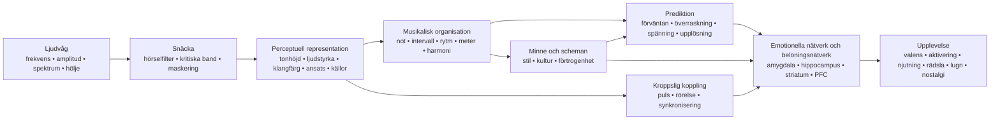

<!-- Translation of: research/sources/author-supplied/sound-expectation-and-emotion.md; source commit: 304d75ed6ff646d311fd9df8b4e2db0d4dee277a -->
# Ljud och känsla: hur akustisk struktur blir till förnimmelse, förväntan och affekt

## Sammanfattning

Relationen ljud–känsla **fungerar inte som en fast ordbok** där en frekvens, ett intervall eller ett ackord nödvändigtvis framkallar en känsla. Vad som finns är en sannolikhetsarkitektur: akustiska egenskaper förändrar fysiologisk aktivering, framträdande drag, förväntan, källseparation, känslan av stabilitet och rörelse; dessa representationer kombineras sedan med kulturellt lärande, självbiografiskt minne, förtrogenhet, stil, kontext och interpretativ avsikt. Tvär­kulturella studier visar två viktiga fakta på en gång: vissa breda musikalisk-emotionella signaler korsar kulturer, men specifika preferenser och betydelser — t.ex. preferensen för konsonans — kan variera avsevärt med kulturell erfarenhet. citeturn22search10turn5search11

Den viktigaste distinktionen är den mellan **fysikalisk egenskap** och **perception**. Frekvens är inte tonhöjd; ljudtryck är inte ljudstyrka; fysisk röstmångfald är inte nödvändigtvis det upplevda antalet röster; spektrum är inte klangfärg. Ett särskilt tydligt fall är den *saknade grundtonen*: lyssnaren kan uppleva en tonhöjd som motsvarar en grundfrekvens som fysiskt saknas i spektrumet, och tonhöjdskänsliga neuroner svarar på harmoniska komplex med saknad grundton. citeturn18search2

Emotionellt uppträder de mest konsistenta effekterna i **tempo, intensitet/ljudstyrka, modus, harmonisk förväntan, dissonans/strävhet, klangfärg och expressivt framförande**, men dessa parametrar samverkar. I kontrollerade studier kan tempo och modus fylla delvis olika funktioner: tempot förändrar starkt *aktiveringen*, medan moduset förändrar stämnings-/valensbedömningar; manipulationer av tonhöjd, intensitet och temporal hastighet förändrar också affektiva dimensioner i både musik och tal. citeturn20search4turn21search7

Musik når också belöningssystem direkt. Intensiv musikalisk njutning har kopplats till dopaminfrisättning i striatum; i Salimpoors och kollegors klassiska studie var **caudatus** mer associerad med anticipation och **nucleus accumbens** med den njutningsfulla toppen. Angenäm och oangenäm musik rekryterar också differentiellt ventralt striatum, amygdala, hippocampus, gyrus parahippocampalis, insula och kortikala regioner. citeturn18search0turn18search1

Detta hjälper till att förklara varför **överraskning inte helt enkelt är "dålig"**. Musik utnyttjar ett mellanläge mellan förutsägbarhet och nyhet: förväntan bygger en modell; avvikelse producerar information; upplösning eller bekräftelse förvandlar en del av den spänningen till belöning. Studier av harmoniska progressioner visar att osäkerhet och överraskning samverkar vid förutsägelse av njutning och aktivitet i auditiv cortex, amygdala och hippocampus; andra arbeten finner en icke-linjär relation mellan förutsägbarhet och njutning. citeturn16search24turn16search1

Praktiskt sett är den avgörande variabeln sällan "vilket ackord är sorgset?" utan **vilken uppsättning ledtrådar som organiseras till vilken temporal bana**. För att framkalla sorgsenhet är t.ex. mollmodus ensamt en ledtråd; att kombinera måttligt/lågt register, långsamt tempo, låg intensitet, mjuka ansatser, legato, låg täthet, fallande konturer och flexibelt temporalt framförande gör kommunikationen långt mer robust. Framförandestudier visar just denna redundans: olika utövare kan kommunicera samma känsla med olika kombinationer av tempo, intensitet, artikulation och klangfärg. citeturn22search4turn22search8

En användbar syntes är:

> **Akustiken sätter möjligheter → perceptionen förvandlar dem till objekt och mönster → prediktion och minne tilldelar betydelse → autonoma, motoriska, limbiska och belöningssystem producerar aktivering, spänning, njutning och minne → kultur och kontext bestämmer mycket av den slutliga emotionella betydelsen.**

Diagrammet bör läsas som ett **nätverk**, inte som en stel neural kedja. Det finns återkommande bearbetning mellan auditiv cortex, motoriska system, minne, värdering och belöning; dessutom kan förtrogenhet och självbiografi djupt förändra upplevelsen av samma akustiska signal. citeturn18search0turn18search1turn15search2

## Från ljudvåg till emotionell hjärna

### Fysik: frekvens, spektrum, hölje och övertoner

Ett musikaliskt ljud kan grovt beskrivas genom sin energifördelning över tid och frekvens. För en periodisk signal motsvarar grundfrekvensen \(f_0\) mönstrets repetitionsfrekvens; akustiska instrument producerar normalt också deltoner ovanför den. I approximativt harmoniska ljud uppträder dessa deltoner nära heltalsmultiplar av \(f_0\). Men **den upplevda tonhöjden är en inferens från hörselsystemet**, inte en enkel avläsning av den lägsta spektralkomponenten. Därför tar borttagandet av \(f_0\) inte nödvändigtvis bort den tonhöjdsupplevelsen. citeturn18search2

**Spektrumet** bestämmer mycket av klangfärgen. Klassiska psykofysiska studier av klangfärgsrum fann dimensioner relaterade till **spektralcentroiden** — starkt associerad med ljushetsupplevelsen —, till ansatsens temporala struktur och till spektral utveckling över ljudet. Senare forskning bekräftar att flera spektrala och temporala dimensioner behövs för att förklara klangfärgslikhet. citeturn21search4turn21search12

**Höljet** beskriver hur energin varierar över tid. ADSR-modellen som används i syntes — *attack, decay, sustain, release* — är en användbar förenkling:

**attack** = initial amplitudstigning;  
**decay** = fall efter toppen;  
**sustain** = approximativt bibehållen nivå medan källan förblir exciterad;  
**release** = utklingning efter att excitationen upphört.

Verkliga instrument har ofta mer komplexa höljen än ett enkelt ADSR, men ansatshastighet och spektro-temporal utveckling påverkar starkt klangfärgsidentitet och perceptuell segmentering. citeturn21search4turn21search23

En abrupt ansats producerar stor transient energi och ofta mer högfrekvent innehåll; långsamma ansatser döljer det exakta ansatstillfället och kan ge en mer kontinuerlig perception. Denna fysikaliska skillnad grundar musikaliska kontraster som **perkussiv ↔ mjuk**, **staccato ↔ legato**, **aggressiv ↔ delikat**, även om den resulterande känslan beror på resten av det musikaliska upplägget. citeturn21search12turn22search4

### Kritiska band, maskering och strävhet

Snäckan utför ingen perfekt Fouriertransform: frekvenser analyseras av hörselfilter med ändlig bredd. Det klassiska begreppet **kritiskt band** demonstrerades experimentellt i fenomen som ljudstyrkesummering, trösklar och maskering: att sprida energi utanför en given bandbredd förändrar hur den kombineras perceptuellt. citeturn21search2turn21search25

Detta är nyckeln till att förstå sensorisk konsonans och dissonans. När närliggande deltoner samverkar inom överlappande hörselregioner kan snabba amplitudfluktuationer producera **svävningar/strävhet**. Plomps och Levelts arbete etablerade en historisk koppling mellan kritisk bandbredd och tonal konsonans, även om verklig musikalisk konsonans också beror på harmonicitet, förtrogenhet och kultur. citeturn21search1turn5search17

**Maskering** betyder att en komponent kan höja en annans hörbarhetströskel. I musikproduktion tillför därför tillagd energi inte nödvändigtvis upplevd information: spektralt konkurrerande lager kan dölja artikulations-, övertons- och transientdetaljer. Det är en direkt brygga mellan psykoakustik och orkestrering/mixning. citeturn21search2

### Från auditiv cortex till belöningssystem

Tonhöjd, klangfärg, rytm och musikalisk struktur bearbetas inte av ett enda "musikcentrum". Ett särskilt starkt neurofysiologiskt exempel är identifieringen av tonhöjdskänsliga kortikala neuroner som svarar på både rena toner och harmoniska komplex med samma upplevda \(f_0\), även när grundtonen saknas. citeturn18search2

När ljud får emotionell betydelse tillkommer ytterligare nätverk. I fMRI producerade bestående dissonant oangenäm musik större aktivitet i amygdala, hippocampus, gyrus parahippocampalis och temporalpoler, medan angenäm musik visade svar som involverade ventralt striatum, insula, auditiv cortex och frontala/operkulära regioner. Detta betyder inte att en region "är" en känsla; det betyder att det musikaliska tillståndet modifierar nätverk som också är involverade i värdering, minne, motivation och handling. citeturn18search1

Belöningskomponenten är särskilt tydlig vid intensiv njutning. Salimpoor m.fl. kombinerade funktionell neuroavbildning och dopaminerga mått och fann striatal dopaminfrisättning under intensivt njutningsfull musik, med temporal differentiering mellan anticipation och hedonisk topp. citeturn18search0

**Nostalgi** illustrerar en annan väg. I självbiografiskt relevant musik fann Janata aktivitet i dorsal medial prefrontal cortex som följde självbiografisk framträdandehet, medan prefrontala och posteriora nätverk deltog i återkallandet av musikassocierade minnen. Således "innehåller" ingen isolerad akustisk egenskap nostalgi; musik fungerar som en åtkomstnyckel till ett personligt minnesnätverk. citeturn15search2turn15search3

Detta förklarar också en väsentlig distinktion: **upplevd känsla** ("denna musik låter sorgsen") är inte identisk med **känd känsla** ("denna musik gör mig sorgsen"). En utövare kan kommunicera sorgsenhet igenkännbart medan lyssnaren samtidigt upplever estetisk njutning. Studier av framförandekommunikation och belöning adresserar just olika nivåer av denna process. citeturn22search4turn18search0

## Tonhöjd, frekvens, noter, intervall, skalor, modi och harmoni

### Tonhöjd, frekvens, not och register

| Element | Fysikalisk/perceptuell mekanism | Evidensstödd emotionell tendens | Musikalisk manipulation och tillämpning |
|---|---|---|---|
| **Frekvens** | Fysikalisk repetitionsfrekvens; relaterar i harmoniska komplex till \(f_0\) men är inte identisk med tonhöjd. citeturn18search2 | Det finns ingen allmän funktion "X Hz = känsla Y". Den emotionella effekten uppstår ur relationer, spektrum, nivå, kontext och inlärning. | Transponering, basdesign, grundtonsval, syntes och EQ. Arbeta med relationer och bana, inte "magiska frekvenser". |
| **Tonhöjd** | Perceptuell representation av periodicitet/grundton, bevarbar även med *saknad grundton*. citeturn18search2 | Höjd tonhöjd tenderar att höja *aktiveringen* i kontrollerade manipulationer; valensbetydelsen beror på klangfärg, kontext och stil. I isolerade violintoner höjde högre tonhöjd *aktiveringen*. citeturn22search2turn22search6 | Höj registret för intensifiering, brådska eller lätthet; sänk för tyngd, stabilitet eller intimitet, och testa alltid klangfärgssamspelet. |
| **Not** | Händelse som kombinerar tonhöjd, ansats, duration, intensitet och klangfärg. | Namnet "C", "Fiss" etc. har ingen påvisad egenkänsla. Även en isolerad not förändras emotionellt när tonhöjd, vibrato och dynamik förändras. citeturn22search2 | Tänk varje not som en multidimensionell händelse: stämföring, hölje, artikulation och melodiskt mål betyder lika mycket som dess tonhöjdsklass. |
| **Register** | Placering av tonhöjder i låga/höga band, som också förändrar instrument­spektrum och maskering. | Högre register höjer ofta aktivering/spänning; låga register kan ge tyngd/kraft, men effekten är varken universell eller separerbar från klangfärgen. citeturn22search2turn21search7 | Reservera registerextremer för strukturella punkter; kontrastera en central sektion med en hög klimax eller subbas för att vidga tillståndsförändringen. |

I komposition är det särskilt användbart att separera **absolut tonhöjd** från **kontur**. Ett uppåtgående språng, progressiv registerackumulation eller en fallande linje skapar rikt­nings­information även när tonaliteten förblir densamma. Affektivt är banan vanligtvis mer informativ än en enskild not.

### Intervall

Ett simultant intervall producerar ett kombinerat spektrum. När de två tonernas deltoner interfererar kraftigt inom samma kritiska regioner stiger strävheten; när de delar hög harmonicitet kan den perceptuella fusionen öka. Denna akustiska komponent hjälper till att förklara en del av sensorisk dissonans, men uttömmer inte den musikaliska konsonansupplevelsen. citeturn21search1turn5search17

Dissonans har också tidiga neurala och affektiva korrelat, och bestående dissonant musik kan förstärka svar i strukturer relaterade till framträdandehet och negativ valens. citeturn18search1

Det är dock ett misstag att förvandla detta till regeln:

> liten sekund = rädsla; liten ters = sorgsenhet; kvint = kraft.

Dessa par kan fungera stilistiskt, men ett intervalls betydelse förändras med **register, melodisk riktning, duration, metrisk position, klangfärg, tonal kontext och kultur**. Själva preferensen för konsonans framför dissonans varierar mellan populationer med olika grader av västerländsk musikexponering. citeturn5search11

**Tillämpning:** små kromatiska intervall skapar effektivt friktion när de håller deltoner nära och utmanar den tonala förväntan; vida språng kan framhäva överraskning, expansion eller instabilitet; uthållna konsonanser tenderar att sänka sensorisk spänning men kan förbli harmoniskt "svävande" om kontexten kräver upplösning.

### Skalor och modi

En skala är en tonhöjdssamling; ett modus lägger till **hierarki, centrum och melodiskt/harmoniskt beteende**. Dur/moll-effekten är ett av den västerländska tonala traditionens mest dokumenterade fenomen: i experiment som manipulerar modus och tempo förändrar moduset stämnings-/valensbedömningar, medan tempot starkt påverkar aktiveringen. citeturn20search4turn20search13

Detta ger den robusta men inte absoluta associationen:

**dur → relativt mer positiv valens**  
**moll → relativt mer negativ/sorgsen valens**

Det betyder inte "moll = sorgsenhet". Ett mollmodus i 170 BPM, med stark intensitet, ljus klangfärg och motorisk rytm, kan producera upphetsning, aggressivitet eller eufori; ett långsamt, glest durmodus med låg dynamik kan låta kontemplativt eller melankoliskt. Den multivariata konfigurationen bestämmer utfallet. citeturn20search4turn21search7

Modi som dorisk, frygisk, lydisk eller mixolydisk får betydelse genom en kombination av **karakteristiska intervall + tonalt centrum + inlärd repertoar**. Det finns långt mindre experimentell evidens som stöder att "lydisk framkallar känsla X" tvär­kulturellt. Tvär­kulturella studier indikerar att lyssnare kan känna igen vissa känslokategorier i kulturellt främmande musik, men visar också att kulturellt lärande starkt modifierar musikaliska bedömningar. citeturn22search10turn5search11

**Tillämpning:** i stället för att välja ett modus efter emotionell etikett, identifiera vilken ton som skiljer det från förväntad dur/moll och **gör den tonen perceptuellt strukturell**. En lydisk ♯4 dold i en passage producerar inte samma effekt som en ♯4 uthållen i framträdande position mot tonikan.

### Harmoni, progressioner och kadenser

| Element | Mekanism | Känsla/perception | Tekniker |
|---|---|---|---|
| **Harmoni** | Simultan tonhöjdskombination → harmonicitet, strävhet, fusion, virtuell bas och inlärda relationer. citeturn21search1turn5search17 | Konsonans tenderar mot större behag hos förtrogna lyssnare; uthållen dissonans kan höja spänning/negativ valens. Preferensen är inte kulturellt invariant. citeturn18search1turn5search11 | Spacing, omvändning, lågt register, extensioner, kluster, stämföringar och kontroll av förberedelse/upplösning. |
| **Progression** | Sekvensen förvandlar ackord till betingade sannolikheter: varje händelse uppdaterar nästa förväntan. | Lägre sannolikhet kan höja överraskning och spänning; njutning kan resultera från specifika osäkerhets-överraskningskombinationer. citeturn16search24turn16search1 | Förbered → avvik → upplös; dominantsubstitut; förlängd subdominant; modulation; pivotackord; kromatik. |
| **Kadens** | Avslutningshändelse som kombinerar basrörelse, skalsteg, stämföring, meter och inlärd förväntan. | Olika kadenser får distinkta valens- och aktiveringsbedömningar; starkt avslut minskar osäkerhet, medan avbrutna kadenser bevarar förväntan. citeturn16search2turn16search6 | Autentisk kadens för avslut; bedräglig för förlängning; halvkadens för svävning; elision för flöde. |

Den vetenskapliga nyckeln här är **prediktion**. En progression är inte emotionell endast genom sina isolerade ackord; den bygger ett sannolikhetsrum. Ett isolerat neutralt ackord kan utlösa ett stort svar om det intar en punkt där den interna modellen förutspådde något annat. Cheung och kollegor visade att **överraskning och osäkerhet samverkar** vid förutsägelse av musikalisk njutning och modulerar auditiv cortex, amygdala och hippocampus. citeturn16search24

Detta ger en förklaring från första principer av harmonisk spänning:

\[
\text{Upplevd spänning}
\approx
f(\text{sensorisk dissonans},
\text{tonal instabilitet},
\text{osannolikhet},
\text{uppskjutande},
\text{energi},
\text{kontext})
\]

Det är inte en bokstavlig fysiologisk ekvation; det är en funktionell dekomposition. Två ackord kan ha liknande strävhet men ändå orsaka olika spänningar eftersom det ena är förväntat och det andra bryter mot den inlärda grammatiken.

För komposition är den kraftfullaste principen att kontrollera **mängden och placeringen av oväntad information**. Konstant överraskning upphör att vara överraskning; total förutsägbarhet minskar informationen. Fältet med störst emotionellt intresse tenderar att ligga mellan extremerna, också observerat i njutnings–förutsägbarhetsstudier. citeturn16search1turn16search24

## Tempo, duration, rytm, meter, mikrotiming och groove

### Tempo och duration

**Tempot** förändrar händelsetätheten per tidsenhet och därmed hastigheten med vilken perceptionssystemet måste uppdatera prediktioner. Det är en av de starkaste emotionella ledtrådarna. Experimentella manipulationer visar att tempoförändringar påverkar *aktiveringen*, och snabbare musik tenderar att producera större aktivering än långsam, även om intensitet, rytm och preferens kan modifiera effekten. citeturn20search4

Effekten uppträder också fysiologiskt: studier med musik under olika tempobetingelser observerade kardiovaskulära, respiratoriska och cerebrovaskulära förändringar, vilket stöder idén att musikaliskt tempo inte bara är en "energi"-metafor; det kan effektivt modifiera det autonoma tillståndet. citeturn7search1

Grovt sett:

| Upplägg | Mest sannolika tendens |
|---|---|
| snabbt + starkt + ljust + artikulerat | hög aktivering; energisk glädje, brådska, ilska eller upphetsning per valens/kontext |
| långsamt + svagt + mörkt + legato | låg aktivering; lugn, ömhet eller sorgsenhet |
| långsamt + starkt + lågt + dissonant | hot, högtidlighet eller tyngd |
| snabbt + låg nivå + oregelbundet | nervositet, instabilitet, oro |

Dessa kombinationer är probabilistiska, inte universella recept. Evidensen om framförandekommunikation visar just att flera akustiska ledtrådar är redundanta och kan ersätta varandra. citeturn22search4turn22search8

**Durationen** verkar på flera nivåer: notduration, ansatsintervall, frasduration och en harmonis uppehållstid. Korta noter ökar händelseseparationen och kan göra pulsen mer explicit; långa noter ökar kontinuiteten och tillåter större spektral utveckling, vibrato och inre dynamik. I studier av expressivt framförande ansluter sig duration och artikulation till en större ledtrådsuppsättning, varför det är farligt att tillskriva "lång not" eller "kort not" en fast känsla. citeturn22search4

I produktion kan en durationsförändring radikalt transformera samma MIDI-sekvens utan att ändra tonhöjd: förkorta *gate* och release för att höja definition/transienter; förläng sustain/release för att fusionera händelser och minska temporal granularitet.

### Rytm och meter

Rytm är den temporala fördelningen av händelser; meter är en struktur av **accentförväntningar**. Hjärnan hör inte bara "hur mycket tid som passerat": den bygger regulariteter och förutspår ansatser. När en not landar där den metriska modellen inte förväntade den, får vi förskjutning, synkopering eller temporal överraskning.

Pulsperceptionen är starkt knuten till det motoriska systemet, även utan explicit fysisk rörelse; neuroavbildningsstudier visar rekrytering av motoriska områden under lyssning till musikalisk rytm, vilket ger en neural grund för kopplingen puls–rörelseimpuls. citeturn7search25turn7search37

**Metern** ensam har mindre direkt evidens för "specifik känsla" än tempo eller modus. Dess huvudsakliga affektiva kraft verkar indirekt: den definierar matrisen mot vilken synkopering, anticipation, fördröjning och accenter bedöms. En stabil meter gör avvikelser läsbara; en redan höggradigt oförutsägbar meter förändrar själva prediktionsreferensen.

Detta implicerar en viktig kompositionsregel:

> **För att producera rytmisk spänning måste det först finnas något temporalt förutsägbart att spänna.**

### Synkopering och groove

Det mest kända experimentella grooveresultatet är den **inverterade U**-kurvan som Witek m.fl. fann: intermediära synkoperingsnivåer producerade större njutning och starkare impuls att röra kroppen än mycket låga eller mycket höga nivåer. citeturn20search2

Logiken liknar harmonins:

**för mycket förutsägbarhet** → liten utmaning;  
**intermediär avvikelse** → tillräckligt tydlig förväntan + ny information;  
**excessivt kaos** → puls­prediktionen försvagas, vilket minskar chansen att "spela mot" rutnätet.

Denna relation är särskilt relevant för funk, hiphop, dansmusik och andra stilar där grooven beror på samspelet mellan en stabil temporal referens och förskjutande händelser. Witek m.fl. fann relationen för både njutning och rörelseimpuls. citeturn20search2

### Mikrotiming

Mikrotiming är förskjutning av händelser med tiotals millisekunder kring en nominell metrisk position. Musikaliskt kan det uppträda som *laid-back*, *pushing*, swing, baskagge­asynkroni, virvelfördröjning eller en utövares individuella timing.

En produktionsmyt är att "kvantiserat = groovelöst" och "imperfekt = mänskligt = bättre". Experiment stöder inte denna allmänna regel. Frühauf och kollegor manipulerade mikrotemporala avvikelser i trumpattern och fann att grooven minskade ju större de artificiella avvikelserna blev; precis alignerad timing kunde få mycket höga bedömningar. citeturn22search5

I ett annat angreppssätt jämförde Senn m.fl. professionella bas/trumframföranden, kvantiserade versioner och överdriven mikrotiming. Originalframförande och kvantisering kunde ge jämförbara groovenivåer, medan överdrivna avvikelser skadade upplevelsen; expertlyssnare var också känsligare för skillnaderna. citeturn22search27

Därför:

\[
\text{effektiv mikrotiming} \neq \text{slumpmässigt fel}
\]

Det är **relationell struktur**. Virvelfördröjningen kan fungera eftersom kick, bas, hi-hat och subdivision bildar konsistenta referenser. Att randomisera varje not ±20 ms förstör just de relationer som gör en pocket igenkännbar.

### Jämförande temporal karta

| Element | Fysik/perception | Mest associerade känslor | Praktiska tekniker |
|---|---|---|---|
| **Tempo** | Global händelse/puls-hastighet. | Snabbt → ↑ aktivering; långsamt → ↓ aktivering, i genomsnitt. citeturn20search4 | BPM-automation, perceptuell halvtid/dubbeltid, ritardando, accelerando. |
| **Duration** | Temporal utsträckning av händelse/hölje. | Kort kan höja aktivitet/definition; lång kan gynna kontinuitet/lugn eller uthållen spänning; höggradigt kontextuell. citeturn22search4 | Gate, notlängd, sustain, release, fermat. |
| **Rytm** | Ansats- och durationsmönster. | Regularitet gynnar prediktion; störning ger förväntan/överraskning. | Ostinato, synkopering, anticipation, tystnad, täthet. |
| **Meter** | Hierarki av starka/svaga pulser. | Effekt huvudsakligen via stabilitet och förväntansbrott. | Stabil 4/4, additiva metrar, motaccenter, hemiol. |
| **Mikrotiming** | Submetriska ansatsavvikelser. | Kan ge pocket/brådska/avslappning; excess minskar grooven. citeturn22search5turn22search27 | Fördröj virvel, anticipiera bas, swing, timing per instrument. |
| **Groove** | Integration av puls, synkopering, pattern och motorisk koppling. | Njutning + rörelseimpuls; intermediär synkopering maximerar ofta båda. citeturn20search2 | Stabilt lager + kontrollerade avvikelser; interlocking; repetition med mikrovariation. |

## Klangfärg, intensitet, dynamik, artikulation, textur, register och orkestrering

### Klangfärg

Klangfärg är inte en enkel dimension. Den uppstår ur **spektrum, harmonisk och brusfördelning, ansats, avklingning, modulationer, inharmonicitet och temporal utveckling**. Psykofysiskt hör spektralcentroid och ansatsegenskaper till huvudaxlarna som differentierar instrumentala ljud. citeturn21search4turn21search12

Den emotionella konsekvensen är djupgående: samma melodiska material kan byta karaktär när instrumentet byts. Hailstone m.fl. visade experimentellt att klangfärg påverkar musikalisk-känslobedömningar oberoende av flera andra kontrollerade musikaliska faktorer. citeturn20search5

En användbar operationell beskrivning:

**högre spektralcentroid / mer hög energi** → större "ljushet", penetration, möjlig högre aktivering;  
**mer brus, inharmonicitet och strävhet** → större framträdandehet, hårdhet, möjligt hot/spänning;  
**abrupt ansats** → större definition och impulsivitet;  
**långsam ansats** → lägre ansatsframträdandehet och större fusion;  
**stark stabil harmonisk komponent** → tydlig tonhöjd/fusion;  
**diffust/brusigt spektrum** → tonhöjdsambiguitet och textur.

Dessa dimensioner har ingen fast valens. Ljushet kan betyda glädje på en hög flöjt eller aggressivitet på en distorderad gitarr; brus kan representera hot, energi, extas eller helt enkelt en stilistisk konvention.

**Syntestillämpning:** för att höja spänningen utan att ändra harmonin, höj progressivt spektralcentroiden, öka brus/inharmonicitet, förkorta ansatsen eller introducera spektral modulation. För att upplösa spänningen, utför den omvända rörelsen.

### Intensitet och dynamik

Fysiskt relaterar intensitet till ljudenergi/tryck; perceptuellt är korrelatet **ljudstyrka**, vars relation till fysisk nivå beror på frekvens, duration, kontext och spektral fördelning. Begreppet kritiskt band visar att hörselsystemet summerar energi beroende på hur den sprids över hörselfilter. citeturn21search2turn21search25

I musik är större intensitet en klassisk ledtråd för **aktivering, kraft och brådska**, men samverkar återigen med andra dimensioner. Ilie och Thompson fann att intensitet, tonhöjd och temporal hastighet modifierar affektiva dimensioner i musikaliska och talstimuli. citeturn21search7

En nyare studie med isolerade violintoner visar också varför enkla regler misslyckas: i det experimentella upplägget hade tonhöjd och vibrato starkare affektiva effekter än dynamik, och dynamikeffekterna följde inte nödvändigtvis karikatyren "starkare = mer aktivering" i alla betingelser. citeturn22search2turn22search6

**Dynamik** är mer än absolut nivå:

- **crescendo** skapar en positiv energiderivata, ofta läst som närmande, intensifiering eller ankomst;
- **decrescendo** kan producera tillbakadragande/upplösning;
- **sforzando/accent** höjer framträdandehet och överraskning;
- **subito piano** kan producera stark kontrast utan att vara fysiskt intensivt;
- **excessiv kompression** krymper utrymmet mellan intensitetstillstånd och reducerar potentiellt en viktig expressiv dimension.

Den emotionella principen är att hjärnan svarar inte bara på värden utan också på **förändringar**.

### Artikulation

Artikulation kontrollerar den temporala och spektrala relationen mellan noter: effektiv längd, ansatsklarhet, överlappning och mellantystnad.

**staccato**: korta durationer, större separation, perceptuellt tydliga ansatser;  
**legato**: överlappning/förbindelse, energikontinuitet;  
**marcato/accent**: större ansatsframträdandehet;  
**tenuto**: bibehållande av duration/energi.

I Juslins experiment kunde professionella musiker kommunicera ilska, sorgsenhet, glädje och rädsla genom akustiska ledtrådskombinationer som inkluderade **tempo, nivå, artikulation och klangfärg**; lyssnare använde kompatibla ledtrådar, och olika utövare kunde nå liknande resultat via distinkta kombinationer. citeturn22search4turn22search8

Detta är mycket viktigt för MIDI-komposition: att programmera endast rätt noter bevarar en bråkdel av budskapet. **Velocity, notlängd, överlappning, timing, ansats och frasdynamik** kan avgöra om samma sekvens upplevs som mekanisk, öm, aggressiv, tvekande eller glad.

### Textur

Textur lägger till ytterligare en variabel: **hur många simultana perceptuella strömmar som finns och hur de förhåller sig till varandra**.

I tre experiment med polyfona utdrag manipulerade/studerade Broze m.fl. röstmångfald och fann att texturer med fler röster bedömdes **gladare, mindre sorgsna, mindre ensamma och stoltare**. Bedömningarna följde nära rösternas upplevda numerositet. citeturn17view3

Detta fynd är särskilt intressant eftersom det visar att känsla kan uppstå ur en strukturell dimension som varken är "melodi" eller "ackord". Men mekanismerna själva är kontextuella: en massa av hundra aggressiva röster behöver uppenbarligen inte låta gladare än en ensam röst. Studien demonstrerar en effekt i specifika polyfona stimuli, inte en universell täthetslag. citeturn17view3

I praktiken:

**monofoni** → exponering, sårbarhet, klarhet, potentiell ensamhet;  
**tät homofoni** → massa, kraft, gemenskap;  
**polyfoni** → aktivitet, komplexitet, oberoende;  
**bordun** → stabilitet eller svävning;  
**kluster/ljudmassa** → fusion, strävhet, källambiguitet.

Den emotionella effekten beror huvudsakligen på **täthet × klangfärg × register × intensitet × inre rörelse**.

### Orkestrering

Orkestrering manipulerar simultant spektrum, register, källantal, placering, ansats, hölje och dynamik. Den är således ett slags psykoakustisk "makrokontroll".

Den instrumentala klangfärgens emotionella kraft finner direkt stöd i Hailstone m.fl.; dessutom visar experiment som jämför instrumentala versioner att instrumentering kan förändra aktiveringen medan relaterat musikaliskt material behålls. citeturn20search5turn10search10

En praktisk läsning:

| Mål | Akustisk-orkestrala strategier |
|---|---|
| **intimitet** | få källor, nära register, låg nivå, mjuka ansatser, smal spektral bredd |
| **storhet** | vitt registerspann, fördubblingar, solid bas, hög mångfald, dynamisk uppbyggnad |
| **hot** | energirika låga toner + strävhet + brus + starka ansatser + dissonans + låg förutsägbarhet |
| **lätthet** | mindre spektral massa, delikata transienter, mellan/högt register, luckor mellan händelser |
| **mysterium** | delvis ambig tonhöjd, långsamma ansatser, måttlig inharmonicitet, borduner, låg händelsetäthet |
| **klimax** | simultan expansion av intensitet, register, täthet, ljushet och händelsefrekvens |

Det effektivaste sättet att bygga en klimax är vanligtvis inte att maximera allt från starten; det är att **bevara akustiska frihetsgrader för att öppna dem senare**.

## Ornamentik och framförandetekniker

Mänskligt framförande introducerar kontinuerlig rörelse i parametrar som notation vanligtvis representerar diskret. Det är där vibrato, portamento, glissando, drill, rubato, accent och mikrodynamik förvandlar "noten" till expressivt beteende.

### Vibrato

Vibrato är en periodisk modulation — mestadels av frekvens/tonhöjd, ofta åtföljd av amplitud- och spektrumkomponenter beroende på instrument. Dess parametrar inkluderar:

\[
\text{hastighet} \quad+\quad \text{djup} \quad+\quad \text{start} \quad+\quad \text{regelbundenhet}
\]

I en kontrollerad studie med violinljud som varierade tonhöjd, dynamik och vibrato var vibrato den näst mest inflytelserika faktorn: större vibrato tenderade att **sänka valensen och höja aktiveringen**, medan högre tonhöjd också höjde aktiveringen. citeturn22search2turn22search6

Detta implicerar inte "vibrato = sorgsenhet". I verkligt framförande kan vibrato kommunicera värme, passion, spänning, sårbarhet, ysterhet eller intensitet eftersom dess betydelse beror på hastighet, bredd, start, strukturell not och stilistisk tradition.

**Tillämpning:** applicera inte uniformt vibrato på varje not. Kontrollera dess **bana**: att börja utan vibrato och vidga det över en not producerar en annan intensifiering än att börja med brett vibrato och minska det.

### Portamento och glissando

**Portamento** förbinder två tonhöjder genom en perceptuellt expressiv kontinuerlig övergång; **glissando** gör vägen mer explicit hörbar och kan spänna över ett vitt omfång.

Fysiskt förvandlar båda ett diskret frekvenssprång till en **kontinuerlig \(f_0\)-bana**. Detta höjer den temporala informationen inuti noten och kan generera anticipation, närmande mot eller avvikelse från målet.

Isolerad kausal evidens för portamento/glissando, bortsett från alla andra emotionella parametrar, är mycket knappare än för tempo, modus eller vibrato. Därför bör tillskrivningar som "portamento = nostalgi" behandlas som stilistiska och framförandemässiga konventioner, inte psykoakustiska lagar.

I praktiken:

**långsamt uppåtgående portamento** → betonar akten att anlända;  
**tonhöjdsfall** → kan kommunicera avslappning, klagan eller upplösning per kontext;  
**snabbt glissando** → överraskning, gest, komik eller hot per klangfärg;  
**selektivt portamento** → höjer expressiviteten genom kontrast mot oglidade noter.

### Drill och andra snabba ornament

Drillen alternerar snabbt två tonhöjder och höjer därmed temporal täthet, spektral modulation och lokal osäkerhet. Beroende på hastighet upplever lyssnaren alternerande noter eller en mer fusionerad textur.

Fysiskt finns en övergång från ett **diskret-händelse**-läge till **temporal modulation/strävhet** när hastigheten växer. Emotionellt kan detta ge upphetsning, elegant ornamentik, instabilitet eller spänning, men betydelsen är höggradigt stilistisk.

Samma resonemang täcker mordenter, tremolo och flatter:

- fler händelser per sekund → generellt större perceptuell aktivitet;
- större modulation → större framträdandehet;
- regularitet → förutsägbarhet;
- irregularitet → instabilitet;
- närmande till strukturellt viktiga noter → större förväntan.

### Rubato

Rubato omorganiserar mikro- och makrotid utan att nödvändigtvis förändra det globala medeltempot. Det modifierar direkt prediktionsfältet: att fördröja en ankomstpunkt förlänger förväntan; att komprimera tiden efter fördröjningen kan skapa driv.

Rubato tänks bättre som **frasens temporala krökning**, inte oprecision. Det emotionella framförande som Juslin studerade demonstrerar att timing, artikulation, dynamik och klangfärg bildar en redundant kod som utövare använder för att kommunicera igenkännbara känslor. citeturn22search4

För expressivitet:

\[
\text{användbart rubato} = \text{strukturrelaterad avvikelse}
\]

och inte

\[
\text{användbart rubato} = \text{slumpmässigt jitter}
\]

Att systematiskt fördröja en klimax, en appoggiatura eller en kadensupplösning kommunicerar avsikt; att slumpmässigt skifta varje not degraderar helt enkelt förutsägbarheten.

### Jämförda framförandetekniker

| Teknik | Huvudsaklig akustisk förändring | Sannolik emotionell effekt | Användning |
|---|---|---|---|
| **Vibrato** | tonhöjds/amplitud/spektrum-modulation | ↑ aktivering vid intensivare vibrato i violinstudie; kontextberoende valens. citeturn22search2 | notklimax, värme, spänning, intensitet |
| **Portamento** | kontinuerlig väg mellan tonhöjder | närmande, klagan, sensualitet, stilistisk nostalgi; begränsad isolerad evidens | röster, stråkar, synthlead |
| **Glissando** | vitt tonhöjdssvep | gest, överraskning, perceptuell acceleration, hot/komik per klangfärg | övergångar, risers, harpa, stråkar, synth |
| **Drill** | snabb alternering mellan tonhöjder | upphetsning/instabilitet/ornament | suspense, kadens, briljans |
| **Tremolo** | snabb repetition/modulation | aktivering, förväntan, uthållen energi | stråkar, gitarr, percussion |
| **Rubato** | strukturerad tidsdeformation | förväntan, tvekan, expansion, intimitet | melodisk frasering |
| **Accent** | lokal ansats/intensitet | framträdandehet, överraskning, kraft | meter, groove, klimax |
| **Legato** | överlappning och utjämnade ansatser | kontinuitet; ofta associerat med mindre abrupta tillstånd | lugn, lyrik, kontextuell sorgsenhet/ömhet |
| **Staccato** | reducerad duration och separation | större segmentering/aktivitet; kan signalera lätthet eller aggressivitet | dans, humor, brådska |
| **Inre dynamik** | variabelt hölje inom noten | närmande/tillbakadragande och intensifiering | blås, röst, stråkar, synthautomation |

För portamento, glissando och drill är den specifika experimentella litteraturen avsevärt mindre omfattande än för tempo, ljudstyrka, klangfärg, modus, groove eller vibrato; ovanstående tillämpningar är därför akustisk-musikaliska inferenser och framförandekonventioner, inte universella emotionella motsvarigheter.

## Jämförande syntes, tillämpningar och nyckelstudier

### Fullständig karta element → mekanism → känsla → teknik

| Element | Dominerande mekanism | Mest försvarbara emotionella effekt | Hur man utnyttjar |
|---|---|---|---|
| **Tonhöjd** | upplevd periodicitet | ↑ tonhöjd ofta ↑ aktivering. citeturn22search2 | registerbana, språng, klimax |
| **Frekvens** | fysikalisk oscillation | ingen fast känsla per Hz | harmoniska relationer, spektrum, subbas |
| **Klangfärg** | spektrum + hölje | förändrar känsla även med kontrollerat musikaliskt material. citeturn20search5 | ljushet, brus, ansats, inharmonicitet |
| **Intensitet** | energi/tryck → ljudstyrka | ofta aktivering/kraft; interaktiv effekt. citeturn21search7 | nivå, accent, kontrast |
| **Duration** | temporal utsträckning | modulerar aktivitet/kontinuitet; lite deterministisk ensam | gate, sustain, tystnad |
| **Rytm** | ansatsmönster | prediktion, överraskning, motorisk aktivering | synkopering, ostinato, täthet |
| **Meter** | pulshierarki | strukturerar förväntan | förskjutning, hemiol, additiv meter |
| **Tempo** | global hastighet | stark aktiveringsdeterminant. citeturn20search4 | BPM, ritardando, accelerando |
| **Not** | tonhöjd + hölje + klangfärg + nivå | ingen tonhöjdsklass har påvisad egenkänsla | behandla noten som en multidimensionell händelse |
| **Intervall** | spektral interaktion + tonal relation | strävhet/dissonans kan höja spänning; betydelse­kontext­beroende. citeturn21search1 | spacing, riktning, register |
| **Skala** | tonhöjdssamling/statistik | huvudsakligen relationell/kulturell betydelse | karakteristiska toner och hierarki |
| **Modus** | tonal hierarki | dur/moll påverkar valens/stämning hos förtrogna lyssnare. citeturn20search4 | modalinterchange, modal blandning |
| **Harmoni** | simultanitet + harmonicitet + tonalt schema | konsonans/dissonans och stabilitet påverkar njutning/spänning. citeturn18search1turn5search11 | stämföringar, extensioner, kromatik |
| **Progression** | sekventiell prediktion | överraskning + osäkerhet modulerar spänning och njutning. citeturn16search24 | förberedelse/avvikelse/upplösning |
| **Kadens** | probabilistiskt/tonalt avslut | olika avslut förändrar valens/aktivering och fullständighet. citeturn16search2 | autentisk, bedräglig, halvkadens |
| **Artikulation** | ansats + duration + överlappning | ansluter sig starkt till expressiv kommunikation, med andra ledtrådar. citeturn22search4 | legato/staccato/marcato |
| **Dynamik** | ljudstyrkebana | crescendo/kontrast modulerar aktivering och framträdandehet | automation, swell, subito |
| **Ornamentik** | snabba lokala modulationer | intensifierar aktivitet, framträdandehet och förväntan; höggradigt stilberoende | drill, mordent, tremolo |
| **Textur** | antal/separation av strömmar | fler röster var mer positiva och mindre ensamma i kontrollerade stimuli. citeturn17view3 | monofoni ↔ massa/polyfoni |
| **Register** | spektral/tonhöjds-position | extremer höjer framträdandehet; högt tenderar att höja aktivering i tonhöjdsmanipulationer | registerexpansion/kontraktion |
| **Orkestrering** | kombination av klangfärg, register och källor | instrumentering förändrar aktivering och affektiv karaktär. citeturn20search5turn10search10 | täthet, fördubbling, klangfärgskontrast |
| **Mikrotiming** | millisekundavvikelser | groove­relationen är strukturell; mer avvikelse är inte automatiskt bättre. citeturn22search5turn22search27 | pocket, laid-back, push |
| **Groove** | puls + synkopering + motorisk prediktion | njutning och rörelseimpuls; frekvent maximum vid intermediär komplexitet. citeturn20search2 | förutsägbar bas + kontrollerad synkopering |
| **Framförande** | kontinuerlig kombination av timing, nivå, klangfärg, tonhöjd | utövare kommunicerar känslor via redundanta ledtrådar. citeturn22search4 | frasering och ledtrådskoordination |

### Hur man komponerar efter känsla utan att falla i formler

Den robustaste metoden arbetar i **vektorer**, inte enskilda element.

För **lugn**, sänk aktiveringen på flera axlar på en gång: måttligt/långsamt tempo, låg ansatstäthet, rundade ansatser, liten strävhet, stabil dynamik, icke-extremt register, tillräcklig förutsägbarhet och längre release. Litteraturen om tempo, intensitet och uttryck stöder dessa relationer som tendenser, inte garantier. citeturn20search4turn21search7turn22search4

För **sorgsenhet** kan ett mollmodus förstärka negativ valens, men blir långt effektivare med låg aktivering: långsamt tempo, förbunden artikulation, reducerad intensitet och lägre täthet. citeturn20search4turn22search4

För **glädje**, höj valens och ofta aktivering: större metrisk förutsägbarhet, livligare tempo, mindre hårda klangfärger, tydlig artikulation, durmodus där stilistiskt relevant, och socialt "fulla" texturer. Det positiva inflytandet av större röstmångfald demonstrerades i ett kontrollerat polyfont musikset. citeturn17view3turn20search4

För **rädsla/hot**, kombinera hög framträdandehet med negativ valens: strävhet, dissonans, låg förutsägbarhet, abrupta ansatser, registerextremer, brus, plötslig dynamik och händelser vars timing bryter förväntan. Associationen av bestående dissonans med amygdala/hippocampus-aktivitet och andra affektiva strukturer ger experimentell grund för en del av denna effekt. citeturn18search1

För **spänning** är det centrala verktyget **uppskjutandet**: etablera en förväntan och blockera temporärt dess uppfyllelse. Detta kan ske harmoniskt, rytmiskt, melodiskt, dynamiskt eller registralt. Studier av musikalisk överraskning visar att förväntan och osäkerhet är centrala för affektiv och hedonisk respons. citeturn16search24turn16search1

För **överraskning**, bevara först viss redundans. Ett förväntansbrott är informativt endast om det fanns en tillräckligt stabil modell att bryta. citeturn16search24

För **groove och kroppslig njutning**, maximera inte komplexiteten: håll pulsen återvinningsbar och placera tillräckligt med synkopering för att mobilisera prediktion och rörelse. Den experimentella evidensen gynnar en intermediär synkoperingszon. citeturn20search2

För **nostalgi**, sök inte en specifik frekvens. Förtrogenhet och självbiografisk association betyder långt mer. Musik bunden till personlig historia rekryterar prefrontala nätverk associerade med självbiografiskt minne och personlig framträdandehet. citeturn15search2

### Tillämpning i arrangemang och produktion

I **arrangemanget**, tänk känslan som perceptuell resurshantering. En sektion kan göras större utan att ändra något ackord: fördubbla oktaver, expandera register, höj röstantalet, lägg till transienter, höj ljusheten och vidga dynamiken. Varje steg modifierar dimensioner med distinkta psykoakustiska korrelat. citeturn21search4turn17view3

I **produktionen** är EQ och syntes inte bara tekniska processer. Att ändra spektralcentroiden ändrar ljusheten; en kompressor förändrar hölje och kontrast; mättning introducerar övertoner och potentiell strävhet; reverb förlänger energin och minskar temporal skärpa; transientformning modifierar ansatsen; kvantisering modifierar temporal förväntan; velocity och automation förändrar ljudstyrka och klangfärg simultant. De perceptuella klangfärgs- och höljesdimensioner som demonstrerats i psykofysik grundar dessa manipulationer. citeturn21search4turn21search12

**Maskering** introducerar ytterligare en princip: ett emotionellt "stort" arrangemang behöver inte ha fler element, utan perceptuellt urskiljbara. Om två lager intar liknande filter och ömsesidigt maskerar sina ansatser/övertoner, kan höjning av båda minska klarheten i stället för att höja effekten. citeturn21search2

I **basen** förtjänar spacings och stämföringar särskild uppmärksamhet: hörselfilterbredd, harmonisk täthet och svävningsfrekvenser gör att kompakta strukturer i låga register ofta producerar mer interaktion/strävhet än samma intervall i högre register. Principen härleds från relationen kritisk-bandbredd–sensorisk-konsonans. citeturn21search1

I **elektronisk musik** tillåter detta att bygga känsla utan komplex tonalitet: en enda tonhöjd kan genomlöpa helt olika tillstånd genom filterautomation, hölje, distorsion, spektral bredd, rytmisk täthet, mikrotiming och intensitet. Klangfärg, rytm och förväntan ger redan flera oberoende affektiva kanaler. citeturn20search5turn20search2

### Tillämpning i framförande

För utövare är litteraturens största resultat att känslan inte bör "läggas" uteslutande i tempot eller uteslutande i dynamiken. Studier visar **ledtrådsredundans**: lyssnaren kombinerar tempo, intensitet, artikulation, klangfärg och andra variabler för att inferera den emotionella avsikten. citeturn22search4turn22search8

Detta föreslår en framförandestrategi på tre skalor:

**Makro:** välj tempo-, dynamik- och täthetsbanan för hela sektionen.

**Meso:** ge varje fras ett mål — expansion, svävning, acceleration, upplösning.

**Mikro:** bestäm ansats, duration, intensitet, vibrato, portamento och timing för strukturella noter.

En effektiv expressiv interpretation tenderar att peka dessa skalor i samma riktning. En klimax som simultant vinner tonhöjd, intensitet, täthet, vibrato och temporal brådska innehåller redundanta intensifieringsledtrådar; redundans höjer emotionell läsbarhet, exakt som experimentellt observerat i framförandekommunikation. citeturn22search4

### Vad evidensen stöder — och vad den inte stöder

Forskningen stöder med tillförsikt att akustiska och strukturella egenskaper **systematiskt förändrar affektiva dimensioner**. Tempo, modus, intensitet, tonhöjd, klangfärg, förväntan, konsonans/dissonans, rösttäthet, synkopering och framförande är mätbara och experimentellt manipulerbara. citeturn20search4turn20search5turn17view3turn20search2

Den stöder inte att bygga en universell tabell som:

> 440 Hz = känsla A  
> 432 Hz = känsla B  
> liten ters = sorgsenhet  
> D-dorisk = hopp  
> 120 BPM = glädje.

Tonhöjd är inte ens ekvivalent med enkel fysikalisk frekvens, som den *saknade grundtonen* visar; och konsonans- och känsloeffekter varierar med exponering och kultur. citeturn18search2turn5search11

Det är inte heller lämpligt att säga "amygdalan är det musikaliska rädslocentret" eller "nucleus accumbens är njutningscentret". Studier visar **distribuerade nätverk**, där auditoriska, motoriska, mnestiska, evaluativa och belöningsregioner dynamiskt samverkar. citeturn18search0turn18search1turn15search2

Slutligen bör **närmande/undvikande** användas försiktigare än valens och aktivering. Ett högaktiverat ljud kan inducera närmande när det är njutningsfullt — dans, extas, groove — eller vaksamhet/undvikande när det är hotfullt. Samma akustiska energi kan därför nära motsatta motivationstillstånd beroende på valens, prediktion och kontext. Samexistensen av belöningssvar på intensivt upphetsande musik och negativa svar på oangenäm dissonans illustrerar denna punkt. citeturn18search0turn18search1

### Väsentliga primärstudier

För **tonhöjd och neural representation** är Bendor & Wang (2005), *The neuronal representation of pitch in primate auditory cortex*, fundamental för att påvisa neuroner som bevarar tonhöjd även med *saknad grundton*. citeturn18search2

För **kritiska-band- och konsonanspsykoakustik** förblir Zwicker, Flottorp & Stevens (1957), *Critical Band Width in Loudness Summation*, och Plomp & Levelt (1965), *Tonal Consonance and Critical Bandwidth*, grundläggande referenser. citeturn21search2turn21search1

För **klangfärg** etablerar McAdams m.fl. (1995), *Perceptual scaling of synthesized musical timbres*, perceptuella spektrala och temporala dimensioner; Hailstone m.fl. (2009), *Timbre affects perception of emotion in music*, demonstrerar klangfärgens bidrag till upplevd känsla. citeturn21search4turn20search5

För **tempo, modus, tonhöjd och intensitet** är Husain, Thompson & Schellenberg (2002) och Ilie & Thompson (2006) centrala referenser i kontrollerade manipulationer av akustisk-musikaliska ledtrådar och affektiva dimensioner. citeturn20search4turn21search7

För **emotionellt framförande** visar Juslin (2000), *Cue Utilization in Communication of Emotion in Music Performance*, empiriskt hur musiker och lyssnare konvergerar i användningen av multipla expressiva ledtrådar. citeturn22search4

För **känsla och hjärna** visar Koelsch m.fl. (2006), *Investigating emotion with music: an fMRI study*, differentiella svar på konsonant/angenäm vs. bestående dissonant/oangenäm musik. citeturn18search1

För **njutning och dopamin** kopplar Salimpoor m.fl. (2011), *Anatomically distinct dopamine release during anticipation and experience of peak emotion to music*, musikalisk njutning till striatal dopaminerg frisättning och differentierar anticipation från hedonisk topp. citeturn18search0

För **överraskning, förväntan och belöning** ger Cheung m.fl. (2019), *Uncertainty and Surprise Jointly Predict Musical Pleasure and Amygdala, Hippocampus, and Auditory Cortex Activity*, och Gold m.fl. (2019), *Predictability and Uncertainty in the Pleasure of Music*, evidens för att musikalisk njutning beror på samspelet mellan prediktion och ny information. citeturn16search24turn16search1

För **groove** demonstrerar Witek m.fl. (2014), *Syncopation, Body-Movement and Pleasure in Groove Music*, den inverterade U-relationen mellan synkoperad komplexitet, njutning och rörelseimpuls. citeturn20search2

För **mikrotiming** är Frühauf m.fl. (2013), *Music on the Timing Grid*, och Senn m.fl. (2016), *The Effect of Expert Performance Microtiming on Listeners' Experience of Groove*, särskilt användbara eftersom de motsäger den förenklade idén att mer temporal avvikelse nödvändigtvis betyder mer groove. citeturn22search5turn22search27

För **textur** ger Broze m.fl. (2014), *Polyphonic Voice Multiplicity, Numerosity, and Musical Emotion Perception*, sällsynt experimentell evidens för att det upplevda röstantalet förändrar den upplevda känslan. citeturn17view3

För **nostalgi och självbiografiskt minne** visar Janata (2009), *The Neural Architecture of Music-Evoked Autobiographical Memories*, associationen mellan självbiografiskt framträdande musik och medial prefrontal cortex. citeturn15search2

För **kultur och universalitet** demonstrerar Fritz m.fl. (2009), *Universal Recognition of Three Basic Emotions in Music*, viss tvär­kulturell igenkänning av basala känslor; detta resultat bör läsas tillsammans med studier som McDermott m.fl., som visar starkt kulturellt inflytande på konsonanspreferensen. citeturn22search10turn5search11

Syntesen av all denna litteratur är ett perspektivskifte: **musikalisk känsla lever inte i isolerade noter, frekvenser eller ackord. Den uppstår ur den temporala transformationen av akustisk energi till perception, prediktion, rörelse, minne och värde.** Komposition kontrollerar sannolikheterna; framförande ger dessa sannolikheter bana; hjärnan tolkar dem i ljuset av en kropp, en kultur och en personlig historia.
