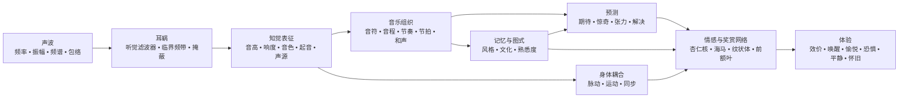

<!-- Translation of: research/sources/author-supplied/sound-expectation-and-emotion.md; source commit: 304d75ed6ff646d311fd9df8b4e2db0d4dee277a -->
# 声音与情感：声学结构如何变成感觉、期待与情感

## 执行摘要

声音–情感关系**并非一部固定词典**，其中某个频率、音程或和弦必然产生某种情感。实际存在的是概率架构：声学特征改变生理唤醒、显著性、期待、声源分离、稳定感与运动感；这些表征随后与文化学习、自传体记忆、熟悉度、风格、语境和演绎意图相结合。跨文化研究同时显示了两个重要事实：一些宽泛的音乐情感信号跨越文化，但具体的偏好与意义——例如对协和的偏好——可随文化经验而大不相同。citeturn22search10turn5search11

最重要的区分是**物理属性**与**知觉**之间的区分。频率不是音高；声压不是响度；物理上的声部数量不必然是知觉到的声部数量；频谱不是音色。一个特别清晰的例子是*缺失基频*：听者可能感知到与频谱中物理缺失的基频相对应的音高，而音高敏感神经元会对缺失基频的谐波复合音作出反应。citeturn18search2

在情感上，最一致的效应出现在**速度、强度/响度、调式、和声期待、不协和/粗糙度、音色与富有表现力的演奏**中，但这些参数相互作用。在受控研究中，速度与调式可承担部分不同的功能：速度强烈改变*唤醒*，而调式改变心境/效价评分；音高、强度与时间速率的操控也会改变音乐与言语中的情感维度。citeturn20search4turn21search7

音乐还直接触及奖赏系统。强烈的音乐愉悦与纹状体多巴胺释放相关；在 Salimpoor 等人的经典研究中，**尾状核**更多与期待相关，而**伏隔核**与愉悦峰值相关。愉快与不愉快的音乐还差异性地招募腹侧纹状体、杏仁核、海马、海马旁回、脑岛与皮层区域。citeturn18search0turn18search1

这有助于解释为什么**惊奇并不简单地是"坏的"**。音乐利用可预测性与新颖性之间的中间状态：期待建立模型；偏离产生信息；解决或确认将部分张力转化为奖赏。和声进行研究显示，不确定性与惊奇在预测愉悦以及听觉皮层、杏仁核与海马活动时相互作用；其他工作发现可预测性与愉悦之间存在非线性关系。citeturn16search24turn16search1

在实践中，决定性变量很少是"哪个和弦是悲伤的？"，而是**哪组线索被组织成何种时间轨迹**。例如，要产生悲伤，单用小调式只是一条线索；结合中/低音区、慢速、低强度、柔和起音、连奏、低密度、下行线条与灵活的时间演奏，会使传达稳健得多。演奏研究恰恰显示了这种冗余：不同演奏者可以用速度、强度、发音与音色的不同组合传达相同情感。citeturn22search4turn22search8

一个有用的综合是：

> **声学设定可能性 → 知觉将其变为对象与模式 → 预测与记忆赋予意义 → 自主、运动、边缘与奖赏系统产生唤醒、张力、愉悦与记忆 → 文化与语境决定最终情感意义的大部分。**

该图应读作**网络**，而非僵硬的神经链。听觉皮层、运动系统、记忆、评价与奖赏之间存在循环处理；而且熟悉度与自传体经历可深刻改变对同一声学信号的体验。citeturn18search0turn18search1turn15search2

## 从声波到情感脑

### 物理学：频率、频谱、包络与泛音

乐音可粗略地由其能量在时间与频率上的分布来描述。对于周期信号，基频 \(f_0\) 对应模式的重复率；原声乐器通常还在其上方产生分音。在近似谐和的声音中，这些分音出现在 \(f_0\) 整数倍附近。然而，**感知到的音高是听觉系统的推断**，不是对最低频谱成分的简单读数。因此去除 \(f_0\) 不必然去除那种音高感觉。citeturn18search2

**频谱**决定音色的大部分。经典的音色空间心理物理学研究发现了与**频谱质心**（与明亮感强烈相关）、起音时间结构以及声音全程频谱演变相关的维度。后来的研究证实，需要多个频谱与时间维度才能解释音色相似性。citeturn21search4turn21search12

**包络**描述能量如何随时间变化。合成中使用的 ADSR 模型——*起音（attack）、衰减（decay）、保持（sustain）、释音（release）*——是一个有用的简化：

**起音** = 振幅的初始上升；  
**衰减** = 峰值后的下降；  
**保持** = 声源持续受激时的近似持续电平；  
**释音** = 激励结束后的消退。

真实乐器的包络通常比简单的 ADSR 更复杂，但起音速度与频谱–时间演变极大地影响音色身份与知觉切分。citeturn21search4turn21search23

突发的起音产生大的瞬态能量，且常含更多高频成分；缓慢的起音模糊确切的起始时刻，可产生更连续的知觉。这一物理差异奠定了音乐对比的基础，如**打击性 ↔ 柔和**、**断奏 ↔ 连奏**、**攻击性 ↔ 细腻**，尽管最终的情感取决于其余音乐布局。citeturn21search12turn22search4

### 临界频带、掩蔽与粗糙度

耳蜗不执行完美的傅里叶变换：频率由有限带宽的听觉滤波器分析。经典的**临界频带**概念在响度总和、阈值与掩蔽现象中得到实验证明：将能量扩散到给定带宽之外会改变其知觉组合方式。citeturn21search2turn21search25

这是理解感觉协和与不协和的关键。当相邻分音在重叠的听觉区域内相互作用时，快速的振幅起伏可产生**拍频/粗糙度**。Plomp 与 Levelt 的工作建立了临界带宽与调性协和之间的历史联系，尽管真实的音乐协和还取决于谐和性、熟悉度与文化。citeturn21search1turn5search17

**掩蔽**指一个成分可抬高另一个成分的可听阈。在音乐制作中，因此增加能量不必然增加感知到的信息：频谱竞争的声层可隐藏发音、泛音与瞬态细节。这是心理声学与配器/混音之间的直接桥梁。citeturn21search2

### 从听觉皮层到奖赏系统

音高、音色、节奏与音乐结构并非由单一"音乐中枢"处理。一个特别有力的神经生理学例子是音高敏感皮层神经元的确认：它们对纯音和具有相同感知 \(f_0\) 的谐波复合音都作出反应，包括基频缺失时。citeturn18search2

当声音获得情感意义时，更多网络加入。在 fMRI 中，持续不协和的不愉快音乐在杏仁核、海马、海马旁回与颞极产生更大活动，而愉快音乐显示涉及腹侧纹状体、脑岛、听觉皮层与额叶/岛盖区的反应。这不意味着某个区域"就是"某种情感；它意味着音乐状态改变了同样参与评价、记忆、动机与行动的网络。citeturn18search1

奖赏成分在强烈愉悦中特别清晰。Salimpoor 等人结合功能性神经影像与多巴胺能测量，发现强烈愉悦音乐期间纹状体多巴胺释放，并在期待与享乐峰值之间有时间区分。citeturn18search0

**怀旧**说明了另一条路径。在与自传体相关的音乐中，Janata 发现背侧内侧前额叶皮层活动追踪自传体显著性，而前额叶与后部网络参与提取音乐相关记忆。因此，没有孤立的声学属性"包含怀旧"；音乐充当进入个人记忆网络的钥匙。citeturn15search2turn15search3

这也解释了一个本质区分：**感知到的情感**（"这音乐听起来悲伤"）不等于**感受到的情感**（"这音乐让我悲伤"）。演奏者可清晰传达悲伤，而听者同时体验审美愉悦。演奏传达与奖赏研究恰恰针对这一过程的不同层面。citeturn22search4turn18search0

## 音高、频率、音符、音程、音阶、调式与和声

### 音高、频率、音符与音区

| 要素 | 物理/知觉机制 | 有证据支持的情感倾向 | 音乐操控与应用 |
|---|---|---|---|
| **频率** | 物理重复率；在谐波复合音中与 \(f_0\) 相关但不等同于音高。citeturn18search2 | 不存在一般的"X Hz = 情感 Y"函数。情感效应产生于关系、频谱、电平、语境与学习。 | 移调、低音设计、基频选择、合成与均衡。处理关系与轨迹，而非"魔术频率"。 |
| **音高** | 周期性/基频的知觉表征，即使*缺失基频*也可保留。citeturn18search2 | 在受控操控中，提高音高倾向于提高*唤醒*；效价意义取决于音色、语境与风格。在孤立小提琴音符中，较高音高提高了*唤醒*。citeturn22search2turn22search6 | 提高音区以加强、制造紧迫或轻盈；降低以获得重量、稳定或亲密，始终测试音色相互作用。 |
| **音符** | 结合音高、起音、时值、强度与音色的事件。 | "C"、"F♯"等名称没有已证实的内在情感。即使孤立音符在音高、颤音与力度变化时情感也会改变。citeturn22search2 | 将每个音符视为多维事件：声部配置、包络、发音与旋律目的地与其音高类别同等重要。 |
| **音区** | 音高在低/高频带的放置，也改变乐器频谱与掩蔽。 | 较高音区常提高激活/张力；低音区可产生重量/力量，但效应既非普遍也无法与音色分离。citeturn22search2turn21search7 | 将音区极端保留给结构点；用高音高潮或超低音对比中央段落，以扩大状态变化。 |

在作曲中，将**绝对音高**与**轮廓**分开特别有用。上行大跳、渐进的音区累积或下行线条即使在调性不变时也产生方向信息。在情感上，轨迹通常比单个音符信息量更大。

### 音程

同时音程产生组合频谱。当两音的分音在相同临界区域内强烈干涉时，粗糙度上升；当它们共享高度谐和性时，知觉融合可能增强。这一声学成分有助于解释部分感觉不协和，但并未穷尽音乐协和体验。citeturn21search1turn5search17

不协和也有早期神经与情感相关物，持续不协和的音乐可增强与显著性及负效价相关结构的反应。citeturn18search1

然而，将其变为规则是错误的：

> 小二度 = 恐惧；小三度 = 悲伤；五度 = 力量。

这些配对在风格上可能成立，但音程的意义随**音区、旋律方向、时值、节拍位置、音色、调性语境与文化**而变化。仅仅是对协和而非不协和的偏好，就在西方音乐接触程度不同的人群间有所差异。citeturn5search11

**应用：**当小的半音音程使分音保持接近并挑战调性期待时，能有效制造摩擦；宽大跳可突出惊奇、扩展或不稳定；持续的协和倾向于降低感觉张力，但若语境要求解决，仍可在和声上保持"悬置"。

### 音阶与调式

音阶是音高集合；调式增加了**层级、中心与旋律/和声行为**。大/小调情感效应是西方调性传统中记录最多的现象之一：在操控调式与速度的实验中，调式改变心境/效价评分，而速度强烈影响唤醒。citeturn20search4turn20search13

由此产生稳健但非绝对的关联：

**大调 → 相对更正的效价**  
**小调 → 相对更负/悲伤的效价**

这不意味着"小调 = 悲伤"。170 BPM、强力度、明亮音色与律动节奏的小调式可产生兴奋、攻击性或欣快；缓慢、稀疏、低力度的大调式可听起来沉思或忧郁。多变量配置决定结果。citeturn20search4turn21search7

多利亚、弗里几亚、利底亚或混合利底亚等调式通过**特征音程 + 调性中心 + 习得曲目**的组合获得意义。支持"利底亚产生情感 X"跨文化成立的实验证据要少得多。跨文化研究表明听者能识别文化陌生音乐中的某些情感类别，但也显示文化学习强烈改变音乐判断。citeturn22search10turn5search11

**应用：**不要按情感标签选择调式，而应找出哪个音符使其区别于预期的大/小调，并**使该音符在知觉上具有结构性**。藏在经过句中的利底亚 ♯4 与在显著位置对主音保持的 ♯4 效果不同。

### 和声、进行与终止式

| 要素 | 机制 | 情感/知觉 | 技巧 |
|---|---|---|---|
| **和声** | 同时音高组合 → 谐和性、粗糙度、融合、虚拟低音与习得关系。citeturn21search1turn5search17 | 协和在熟悉的听者中倾向于更大愉悦；持续不协和可提高张力/负效价。偏好并非文化不变。citeturn18search1turn5search11 | 声部间距、转位、低音区、扩展音、音簇、声部配置与预备/解决控制。 |
| **进行** | 序列将和弦变为条件概率：每个事件更新对下一事件的期待。 | 较低概率可提高惊奇与张力；愉悦可来自特定的不确定–惊奇组合。citeturn16search24turn16search1 | 预备 → 偏离 → 解决；属功能替代；延长下属；转调；枢轴和弦；半音化。 |
| **终止式** | 结合低音进行、音级、声部连接、节拍与习得期待的收束事件。 | 不同终止式获得不同的效价与唤醒评分；强收束降低不确定性，而中断终止式保留期待。citeturn16search2turn16search6 | 正格终止收束；阻碍终止延长；半终止悬置；省略保持流动。 |

这里的科学关键是**预测**。进行不仅因孤立和弦而情感化；它构建概率空间。孤立时中性的和弦若占据内部模型预测为他物的位置，可触发大反应。Cheung 等人显示**惊奇与不确定性相互作用**预测音乐愉悦，并调节听觉皮层、杏仁核与海马。citeturn16search24

这给出了和声张力的第一性原理解释：

\[
\text{感知张力}
\approx
f(\text{感觉不协和},
\text{调性不稳定},
\text{不可能性},
\text{推迟},
\text{能量},
\text{语境})
\]

它不是字面的生理方程，而是功能分解。两和弦粗糙度可相似却引起不同张力，因为其一被期待而另一违反习得语法。

对作曲而言，最有力的原则是控制**意外信息的量与位置**。持续的惊奇不再是惊奇；完全可预测降低信息量。情感兴趣最大的领域倾向于位于两极之间，愉悦–可预测性研究也观察到这一点。citeturn16search1turn16search24

## 速度、时值、节奏、节拍、微时值与律动（groove）

### 速度与时值

**速度**改变单位时间的事件密度，从而改变知觉系统更新预测的速度。它是最强的情感线索之一。实验操控显示速度变化影响*唤醒*，较快音乐倾向于比慢速产生更大激活，尽管强度、节奏与偏好可改变效应。citeturn20search4

效应也出现在生理上：不同速度条件下音乐的研究观察到心血管、呼吸与脑血管变化，支持音乐速度不只是"能量"隐喻；它能有效改变自主状态。citeturn7search1

大体上：

| 布局 | 最可能的倾向 |
|---|---|
| 快 + 强 + 亮 + 清晰发音 | 高唤醒；按效价/语境为精力充沛的喜悦、紧迫、愤怒或兴奋 |
| 慢 + 弱 + 暗 + 连奏 | 低唤醒；平静、温柔或悲伤 |
| 慢 + 强 + 低 + 不协和 | 威胁、庄严或重量 |
| 快 + 低电平 + 不规则 | 紧张、不稳定、不安 |

这些组合是概率性的，非普遍配方。演奏传达证据恰恰显示多条声学线索冗余且可相互替代。citeturn22search4turn22search8

**时值**在多个层面运作：音符时值、起音间隔、乐句时值与和声停留时间。短音符增加事件分离，可使脉动更明确；长音符增加连续性，允许更大的频谱发展、颤音与内部力度。在表现性演奏研究中，时值与发音加入更大的线索集，因此给"长音符"或"短音符"赋予固定情感是危险的。citeturn22search4

在制作中，时值变化可在不改音高的情况下彻底改变同一 MIDI 序列：缩短 *gate* 与释音以提高清晰度/瞬态；延长保持/释音以融合事件并降低时间粒度。

### 节奏与节拍

节奏是事件的时间分布；节拍是**重音期待**的结构。大脑不只听"过去了多少时间"：它建立规律并预测起音。当音符落在节拍模型未期待的位置，就得到移位、切分或时间惊奇。

节拍知觉与运动系统紧密相连，即使无明确身体运动；神经影像研究显示音乐节奏聆听时运动区被招募，为节拍–运动冲动联系提供了神经基础。citeturn7search25turn7search37

**节拍**单独关于"特定情感"的直接证据少于速度或调式。其主要情感力量似乎是间接的：它定义了判断切分、先现、延迟与重音的矩阵。稳定的节拍使偏离可读；本已高度不可预测的节拍则改变了预测参照本身。

这意味着一条重要的作曲规则：

> **要产生节奏张力，首先必须有可被张紧的时间可预测物。**

### 切分与律动

最著名的律动实验结果是 Witek 等人发现的**倒 U 形**曲线：中等切分水平比很低或很高的水平产生更大愉悦与更强的身体运动冲动。citeturn20search2

逻辑类似于和声：

**过度可预测** → 挑战小；  
**中等偏离** → 足够清晰的期待 + 新信息；  
**过度混乱** → 节拍预测减弱，降低"对抗"网格的机会。

这一关系对放克、嘻哈、舞曲等风格特别相关，其中律动取决于稳定时间参照与移位事件之间的相互作用。Witek 等人在愉悦与运动冲动两方面都发现了该关系。citeturn20search2

### 微时值

微时值是事件围绕名义节拍位置数十毫秒的位移。音乐上可表现为 *laid-back*（滞后）、*pushing*（前赶）、摇摆、底鼓异步、军鼓延迟或演奏者的个人 timing。

一个制作迷思是"量化 = 无律动"而"不完美 = 人性 = 更好"。实验不支持这一通则。Frühauf 等人操控鼓组中的微时间偏离，发现人工偏离越大律动越低；精确对齐的 timing 可获得很高评分。citeturn22search5

在另一方法中，Senn 等人比较了职业贝斯/鼓演奏、量化版本与夸张微时值。原始演奏与量化可产生相当的律动水平，而夸张偏离损害体验；专家听者对差异也更敏感。citeturn22search27

因此：

\[
\text{有效的微时值} \neq \text{随机误差}
\]

它是**关系结构**。军鼓延迟能成立，因为底鼓、贝斯、踩镲与细分为一致参照。将每个音符随机化 ±20 ms 恰恰破坏了使 pocket（ groove 落点）可识别的关系。

### 比较时间图

| 要素 | 物理/知觉 | 最相关的情感 | 实用技巧 |
|---|---|---|---|
| **速度** | 全局事件/脉动速率。 | 快 → ↑ 唤醒；慢 → ↓ 唤醒，平均而言。citeturn20search4 | BPM 自动化、知觉半速/倍速、渐慢、渐快。 |
| **时值** | 事件/包络的时间跨度。 | 短可提高活性/清晰度；长可利于连续/平静或持续张力；高度语境化。citeturn22search4 | Gate、音符长度、保持、释音、延长记号。 |
| **节奏** | 起音与时值模式。 | 规律利于预测；破坏产生期待/惊奇。 | 固定音型、切分、先现、休止、密度。 |
| **节拍** | 强/弱脉动层级。 | 效应主要经由稳定性与期待违反。 | 稳定 4/4、附加节拍、反重音、赫米奥拉。 |
| **微时值** | 亚节拍起音偏离。 | 可产生 pocket/紧迫/放松；过度降低律动。citeturn22search5turn22search27 | 延迟军鼓、先现贝斯、摇摆、按乐器 timing。 |
| **律动** | 节拍、切分、模式与运动耦合的整合。 | 愉悦 + 运动冲动；中等切分常使两者最大。citeturn20search2 | 稳定层 + 受控偏离；interlocking（互锁）；带微变的重复。 |

## 音色、强度、力度、发音、织体、音区与配器

### 音色

音色不是简单维度。它产生于**频谱、谐波与噪声分布、起音、衰减、调制、非谐性与时间演变**。心理物理学上，频谱质心与起音属性是区分乐器音的主要轴之一。citeturn21search4turn21search12

情感后果深远：同一旋律材料换乐器可改变性格。Hailstone 等人实验证明，音色独立于其他受控音乐因素影响音乐情感判断。citeturn20search5

一个有用的操作性描述：

**较高频谱质心 / 更多高频能量** → 更大"明亮度"、穿透力，可能更高唤醒；  
**更多噪声、非谐性与粗糙度** → 更大显著性、粗粝感，可能的威胁/张力；  
**突发性起音** → 更大清晰度与冲动性；  
**缓慢起音** → 较低起音显著性与更大融合；  
**强而稳定的谐波成分** → 清晰音高/融合；  
**弥散/噪声频谱** → 音高模糊与织体。

这些维度没有固定效价。明亮在高音长笛上可意味喜悦，在失真吉他上可意味攻击性；噪声可代表威胁、能量、狂喜，或仅是风格惯例。

**合成应用：**要在不改和声的情况下提高张力，逐步提高频谱质心、增加噪声/非谐性、缩短起音或引入频谱调制。要消解张力，执行反向运动。

### 强度与力度

物理上，强度与声音能量/声压相关；知觉上，对应物是**响度**，其与物理电平的关系取决于频率、时值、语境与频谱分布。临界频带概念显示听觉系统按能量在听觉滤波器间的分布求和能量。citeturn21search2turn21search25

在音乐中，更大强度是**唤醒、力量与紧迫**的经典线索，但同样与其他维度相互作用。Ilie 与 Thompson 发现强度、音高与时间速率改变音乐与言语刺激中的情感维度。citeturn21search7

一项近期孤立小提琴音符研究也显示简单规则为何失败：在该实验设置中，音高与颤音的情感效应强于力度，且力度效应在所有条件下不必然遵循"越强 = 越唤醒"的简单公式。citeturn22search2turn22search6

**力度**不只是绝对电平：

- **渐强（crescendo）**产生正能量导数，常被读作接近、加强或到达；
- **渐弱（decrescendo）**可产生撤退/消解；
- **突强（sforzando）/重音**提高显著性与惊奇；
- **突弱（subito piano）**可在物理不强的情况下产生强烈对比；
- **过度压缩**缩小强度状态之间的空间，可能削弱重要的表现维度。

情感原则是大脑不仅对值作出反应，也对**变化**作出反应。

### 发音

发音控制音符之间的时间与频谱关系：有效长度、起音清晰度、重叠与中间休止。

**断奏（staccato）**：短时值、更大分离、知觉清晰的起音；  
**连奏（legato）**：重叠/连接、能量连续；  
**顿奏/重音（marcato/accent）**：更大起音显著性；  
**保持（tenuto）**：时值/能量维持。

在 Juslin 的实验中，职业音乐家能通过包括**速度、电平、发音与音色**的声学线索组合传达愤怒、悲伤、喜悦与恐惧；听者使用相容线索，不同演奏者可经由不同组合达到相似结果。citeturn22search4turn22search8

这对 MIDI 作曲极为重要：只编写正确的音符仅保留信息的一小部分。**力度（velocity）、音符长度、重叠、timing、起音与乐句力度**可决定同一序列被感知为机械、温柔、攻击、犹豫还是喜悦。

### 织体

织体增加另一个变量：**存在多少同时的知觉流以及它们如何相关**。

在三项复调摘录实验中，Broze 等人操控/研究了声部多重性，发现声部更多的织体被评为**更快乐、更少悲伤、更少孤独、更自豪**。判断紧密追踪声部的感知数量。citeturn17view3

这一发现特别有趣，因为它显示情感可产生于既非"旋律"也非"和弦"的结构维度。但机制本身是语境化的：一百个攻击性声部的块显然不必然比单个声音听起来更快乐。该研究证明了特定复调刺激中的效应，而非普遍密度定律。citeturn17view3

在实践中：

**单声部** → 暴露、脆弱、清晰、潜在孤独；  
**密集主调** → 块、力量、共同体；  
**复调** → 活性、复杂、独立；  
**持续音（drone）** → 稳定或悬置；  
**音簇/音块** → 融合、粗糙、声源模糊。

情感效应主要取决于**密度 × 音色 × 音区 × 强度 × 内部运动**。

### 配器

配器同时操控频谱、音区、声源数量、放置、起音、包络与力度。因此它是一种心理声学"宏控制"。

乐器音色的情感力量在 Hailstone 等人中得到直接支持；而且比较乐器版本的实验显示，配器可在保持相关音乐材料的同时改变唤醒。citeturn20search5turn10search10

一种实用读法：

| 目标 | 声学–配器策略 |
|---|---|
| **亲密** | 少声源、接近音区、低电平、柔和起音、窄频谱宽度 |
| **宏伟** | 宽音区跨度、八度加倍、坚实低音、高多重性、力度构建 |
| **威胁** | 富能量的低音 + 粗糙度 + 噪声 + 强起音 + 不协和 + 低可预测性 |
| **轻盈** | 较小频谱质量、细腻瞬态、中/高音区、事件间留白 |
| **神秘** | 部分模糊音高、缓慢起音、中度非谐性、持续音、低事件密度 |
| **高潮** | 强度、音区、密度、明亮度与事件率的同时扩展 |

构建高潮最高效的方式通常不是从一开始最大化一切；而是**保留声学自由度以便日后打开**。

## 装饰与演奏技巧

人类演奏在记谱通常离散表示的参数中引入连续运动。颤音、滑音、滑奏、颤音（trill）、自由速度、重音与微力度在此将"音符"变为表现行为。

### 颤音（vibrato）

颤音是周期性调制——主要对频率/音高，常伴随振幅与频谱成分，取决于乐器。其参数包括：

\[
\text{速率} \quad+\quad \text{深度} \quad+\quad \text{起始} \quad+\quad \text{规律性}
\]

在一项受控研究中，小提琴音在音高、力度与颤音上变化，颤音是第二大影响因素：更大颤音倾向于**降低效价并提高唤醒**，而较高音高也提高唤醒。citeturn22search2turn22search6

这不意味着"颤音 = 悲伤"。在真实演奏中，颤音可传达温暖、热情、张力、脆弱、奔放或强度，因为其意义取决于速率、宽度、起始、结构音与风格传统。

**应用：**不要给每个音符施加均匀颤音。控制其**轨迹**：从无颤音开始并在音符上加宽，与从宽颤音开始并收窄，产生不同的加强。

### 滑音（portamento）与滑奏（glissando）

**滑音**通过知觉富有表现力的连续过渡连接两个音高；**滑奏**使路径更明确可闻，可跨越宽音域。

物理上，两者都将离散频率跳跃变为**连续 \(f_0\) 轨迹**。这提高了音符内部的时间信息，可产生期待、向目标接近或远离。

除其他情感参数外，滑音/滑奏的孤立因果证据比速度、调式或颤音稀少得多。因此"滑音 = 怀旧"之类的归因应视为风格与演奏惯例，而非心理声学定律。

在实践中：

**缓慢上行滑音** → 强调到达的行为；  
**音高下落** → 按语境可传达放松、哀叹或消解；  
**快速滑奏** → 按音色为惊奇、手势、喜剧或威胁；  
**选择性滑音** → 通过与不滑音符对比提高表现力。

### 颤音（trill）与其他快速装饰音

Trill 在两音高间快速交替，从而提高时间密度、频谱调制与局部不确定性。按速度，听者感知为交替音符或更融合的织体。

物理上，随速率增长存在从**离散事件**状态到**时间调制/粗糙度**的过渡。情感上，这可产生兴奋、优雅装饰、不稳定或张力，但意义高度风格化。

同样推理涵盖波音、震音与花舌：

- 每秒更多事件 → 一般更大知觉活性；
- 更大调制 → 更大显著性；
- 规律 → 可预测；
- 不规律 → 不稳定；
- 向结构重要音符接近 → 更大期待。

### 自由速度（rubato）

Rubato 重组微观与宏观时间，不必然改变全局平均速度。它直接改变预测场：延迟到达点延长期待；延迟后压缩时间可产生驱动力。

Rubato 更宜视为**乐句的时间曲率**，而非不精确。Juslin 研究的情感演奏证明，timing、发音、力度与音色形成冗余编码，演奏者用它传达可识别的情感。citeturn22search4

为表现力：

\[
\text{有用的 rubato} = \text{与结构相关的偏离}
\]

而非

\[
\text{有用的 rubato} = \text{随机抖动}
\]

系统延迟高潮、倚音或终止式解决传达意图；随机移动每个音符只会降低可预测性。

### 演奏技巧比较

| 技巧 | 主要声学变化 | 可能的情感效应 | 用途 |
|---|---|---|---|
| **颤音** | 音高/振幅/频谱调制 | 小提琴研究中更强时 ↑ 唤醒；效价取决于语境。citeturn22search2 | 音符高潮、温暖、张力、强度 |
| **滑音** | 音高间连续路径 | 接近、哀叹、感性、风格怀旧；孤立证据有限 | 人声、弦乐、合成主音 |
| **滑奏** | 宽音高扫掠 | 手势、惊奇、知觉加速、按音色的威胁/喜剧 | 过渡、risers（上升音）、竖琴、弦乐、合成 |
| **Trill** | 音高间快速交替 | 兴奋/不稳定/装饰 | 悬念、终止式、辉煌 |
| **震音** | 快速重复/调制 | 唤醒、期待、持续能量 | 弦乐、吉他、打击乐 |
| **Rubato** | 结构化时间变形 | 期待、犹豫、扩展、亲密 | 旋律乐句 |
| **重音** | 局部起音/强度 | 显著性、惊奇、力量 | 节拍、律动、高潮 |
| **连奏** | 重叠与平滑起音 | 连续；常与较不突兀的状态相关 | 平静、抒情、语境悲伤/温柔 |
| **断奏** | 缩短时值与分离 | 更大切分/活性；可示轻盈或攻击 | 舞蹈、幽默、紧迫 |
| **内部力度** | 音符内可变包络 | 接近/撤退与加强 | 管乐、人声、弦乐、合成自动化 |

对滑音、滑奏与 trill，特定实验文献比速度、响度、音色、调式、律动或颤音少得多；上述应用因此是声学–音乐推断与演奏惯例，非普遍情感对应。

## 比较综合、应用与关键研究

### 完整 要素 → 机制 → 情感 → 技巧 图

| 要素 | 主导机制 | 最可辩护的情感效应 | 如何利用 |
|---|---|---|---|
| **音高** | 感知周期性 | ↑ 音高常 ↑ 唤醒。citeturn22search2 | 音区轨迹、大跳、高潮 |
| **频率** | 物理振荡 | 每 Hz 无固定情感 | 谐波关系、频谱、超低音 |
| **音色** | 频谱 + 包络 | 即使音乐材料受控也改变情感。citeturn20search5 | 明亮度、噪声、起音、非谐性 |
| **强度** | 能量/声压 → 响度 | 常为唤醒/力量；交互效应。citeturn21search7 | 电平、重音、对比 |
| **时值** | 时间跨度 | 调节活性/连续；单独时少决定性 | gate、保持、休止 |
| **节奏** | 起音模式 | 预测、惊奇、运动激活 | 切分、固定音型、密度 |
| **节拍** | 脉动层级 | 构建期待 | 移位、赫米奥拉、附加节拍 |
| **速度** | 全局速率 | 强唤醒决定因素。citeturn20search4 | BPM、渐慢、渐快 |
| **音符** | 音高 + 包络 + 音色 + 电平 | 无音高类别有已证实的内在情感 | 将音符视为多维事件 |
| **音程** | 频谱相互作用 + 调性关系 | 粗糙度/不协和可提高张力；意义取决于语境。citeturn21search1 | 间距、方向、音区 |
| **音阶** | 音高集合/统计 | 主要为关系/文化意义 | 特征音与层级 |
| **调式** | 调性层级 | 大/小调影响熟悉听者的效价/心境。citeturn20search4 | 调式互换、调式混合 |
| **和声** | 同时性 + 谐和性 + 调性图式 | 协和/不协和与稳定性影响愉悦/张力。citeturn18search1turn5search11 | 声部配置、扩展音、半音化 |
| **进行** | 序列预测 | 惊奇 + 不确定性调节张力与愉悦。citeturn16search24 | 预备/偏离/解决 |
| **终止式** | 概率/调性收束 | 不同收束改变效价/唤醒与完整性。citeturn16search2 | 正格、阻碍、半终止 |
| **发音** | 起音 + 时值 + 重叠 | 与其他线索一起强烈参与表现传达。citeturn22search4 | 连奏/断奏/顿奏 |
| **力度** | 响度轨迹 | 渐强/对比调节唤醒与显著性 | 自动化、swell、突变 |
| **装饰** | 快速局部调制 | 加强活性、显著性与期待；高度风格依赖 | trill、波音、震音 |
| **织体** | 流的数量/分离 | 受控刺激中更多声部更积极、更少孤独。citeturn17view3 | 单声部 ↔ 块/复调 |
| **音区** | 频谱/音高位置 | 极端提高显著性；音高操控中高音倾向于提高唤醒 | 音区扩展/收缩 |
| **配器** | 音色、音区与声源组合 | 配器改变唤醒与情感性格。citeturn20search5turn10search10 | 密度、加倍、音色对比 |
| **微时值** | 毫秒偏离 | 律动关系是结构性的；更多偏离不自动更好。citeturn22search5turn22search27 | pocket、laid-back、push |
| **律动** | 节拍 + 切分 + 运动预测 | 愉悦与运动冲动；中等复杂度常最大。citeturn20search2 | 可预测基础 + 受控切分 |
| **演奏** | timing、电平、音色、音高的连续组合 | 演奏者经由冗余线索传达情感。citeturn22search4 | 乐句与线索协调 |

### 如何按情感作曲而不落入公式

最稳健的方法在**向量**中工作，而非单个要素。

对**平静**，同时在多轴降低唤醒：中/慢速、低起音密度、圆润起音、小粗糙度、稳定力度、非极端音区、足够可预测性与较长释音。速度、强度与表现文献支持这些关系为倾向，非保证。citeturn20search4turn21search7turn22search4

对**悲伤**，小调式可加强负效价，但配低唤醒更有效：慢速、连接发音、降低强度与较低密度。citeturn20search4turn22search4

对**喜悦**，提高效价并常提高唤醒：更大节拍可预测性、更活泼速度、较不粗粝音色、清晰发音、风格相关时用大调式，以及社交上"丰满"的织体。更多声部多重性的积极影响在受控复调音乐集中得到证明。citeturn17view3turn20search4

对**恐惧/威胁**，结合高显著性与负效价：粗糙度、不协和、低可预测性、突发性起音、音区极端、噪声、突然力度与 timing 打破期待的事件。持续不协和与杏仁核/海马活动及其他情感结构的关联为部分效应提供了实验基础。citeturn18search1

对**张力**，核心工具是**推迟**：建立期待并暂时阻止其实现。可发生在和声、节奏、旋律、力度或音区上。音乐惊奇研究显示期待与不确定性是情感与享乐反应的核心。citeturn16search24turn16search1

对**惊奇**，先保留一定冗余。期待破裂仅在存在足够稳定可破的模型时才有信息量。citeturn16search24

对**律动与身体愉悦**，不要最大化复杂度：保持节拍可恢复，放置足够切分以调动预测与运动。实验证据支持中等切分区的存在。citeturn20search2

对**怀旧**，不要寻找特定频率。熟悉度与自传体关联重要得多。与个人史相连的音乐招募与自传体记忆及个人显著性相关的前额叶网络。citeturn15search2

### 编曲与制作应用

在**编曲**中，将情感视为知觉资源管理。不改任何和弦可使段落更大：八度加倍、扩展音区、增加声部数、添加瞬态、提高明亮度、拓宽力度。每步改变具有不同心理声学相关的维度。citeturn21search4turn17view3

在**制作**中，EQ 与合成不只是技术过程。改变频谱质心改变明亮度；压缩器改变包络与对比；饱和引入泛音与潜在粗糙度；混响延长能量并降低时间锐度；瞬态塑形改变起音；量化改变时间期待；velocity 与自动化同时改变响度与音色。心理物理学证明的知觉音色与包络维度奠定了这些操控的基础。citeturn21search4turn21search12

**掩蔽**引入另一原则：情感上"大"的编曲不需要更多要素，而需要知觉可区分的要素。若两层占据相似滤波器并相互掩蔽起音/泛音，提高两者可降低清晰度而非提高冲击力。citeturn21search2

在**低音**中，间距与声部配置值得特别注意：听觉滤波器宽度、谐波密度与拍频使低音区的紧凑结构常比同音程在高音区产生更多相互作用/粗糙度。原则源于临界带宽–感觉协和关系。citeturn21search1

在**电子音乐**中，这允许不经复杂调性构建情感：单个音高可通过滤波器自动化、包络、失真、频谱宽度、节奏密度、微时值与强度穿越完全不同的状态。音色、节奏与期待已提供多个独立情感通道。citeturn20search5turn20search2

### 演奏应用

对演奏者，文献最大结果是情感不应只"放"在速度或只"放"在力度。研究显示**线索冗余**：听者结合速度、强度、发音、音色等变量推断情感意图。citeturn22search4turn22search8

这建议三层演奏策略：

**宏观：**为整个段落选择速度、力度与密度轨迹。

**中观：**给每乐句一个目的地——扩展、悬置、加速、解决。

**微观：**确定结构音的起音、时值、强度、颤音、滑音与 timing。

有效的表现性演绎倾向于使这些层面指向同一方向。同时在音高、强度、密度、颤音与时间紧迫上增长的高潮包含冗余加强线索；冗余提高情感可读性，恰如在演奏传达中实验观察到的那样。citeturn22search4

### 证据支持什么——不支持什么

研究有信心地支持声学与结构属性**系统改变情感维度**。速度、调式、强度、音高、音色、期待、协和/不协和、声部密度、切分与演奏可测量且可实验操控。citeturn20search4turn20search5turn17view3turn20search2

不支持构建普遍表格如：

> 440 Hz = 情感 A  
> 432 Hz = 情感 B  
> 小三度 = 悲伤  
> D 多利亚 = 希望  
> 120 BPM = 快乐。

音高甚至不等同于简单物理频率，如*缺失基频*所示；协和与情感效应随接触与文化而变化。citeturn18search2turn5search11

说"杏仁核是音乐恐惧中枢"或"伏隔核是愉悦中枢"也不恰当。研究显示**分布式网络**，其中听觉、运动、记忆、评价与奖赏区动态相互作用。citeturn18search0turn18search1turn15search2

最后，**接近/回避**应比效价与唤醒更谨慎使用。高唤醒声音在愉悦时可诱发接近——舞蹈、狂喜、律动——在威胁时诱发警觉/回避。同一声学能量因此可按效价、预测与语境供养相反的动机状态。对强烈兴奋音乐的奖赏反应与对不愉快不协和的负反应并存说明了这一点。citeturn18search0turn18search1

### 主要研究

对**音高与神经表征**，Bendor 与 Wang（2005），*The neuronal representation of pitch in primate auditory cortex*，因证明即使*缺失基频*仍保留音高的神经元而基础。citeturn18search2

对**临界频带与协和心理声学**，Zwicker、Flottorp 与 Stevens（1957），*Critical Band Width in Loudness Summation*，以及 Plomp 与 Levelt（1965），*Tonal Consonance and Critical Bandwidth*，仍是基础参考文献。citeturn21search2turn21search1

对**音色**，McAdams 等（1995），*Perceptual scaling of synthesized musical timbres*，建立知觉频谱与时间维度；Hailstone 等（2009），*Timbre affects perception of emotion in music*，证明音色对感知情感的贡献。citeturn21search4turn20search5

对**速度、调式、音高与强度**，Husain、Thompson 与 Schellenberg（2002）及 Ilie 与 Thompson（2006）是声学–音乐线索与情感维度受控操控的核心参考文献。citeturn20search4turn21search7

对**情感演奏**，Juslin（2000），*Cue Utilization in Communication of Emotion in Music Performance*，实证显示音乐家与听者在使用多重表现线索上趋同。citeturn22search4

对**情感与大脑**，Koelsch 等（2006），*Investigating emotion with music: an fMRI study*，显示对协和/愉快与持续不协和/不愉快音乐的差异反应。citeturn18search1

对**愉悦与多巴胺**，Salimpoor 等（2011），*Anatomically distinct dopamine release during anticipation and experience of peak emotion to music*，将音乐愉悦与纹状体多巴胺能释放联系，并区分期待与享乐峰值。citeturn18search0

对**惊奇、期待与奖赏**，Cheung 等（2019），*Uncertainty and Surprise Jointly Predict Musical Pleasure and Amygdala, Hippocampus, and Auditory Cortex Activity*，及 Gold 等（2019），*Predictability and Uncertainty in the Pleasure of Music*，提供音乐愉悦取决于预测与新信息相互作用的证据。citeturn16search24turn16search1

对**律动**，Witek 等（2014），*Syncopation, Body-Movement and Pleasure in Groove Music*，证明切分复杂度、愉悦与运动冲动之间的倒 U 关系。citeturn20search2

对**微时值**，Frühauf 等（2013），*Music on the Timing Grid*，及 Senn 等（2016），*The Effect of Expert Performance Microtiming on Listeners' Experience of Groove*，特别有用，因为它们反驳了更多时间偏离必然意味更多律动的简单想法。citeturn22search5turn22search27

对**织体**，Broze 等（2014），*Polyphonic Voice Multiplicity, Numerosity, and Musical Emotion Perception*，提供感知声部数改变感知情感的罕见实验证据。citeturn17view3

对**怀旧与自传体记忆**，Janata（2009），*The Neural Architecture of Music-Evoked Autobiographical Memories*，显示自传体显著音乐与内侧前额叶皮层的关联。citeturn15search2

对**文化与普遍性**，Fritz 等（2009），*Universal Recognition of Three Basic Emotions in Music*，证明基本情感的一定跨文化识别；该结果应与 McDermott 等显示文化强烈影响协和偏好的研究一起读。citeturn22search10turn5search11

所有这些文献的综合是视角转变：**音乐情感不住在孤立音符、频率或和弦中。它产生于声学能量向知觉、预测、运动、记忆与价值的时间转化。**作曲控制概率；演奏给这些概率轨迹；大脑在身体、文化与个人史的光照下解释它们。
