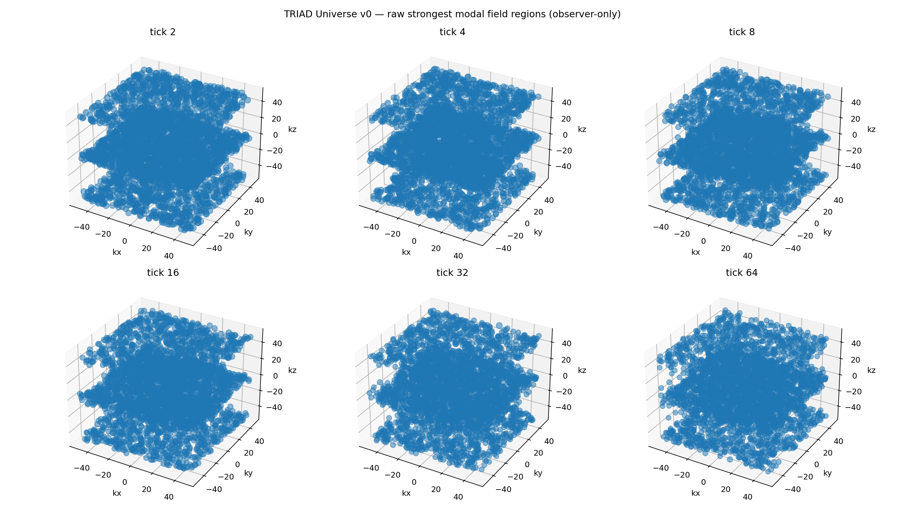

[Lab](../../../docs/pt-BR/README.md) · [English](README.md) · **Português**

[Continuidade](../README.pt-BR.md) · [Glossário](../../../docs/pt-BR/glossary.md) · [Regras do projeto](../../../docs/pt-BR/project-rules.md)

# Protótipo de campo persistente

**Um campo pode continuar de um estado salvo?**

Um protótipo registra continuidade por checkpoint com um milhão de modos residentes. O N³ lógico de 10¹⁸ é metadado da representação, não essa quantidade de células simuladas em memória. libtriad_rt.so está ausente; o stub CUDA incluído não o substitui.

- [README.md](notes/README.md)
- [run-notes.md](notes/run-notes.md)

## Auditoria da execução

> **Identidade TRIAD: NÃO estabelecido como TRIAD completa — rastreabilidade incompleta.**
>
> Registro ponto a ponto: [English](../../../docs/en/triad-identity-audit.md#study-persistent-universe) · [Português](../../../docs/pt-BR/triad-identity-audit.md#study-persistent-universe) · [Español](../../../docs/es/triad-identity-audit.md#study-persistent-universe) · [Deutsch](../../../docs/de/triad-identity-audit.md#study-persistent-universe) · [Svenska](../../../docs/sv/triad-identity-audit.md#study-persistent-universe) · [Norsk](../../../docs/no/triad-identity-audit.md#study-persistent-universe) · [Dansk](../../../docs/da/triad-identity-audit.md#study-persistent-universe) · [中文（简体）](../../../docs/zh-CN/triad-identity-audit.md#study-persistent-universe)

**Execução sem rastreabilidade completa.** Há checkpoints modais, leituras e testes de continuidade; a evolução é delegada a uma biblioteca nativa externa ausente das fontes fornecidas.

[Condições e contrastes registrados](../../../docs/pt-BR/execution-audit.md#study-persistent-universe) · [genesis_modal.py](code/genesis_modal.py#L30) · [genesis_modal.py](code/genesis_modal.py#L98) · [genesis_modal.py](code/genesis_modal.py#L156)

## Arquivos e condições de execução

[Índice completo dos materiais](FILES.md) · [Guia técnico](../../../docs/pt-BR/research-guide.md)

Os arquivos mantêm a implementação e as condições registradas. Consulte a [auditoria das implementações](../../../docs/maintenance/author-rules-audit.md#português) para as diferenças documentadas e o registro de dependências abaixo antes de preparar uma nova execução.

[Dependências e entradas ausentes](../../../provenance/t-archive/dependencies.pt-BR.md)

[Contexto e diagnósticos](../../../docs/pt-BR/topics/persistent-universe.md)
