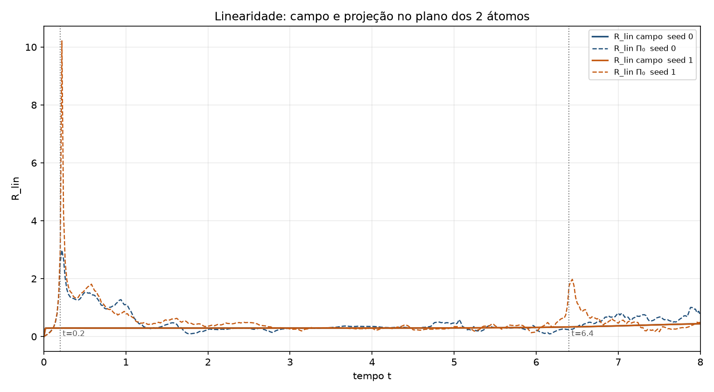

[Lab](../../../README.md) · **English** · [Português](README.pt-BR.md)

[Field diagnostics](../README.md) · [Glossary](../../../docs/en/glossary.md) · [Project rules](../../../docs/en/project-rules.md)

# Testing linearity

Two seeds compare A, B and their superposition under a common additive bath. The recorded weighted residual includes a bath contribution that does not cancel, so it does not isolate nonlinear response. The protocol deviation and historical INCONCLUSIVE decision are retained.

Read in order: protocol → configuration → raw data → analysis. These classifications belong to the historical record; no new run was performed.

- [protocol.md](notes/protocol.md)
- [linearity-record.md](notes/linearity-record.md)
- [analysis.md](notes/analysis.md)
- [config.json](configuration/config.json)
- [result.json](results/data/result.json)

[Every file](FILES.md) · [Dependencies](../../../provenance/t-archive/dependencies.md)

## Execution audit

**Coupled terms documented.** The supplied standalone update documents the coupled terms and three memory modes with FDT active. The superposition residual includes the common additive bath; it is not a pure measure of nonlinear response.

[Conditions and recorded contrasts](../../../docs/en/execution-audit.md#study-q04) · [probe_field_linearity.py](code/probe_field_linearity.py#L54) · [probe_field_linearity.py](code/probe_field_linearity.py#L245) · [probe_field_linearity.py](code/probe_field_linearity.py#L263) · [probe_field_linearity.py](code/probe_field_linearity.py#L324)

## Files and execution context

[Complete material index](FILES.md) · [Research guide](../../../docs/en/research-guide.md)

The files retain their recorded implementation and conditions. Read the [implementation audit](../../../docs/maintenance/author-rules-audit.md) for documented differences and the dependency record below before preparing a new execution.

[Dependencies and missing inputs](../../../provenance/t-archive/dependencies.md)

## Implementation notes

The inspected runner retains nonzero instantaneous, fractional, memory and bath coefficients, with three memory rates and `V_ext=0`. Its recorded numerical verdict remains attached to its declared grid, timestep and diagnostic. This is static inspection, not a new execution. [Source, line 34](../spatial-convergence/code/measure_spatial_convergence.py) · [This study’s source, line 52](code/probe_field_linearity.py).

[Full static audit and source references](../../../docs/maintenance/author-rules-audit.md).
