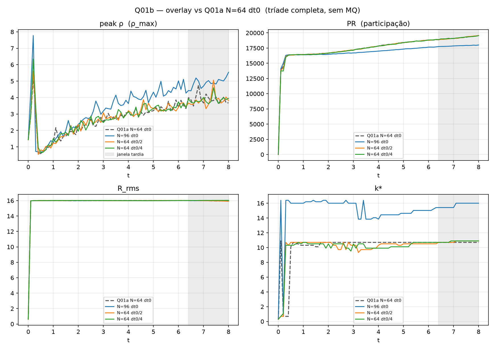

[Lab](../../../docs/pt-BR/README.md) · [English](README.md) · **Português**

[Diagnósticos do campo](../README.pt-BR.md) · [Glossário](../../../docs/pt-BR/glossary.md) · [Regras do projeto](../../../docs/pt-BR/project-rules.md)

# Resolução e passo temporal

N96 e refinamentos do passo temporal dão continuidade a Q01. O registro permanece INCONCLUSIVE.

Leia a sequência: protocolo → configuração → dados brutos → análise. As classificações abaixo pertencem ao registro histórico; não houve nova execução.

- [protocol.md](notes/protocol.md)
- [refinement-record.md](notes/refinement-record.md)
- [analysis.md](notes/analysis.md)
- [config.json](configuration/config.json)
- [result.json](results/data/result.json)
- [seeds.txt](configuration/seeds.txt)

[Todos os arquivos](FILES.md) · [Dependências](../../../provenance/t-archive/dependencies.pt-BR.md)

## Auditoria da execução

> **Identidade TRIAD: TRIAD completa — termos conjuntos documentados.**
>
> Registro ponto a ponto: [English](../../../docs/en/triad-identity-audit.md#study-q01b) · [Português](../../../docs/pt-BR/triad-identity-audit.md#study-q01b) · [Español](../../../docs/es/triad-identity-audit.md#study-q01b) · [Deutsch](../../../docs/de/triad-identity-audit.md#study-q01b) · [Svenska](../../../docs/sv/triad-identity-audit.md#study-q01b) · [Norsk](../../../docs/no/triad-identity-audit.md#study-q01b) · [Dansk](../../../docs/da/triad-identity-audit.md#study-q01b) · [中文（简体）](../../../docs/zh-CN/triad-identity-audit.md#study-q01b)

**Termos conjuntos documentados.** A atualização standalone fornecida documenta os termos conjuntos e três modos de memória com FDT ativo. Refinos de espaço e passo temporal mantêm os termos conjuntos; a convergência numérica permanece em aberto.

[Condições e contrastes registrados](../../../docs/pt-BR/execution-audit.md#study-q01b) · [compare_grid_and_time_step.py](code/compare_grid_and_time_step.py#L38) · [compare_grid_and_time_step.py](code/compare_grid_and_time_step.py#L210) · [compare_grid_and_time_step.py](code/compare_grid_and_time_step.py#L180)

## Arquivos e condições de execução

[Índice completo dos materiais](FILES.md) · [Guia técnico](../../../docs/pt-BR/research-guide.md)

Os arquivos mantêm a implementação e as condições registradas. Consulte a [auditoria das implementações](../../../docs/maintenance/author-rules-audit.md#português) para as diferenças documentadas e o registro de dependências abaixo antes de preparar uma nova execução.

[Dependências e entradas ausentes](../../../provenance/t-archive/dependencies.pt-BR.md)

## Notas da implementação

O runner inspecionado mantém coeficientes instantâneo, fracionário, de memória e de banho não nulos, com três taxas de memória e `V_ext=0`. O veredito numérico registrado continua ligado à grade, ao passo temporal e ao diagnóstico declarados. Esta é uma inspeção estática, não uma nova execução. [Fonte, linha 34](../spatial-convergence/code/measure_spatial_convergence.py) · [Fonte deste estudo, linha 36](code/compare_grid_and_time_step.py).

[Auditoria estática completa e referências das fontes](../../../docs/maintenance/author-rules-audit.md).
