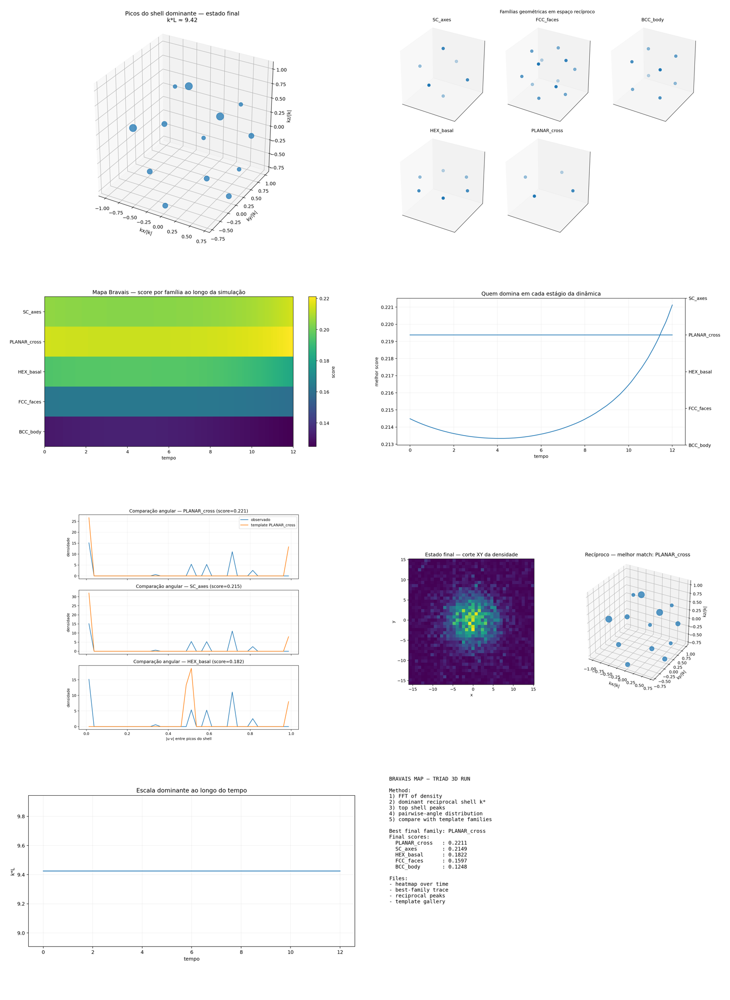

[Lab](../../../README.md) · **English** · [Português](README.pt-BR.md)

[Geometry](../README.md) · [Glossary](../../../docs/en/glossary.md) · [Project rules](../../../docs/en/project-rules.md)

# Bravais template map

FFT/template post-processing of the bounce run; scores depend on this diagnostic.

Imported historical record; this organization did not rerun the simulation.

[Read the original note](notes/original-record.md) · [Every file](FILES.md)

No dedicated runner is linked in this entry. Consult the note and complete record for historical listings and dependencies.

## Execution audit

> **TRIAD identity: NOT a TRIAD execution — context or post-processing.**
>
> Point-to-point record: [English](../../../docs/en/triad-identity-audit.md#study-t-24) · [Português](../../../docs/pt-BR/triad-identity-audit.md#study-t-24) · [Español](../../../docs/es/triad-identity-audit.md#study-t-24) · [Deutsch](../../../docs/de/triad-identity-audit.md#study-t-24) · [Svenska](../../../docs/sv/triad-identity-audit.md#study-t-24) · [Norsk](../../../docs/no/triad-identity-audit.md#study-t-24) · [Dansk](../../../docs/da/triad-identity-audit.md#study-t-24) · [中文（简体）](../../../docs/zh-CN/triad-identity-audit.md#study-t-24)

**Context or post-processing.** Readout or geometric reconstruction from a recorded field, not a new field evolution.

[Conditions and recorded contrasts](../../../docs/en/execution-audit.md#study-t-24) · [original-record.md](notes/original-record.md#L10)

## Available material

12 files associated with this entry: 2 `.csv`, 1 `.md`, 9 `.png`.

[Timeline](../../../docs/en/topics/timeline.md) · [← 23](../../memory/memory-and-bounce/README.md) · [25 →](../first-geometric-network/README.md)

## Files and execution context

[Complete material index](FILES.md) · [Research guide](../../../docs/en/research-guide.md)

The files retain their recorded implementation and conditions. Read the [implementation audit](../../../docs/maintenance/author-rules-audit.md) for documented differences and the dependency record below before preparing a new execution.

[Dependencies and missing inputs](../../../provenance/t-archive/dependencies.md)
