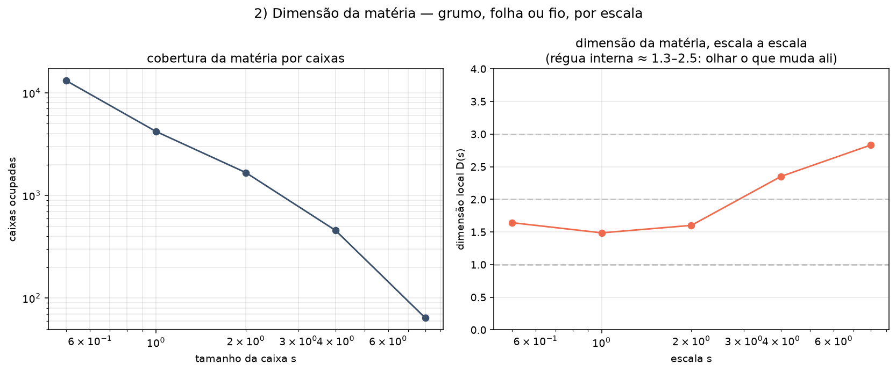

[Lab](../../../docs/pt-BR/README.md) · [English](README.md) · **Português**

[Geometria](../README.pt-BR.md) · [Glossário](../../../docs/pt-BR/glossary.md) · [Regras do projeto](../../../docs/pt-BR/project-rules.md)

# Medidas de estrutura espacial

**Como medir a estrutura espacial?**

O pós-processamento mede a estrutura espacial pelas definições e pelos limiares registrados no script e nos diagnósticos fornecidos.

## Auditoria da execução

**Contexto ou pós-processamento.** Pós-processamento de estados de campo salvos; esta entrada não evolui a equação completa.

[Condições e contrastes registrados](../../../docs/pt-BR/execution-audit.md#study-dimension-analysis) · [bravais_dimensoes.py](code/bravais_dimensoes.py#L1)

## Arquivos e condições de execução

[Índice completo dos materiais](FILES.md) · [Guia técnico](../../../docs/pt-BR/research-guide.md)

Os arquivos mantêm a implementação e as condições registradas. Consulte a [auditoria das implementações](../../../docs/maintenance/author-rules-audit.md#português) para as diferenças documentadas e o registro de dependências abaixo antes de preparar uma nova execução.

[Dependências e entradas ausentes](../../../provenance/t-archive/dependencies.pt-BR.md)
