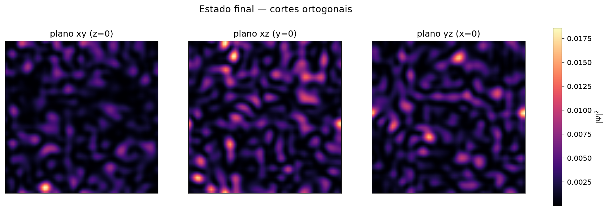

[Lab](../../../docs/pt-BR/README.md) · [English](README.md) · **Português**

[Geometria](../README.pt-BR.md) · [Glossário](../../../docs/pt-BR/glossary.md) · [Regras do projeto](../../../docs/pt-BR/project-rules.md)

# Campo 3D emergente

**Que estrutura espacial e espectral emerge da evolução acoplada?**

Evolui um campo complexo em uma grade 3D periódica, com FFTs, uma proposta acoplada e ponto fixo implícito.


## Auditoria da execução

**Implementação divergente.** A fonte de evolução usa sinal cinético/atualização de ruído e guards condicionais de estado diferentes da referência; as saídas salvas permanecem registros dessa implementação.

[Condições e contrastes registrados](../../../docs/pt-BR/execution-audit.md#study-bravais-01-field) · [bravais_puro_3d.py](code/pt-BR/bravais_puro_3d.py#L116) · [bravais_puro_3d.py](code/pt-BR/bravais_puro_3d.py#L241) · [bravais_puro_3d.py](variants/phase-checkpoints/code/bravais_puro_3d.py#L116) · [bravais_puro_3d.py](variants/phase-checkpoints/code/bravais_puro_3d.py#L241)

## Material disponível



- [final-density-slices.png](results/figures/final-density-slices.png)
- [final_state.npz](results/data/final_state.npz)

## Implementação preservada

O comando abaixo chama a implementação preservada. Comece pelas [condições de execução](../../../docs/pt-BR/getting-started.md) e pela [auditoria das implementações](../../../docs/maintenance/author-rules-audit.md#português); mantenha novas saídas separadas do registro original. Execute da raiz do repositório em uma cópia de trabalho.

```sh
MPLBACKEND=Agg python simulations/geometry/field-3d/code/pt-BR/bravais_puro_3d.py
```

[English source](code/en/bravais_pure_3d.py) · [Código em português](code/pt-BR/bravais_puro_3d.py)

## Leitura e continuidade

A configuração padrão usa `N=64`, `L=32`, 1.200 passos e `dt=0.025`. A inicialização aleatória não tem semente fixa. Uma nova execução não recria exatamente o estado incluído. Resultados novos vão para `bravais_outputs_3d/` no diretório de execução.

## Arquivos e condições de execução

[Índice completo dos materiais](FILES.md) · [Guia técnico](../../../docs/pt-BR/research-guide.md)

## Implementações preservadas

- [Checkpoints com fase](variants/phase-checkpoints/README.pt-BR.md)
- [Memória com sinal e execução padrão mais curta](variants/signed-memory-short-run/README.pt-BR.md)

## Notas da implementação

A implementação geométrica usa coeficientes dependentes do campo e uma contenção numérica condicional. Na fonte 3D inspecionada, norma ao quadrado acima de 100 é reescalada para 50, valores muito pequenos acionam perturbação aleatória e valores não finitos passam por `nan_to_num`. São operações do código preservado; a inspeção estática não identifica sozinha quais foram acionadas em uma execução salva. [Fonte, linha 116](code/pt-BR/bravais_puro_3d.py).

As fontes geométricas arquivadas diferem na expressão de dissipação: a fonte 3D base usa um fator real negativo; a pure 2D e a variante signed-memory usam um fator imaginário nessa posição. As implementações e suas saídas não foram reescritas para uniformizá-las. [Fonte, linha 208](../field-2d/code/bravais_pure_emerge.py) · [Fonte deste estudo, linha 241](code/pt-BR/bravais_puro_3d.py).

[Auditoria estática completa e referências das fontes](../../../docs/maintenance/author-rules-audit.md).
