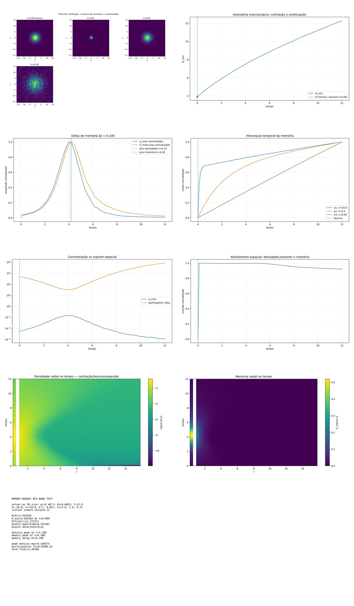

[Lab](../../../README.md) · **English** · [Português](README.pt-BR.md)

[Memory](../README.md) · [Glossary](../../../docs/en/glossary.md) · [Project rules](../../../docs/en/project-rules.md)

# Memory and bounce

The same trajectory gives `bounced=False` with the RMS radius and `bounced=True` with the radius enclosing half the mass (r50). That radius falls from 3.487119 to 1.385641 at t=3.7 and later rises to 9.863062. The density peak at t=4.1 precedes the memory peak at t=4.2; the diagnostic change is not a new run.

Imported historical record; this organization did not rerun the simulation.

[Read the original note](notes/original-record.md) · [Every file](FILES.md)

No dedicated runner is linked in this entry. Consult the note and complete record for historical listings and dependencies.

## Execution audit

**Execution not fully traceable.** Bounce metrics and memory records exist, but the executed bath amplitude/source is not fully bound.

[Conditions and recorded contrasts](../../../docs/en/execution-audit.md#study-t-23) · [original-record.md](notes/original-record.md#L10) · [summary.csv](results/data/summary.csv#L1)

## Available material

18 files associated with this entry: 3 `.csv`, 1 `.gif`, 1 `.md`, 13 `.png`.

[Timeline](../../../docs/en/topics/timeline.md) · [← 22](../../signals/refined-phase-to-density-diagnostic/README.md) · [24 →](../../geometry/bravais-template-map/README.md)

## Files and execution context

[Complete material index](FILES.md) · [Research guide](../../../docs/en/research-guide.md)

The files retain their recorded implementation and conditions. Read the [implementation audit](../../../docs/maintenance/author-rules-audit.md) for documented differences and the dependency record below before preparing a new execution.

[Dependencies and missing inputs](../../../provenance/t-archive/dependencies.md)
