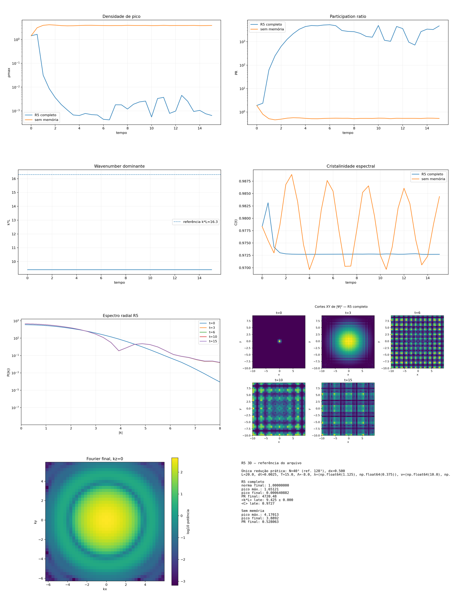

[Lab](../../../README.md) · **English** · [Português](README.pt-BR.md)

[Memory](../README.md) · [Glossary](../../../docs/en/glossary.md) · [Project rules](../../../docs/en/project-rules.md)

# Memory at resolution 40

The historical N=40 comparison labels one branch `full` and removes memory in the other. Their final peak densities are 0.0006409 and 3.889202, with final PR values 4720.477435 and 0.528063, respectively. The `full` label belongs to the source; its generating implementation was not supplied.

Imported historical record; this organization did not rerun the simulation.

[Read the original note](notes/original-record.md) · [Every file](FILES.md)

No dedicated runner is linked in this entry. Consult the note and complete record for historical listings and dependencies.

## Execution audit

**Implementation differs.** The saved comparison explicitly includes a no-memory branch. The generating source for the branch labelled full is absent.

[Conditions and recorded contrasts](../../../docs/en/execution-audit.md#study-t-16) · [original-record.md](notes/original-record.md#L12) · [summary.csv](results/data/summary.csv#L1)

## Available material

13 files associated with this entry: 3 `.csv`, 1 `.md`, 9 `.png`.

[Timeline](../../../docs/en/topics/timeline.md) · [← 15](../accelerated-memory-reference/README.md) · [17 →](../memory-grid-48/README.md)

## Files and execution context

[Complete material index](FILES.md) · [Research guide](../../../docs/en/research-guide.md)

The files retain their recorded implementation and conditions. Read the [implementation audit](../../../docs/maintenance/author-rules-audit.md) for documented differences and the dependency record below before preparing a new execution.

[Dependencies and missing inputs](../../../provenance/t-archive/dependencies.md)
