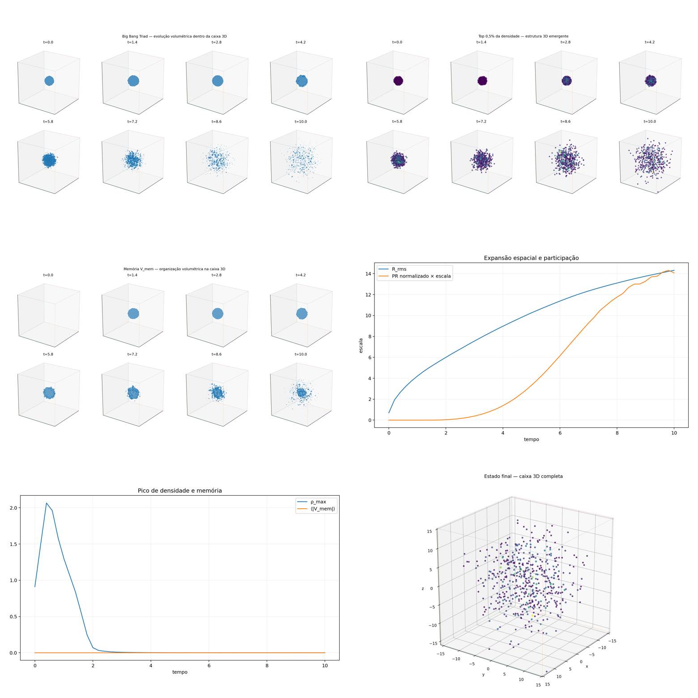

[Lab](../../../docs/pt-BR/README.md) · [English](README.md) · **Português**

[Sinais](../README.pt-BR.md) · [Glossário](../../../docs/pt-BR/glossary.md) · [Regras do projeto](../../../docs/pt-BR/project-rules.md)

# Caixa 3D com banho frio

Há expansão registrada com N=44 e T=10, chegando à norma final de 1,413637. O registro anterior de banho quente usou N=36 e T=8, com amostras iniciais diferentes; esta é outra configuração, não uma comparação que altera só o banho. A nota não relata uma teia cósmica filamentar.

Registro histórico importado; esta organização não reexecutou a simulação.

[Ler a nota original](notes/original-record.md) · [Todos os arquivos](FILES.md)

Esta ficha remete às listagens e dependências do registro histórico; não há um script de execução dedicado associado a ela.

## Auditoria da execução

> **Identidade TRIAD: NÃO estabelecido como TRIAD completa — rastreabilidade incompleta.**
>
> Registro ponto a ponto: [English](../../../docs/en/triad-identity-audit.md#study-t-20) · [Português](../../../docs/pt-BR/triad-identity-audit.md#study-t-20) · [Español](../../../docs/es/triad-identity-audit.md#study-t-20) · [Deutsch](../../../docs/de/triad-identity-audit.md#study-t-20) · [Svenska](../../../docs/sv/triad-identity-audit.md#study-t-20) · [Norsk](../../../docs/no/triad-identity-audit.md#study-t-20) · [Dansk](../../../docs/da/triad-identity-audit.md#study-t-20) · [中文（简体）](../../../docs/zh-CN/triad-identity-audit.md#study-t-20)

**Execução sem rastreabilidade completa.** Os CSVs de banho frio mudam malha, duração e amostras iniciais junto às condições do banho. O gerador está ausente.

[Condições e contrastes registrados](../../../docs/pt-BR/execution-audit.md#study-t-20) · [original-record.md](notes/original-record.md#L10) · [summary.csv](results/data/summary.csv#L1)

## Material disponível

11 arquivo associado à ficha: 2 `.csv`, 1 `.gif`, 1 `.md`, 7 `.png`.

[Cronologia](../../../docs/pt-BR/topics/timeline.md) · [← 19](../hot-bath-diagnostic-failure/README.pt-BR.md) · [21 →](../first-phase-to-density-diagnostic/README.pt-BR.md)

## Arquivos e condições de execução

[Índice completo dos materiais](FILES.md) · [Guia técnico](../../../docs/pt-BR/research-guide.md)

Os arquivos mantêm a implementação e as condições registradas. Consulte a [auditoria das implementações](../../../docs/maintenance/author-rules-audit.md#português) para as diferenças documentadas e o registro de dependências abaixo antes de preparar uma nova execução.

[Dependências e entradas ausentes](../../../provenance/t-archive/dependencies.pt-BR.md)
