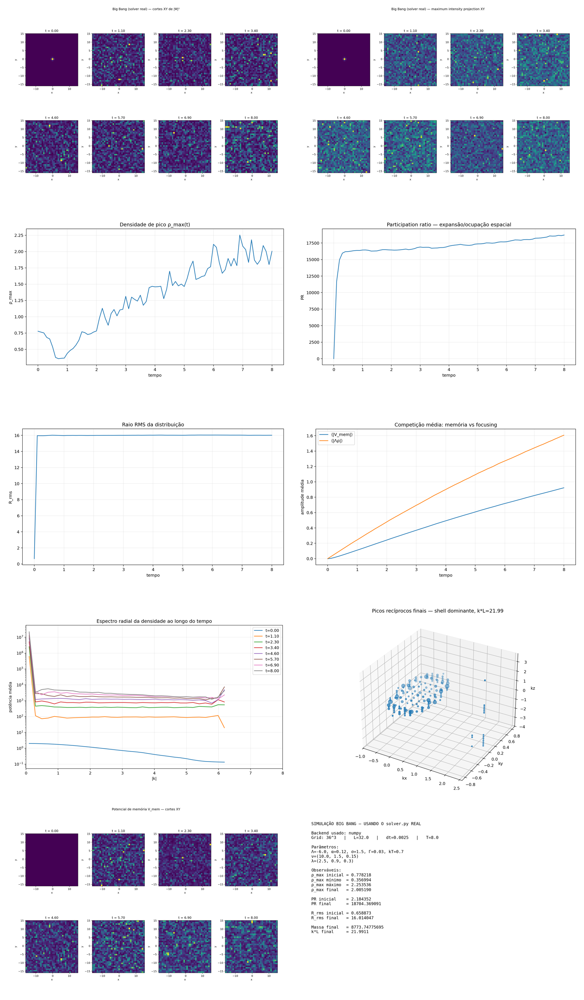

[Lab](../../../README.md) · **English** · [Português](README.pt-BR.md)

[Signals](../README.md) · [Glossary](../../../docs/en/glossary.md) · [Project rules](../../../docs/en/project-rules.md)

# Hot-bath diagnostic failure

At N=36 and T=8, the historical hot-bath record reaches final mass 8773.747757; its failed diagnostic is preserved. The following cold-bath study changes the grid, duration and initial samples as well as the bath, so the pair does not isolate a temperature effect.

Imported historical record; this organization did not rerun the simulation.

[Read the original note](notes/original-record.md) · [Every file](FILES.md)

No dedicated runner is linked in this entry. Consult the note and complete record for historical listings and dependencies.

## Execution audit

> **TRIAD identity: NOT established as complete TRIAD — incomplete traceability.**
>
> Point-to-point record: [English](../../../docs/en/triad-identity-audit.md#study-t-19) · [Português](../../../docs/pt-BR/triad-identity-audit.md#study-t-19) · [Español](../../../docs/es/triad-identity-audit.md#study-t-19) · [Deutsch](../../../docs/de/triad-identity-audit.md#study-t-19) · [Svenska](../../../docs/sv/triad-identity-audit.md#study-t-19) · [Norsk](../../../docs/no/triad-identity-audit.md#study-t-19) · [Dansk](../../../docs/da/triad-identity-audit.md#study-t-19) · [中文（简体）](../../../docs/zh-CN/triad-identity-audit.md#study-t-19)

**Execution not fully traceable.** The hot-bath record has CSVs but no bound solver/configuration for a completeness check.

[Conditions and recorded contrasts](../../../docs/en/execution-audit.md#study-t-19) · [original-record.md](notes/original-record.md#L10) · [summary.csv](results/data/summary.csv#L1)

## Available material

15 files associated with this entry: 2 `.csv`, 1 `.gif`, 1 `.md`, 11 `.png`.

[Timeline](../../../docs/en/topics/timeline.md) · [← 18](../../geometry/visual-atlas/README.md) · [20 →](../3d-cold-bath-box/README.md)

## Files and execution context

[Complete material index](FILES.md) · [Research guide](../../../docs/en/research-guide.md)

The files retain their recorded implementation and conditions. Read the [implementation audit](../../../docs/maintenance/author-rules-audit.md) for documented differences and the dependency record below before preparing a new execution.

[Dependencies and missing inputs](../../../provenance/t-archive/dependencies.md)
