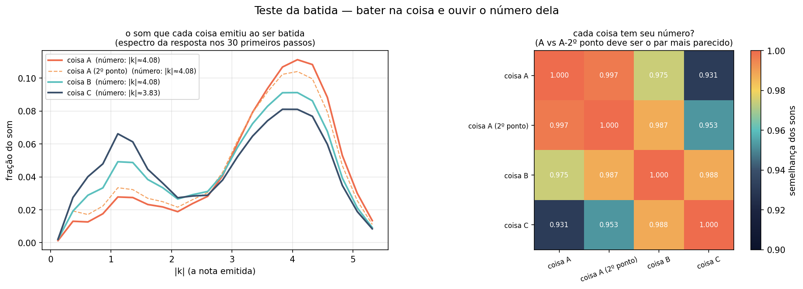

[Lab](../../../README.md) · **English** · [Português](README.pt-BR.md)

[Signals](../README.md) · [Glossary](../../../docs/en/glossary.md) · [Project rules](../../../docs/en/project-rules.md)

# Responses to perturbations

**How does a field respond to perturbations and declared inputs?**

Four recorded protocols explore coupling, small perturbations, impacts and rhythmic forcing. Each source retains the input, comparison and parameter choices used at the time.

## Execution audit

> **TRIAD identity: NOT complete TRIAD — documented departure.**
>
> Point-to-point record: [English](../../../docs/en/triad-identity-audit.md#study-perturbation-tests) · [Português](../../../docs/pt-BR/triad-identity-audit.md#study-perturbation-tests) · [Español](../../../docs/es/triad-identity-audit.md#study-perturbation-tests) · [Deutsch](../../../docs/de/triad-identity-audit.md#study-perturbation-tests) · [Svenska](../../../docs/sv/triad-identity-audit.md#study-perturbation-tests) · [Norsk](../../../docs/no/triad-identity-audit.md#study-perturbation-tests) · [Dansk](../../../docs/da/triad-identity-audit.md#study-perturbation-tests) · [中文（简体）](../../../docs/zh-CN/triad-identity-audit.md#study-perturbation-tests)

**Implementation differs.** The evolving source uses a different kinetic sign/noise update and conditional state guards from the reference; its saved results remain records of that implementation.

[Conditions and recorded contrasts](../../../docs/en/execution-audit.md#study-perturbation-tests) · [teste_borboleta.py](code/teste_borboleta.py#L122) · [teste_borboleta.py](code/teste_borboleta.py#L247) · [teste_ligacao.py](code/teste_ligacao.py#L131) · [teste_ligacao.py](code/teste_ligacao.py#L256)

## Files and execution context

[Complete material index](FILES.md) · [Research guide](../../../docs/en/research-guide.md)

The files retain their recorded implementation and conditions. Read the [implementation audit](../../../docs/maintenance/author-rules-audit.md) for documented differences and the dependency record below before preparing a new execution.

[Dependencies and missing inputs](../../../provenance/t-archive/dependencies.md)

## Implementation notes

Some archived protocols add an input during evolution: the pocket studies plant Gaussian fields at the declared time `T_PLANT=0.5`; the impact script applies a declared kick at the field peak. Read these as recorded interventions, not solely initial conditions or an automatic instance of post-result calibration. [Source, line 515](../../structures/a-pocket-in-the-field/code/simulate_field_pocket.py) · [This study’s source, line 290](code/teste_pancada.py).

[Full static audit and source references](../../../docs/maintenance/author-rules-audit.md).
