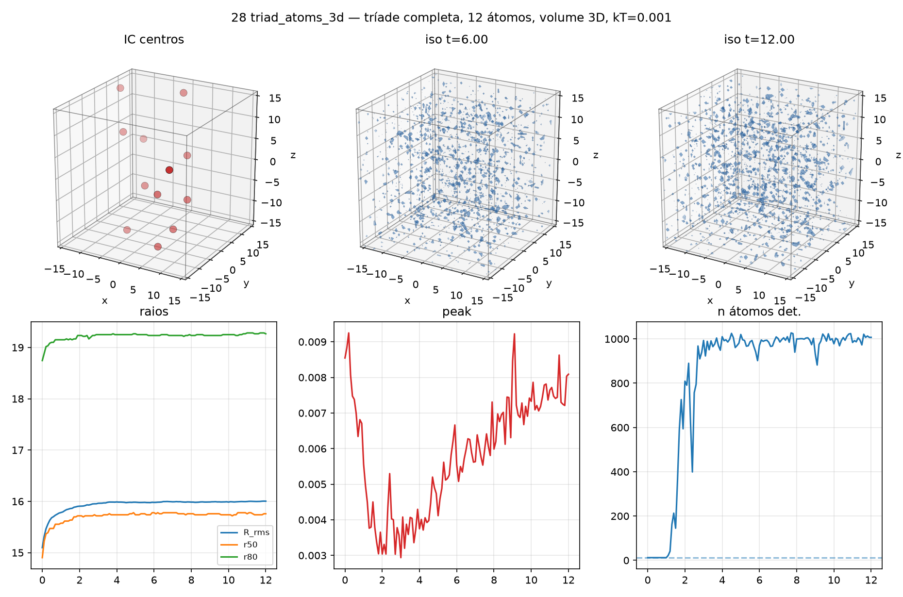

[Lab](../../../docs/pt-BR/README.md) · [English](README.md) · **Português**

[Estruturas](../README.pt-BR.md) · [Glossário](../../../docs/pt-BR/glossary.md) · [Regras do projeto](../../../docs/pt-BR/project-rules.md)

# Trajetórias de átomos em 3D

Centros e trajetórias estão salvos com N=40, T=12 e kT=0,001, chegando à norma final de 23,275045. A execução anterior de doze átomos usava N=32, T=15 e kT=1; a seleção de picos também mudou. A temperatura é uma entrada física alterada, junto a mudanças numéricas e do detector, portanto o contraste não isola um parâmetro.

Registro histórico importado; esta organização não reexecutou a simulação.

[Ler a nota original](notes/original-record.md) · [Todos os arquivos](FILES.md)

[Script preservado](code/simulate_atom_trajectories.py) · [Dependências e portabilidade](../../../provenance/t-archive/dependencies.pt-BR.md)

## Auditoria da execução

**Execução sem rastreabilidade completa.** O runner de trajetórias 3D mantém três modos de memória e banho, mas importa o runtime histórico não fixado.

[Condições e contrastes registrados](../../../docs/pt-BR/execution-audit.md#study-t-28) · [simulate_atom_trajectories.py](code/simulate_atom_trajectories.py#L24) · [simulate_atom_trajectories.py](code/simulate_atom_trajectories.py#L328)

## Material disponível

14 arquivos associados à ficha: 4 `.csv`, 1 `.gif`, 1 `.json`, 1 `.md`, 7 `.png`.

[Cronologia](../../../docs/pt-BR/topics/timeline.md) · [← 27](../twelve-atoms-full-field/README.pt-BR.md) · [29 →](../../memory/memory-small-amplitude/README.pt-BR.md)

## Arquivos e condições de execução

[Índice completo dos materiais](FILES.md) · [Guia técnico](../../../docs/pt-BR/research-guide.md)

Os arquivos mantêm a implementação e as condições registradas. Consulte a [auditoria das implementações](../../../docs/maintenance/author-rules-audit.md#português) para as diferenças documentadas e o registro de dependências abaixo antes de preparar uma nova execução.

[Dependências e entradas ausentes](../../../provenance/t-archive/dependencies.pt-BR.md)
