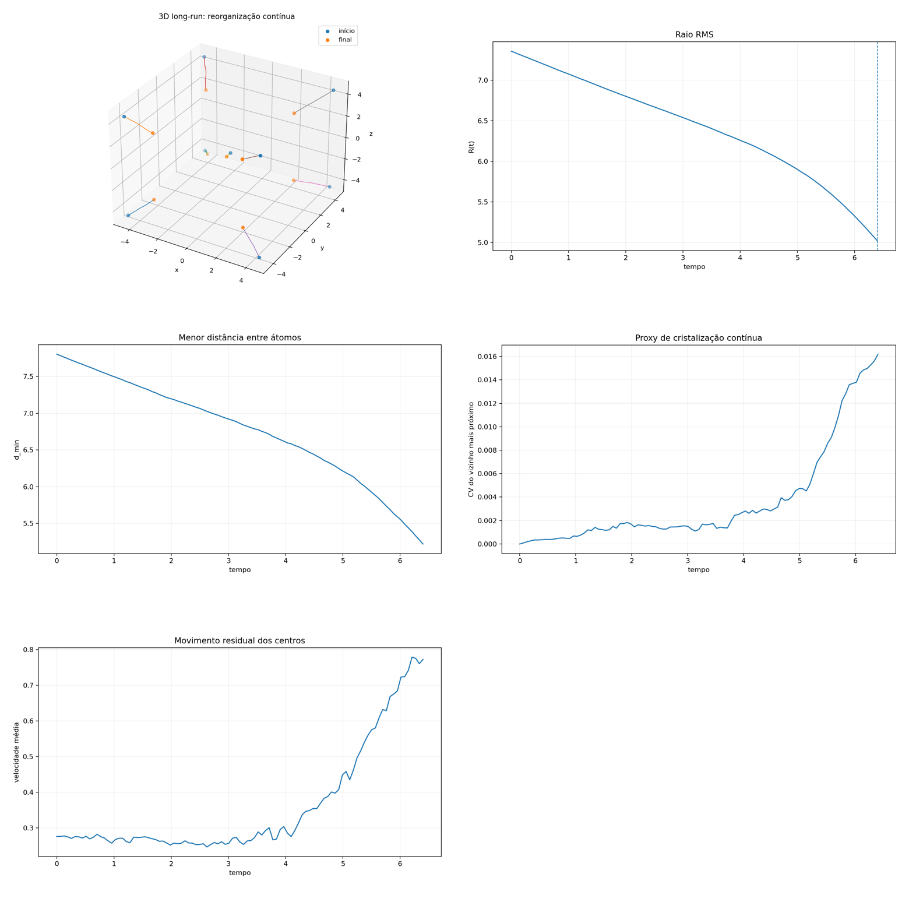

[Lab](../../../docs/pt-BR/README.md) · [English](README.md) · **Português**

[Estruturas](../README.pt-BR.md) · [Glossário](../../../docs/pt-BR/glossary.md) · [Regras do projeto](../../../docs/pt-BR/project-rules.md)

# Execução longa 3D compacta

Outra configuração exploratória 3D compacta, com suas próprias figuras.

Registro histórico importado; esta organização não reexecutou a simulação.

[Ler a nota original](notes/original-record.md) · [Todos os arquivos](FILES.md)

Esta ficha remete às listagens e dependências do registro histórico; não há um script de execução dedicado associado a ela.

## Auditoria da execução

**Execução sem rastreabilidade completa.** A montagem compacta e os diagnósticos de longo prazo não têm gerador salvo nem tabela numérica.

[Condições e contrastes registrados](../../../docs/pt-BR/execution-audit.md#study-t-13) · [original-record.md](notes/original-record.md#L10)

## Material disponível

7 arquivos associados à ficha: 1 `.md`, 6 `.png`.

[Cronologia](../../../docs/pt-BR/topics/timeline.md) · [← 12](../fast-3d-long-run/README.pt-BR.md) · [14 →](../../memory/memory-reference-attempt/README.pt-BR.md)

## Arquivos e condições de execução

[Índice completo dos materiais](FILES.md) · [Guia técnico](../../../docs/pt-BR/research-guide.md)

Os arquivos mantêm a implementação e as condições registradas. Consulte a [auditoria das implementações](../../../docs/maintenance/author-rules-audit.md#português) para as diferenças documentadas e o registro de dependências abaixo antes de preparar uma nova execução.

[Dependências e entradas ausentes](../../../provenance/t-archive/dependencies.pt-BR.md)
