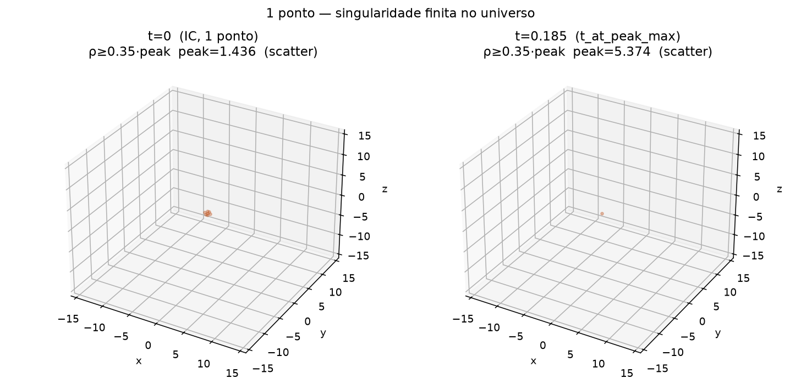

[Lab](../../../docs/pt-BR/README.md) · [English](README.md) · **Português**

[Estruturas](../README.pt-BR.md) · [Glossário](../../../docs/pt-BR/glossary.md) · [Regras do projeto](../../../docs/pt-BR/project-rules.md)

# Pico finito, janela inicial

Janelas iniciais com um e dois átomos; valores finitos não resolvem se um pico de uma célula tem resolução espacial suficiente.

Registro histórico importado; esta organização não reexecutou a simulação.

[Ler a nota original](notes/original-record.md) · [Todos os arquivos](FILES.md)

[Script preservado](code/simulate_early_peak.py) · [Dependências e portabilidade](../../../provenance/t-archive/dependencies.pt-BR.md)

## Auditoria da execução

**Termos conjuntos documentados.** A atualização standalone fornecida documenta os termos conjuntos e três modos de memória com FDT ativo. Janelas iniciais de uma e duas sementes; picos finitos ainda podem ocupar uma célula.

[Condições e contrastes registrados](../../../docs/pt-BR/execution-audit.md#study-t-35) · [simulate_early_peak.py](code/simulate_early_peak.py#L51) · [simulate_early_peak.py](code/simulate_early_peak.py#L239) · [simulate_early_peak.py](code/simulate_early_peak.py#L257) · [simulate_early_peak.py](code/simulate_early_peak.py#L332)

## Material disponível

11 arquivo associado à ficha: 2 `.csv`, 1 `.json`, 1 `.md`, 6 `.png`, 1 `.txt`.

[Cronologia](../../../docs/pt-BR/topics/timeline.md) · [← 34](../long-nest-trajectory/README.pt-BR.md) · [36 →](../../numerical-checks/reproduction-dossier/README.pt-BR.md)

## Arquivos e condições de execução

[Índice completo dos materiais](FILES.md) · [Guia técnico](../../../docs/pt-BR/research-guide.md)

Os arquivos mantêm a implementação e as condições registradas. Consulte a [auditoria das implementações](../../../docs/maintenance/author-rules-audit.md#português) para as diferenças documentadas e o registro de dependências abaixo antes de preparar uma nova execução.

[Dependências e entradas ausentes](../../../provenance/t-archive/dependencies.pt-BR.md)
