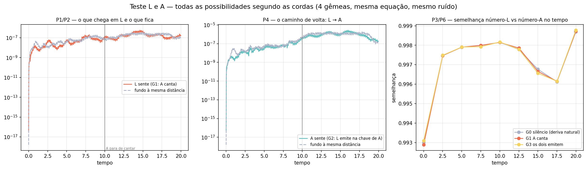

[Lab](../../../docs/pt-BR/README.md) · [English](README.md) · **Português**

[Estruturas](../README.pt-BR.md) · [Glossário](../../../docs/pt-BR/glossary.md) · [Regras do projeto](../../../docs/pt-BR/project-rules.md)

# Cordas, átomos e escala

**Como padrões localizados respondem a mudanças de tamanho e amplitude?**

Dois estudos registrados examinam relações entre átomos e cordas e mudanças no tamanho da caixa e na amplitude. Átomos e cordas nomeiam estruturas localizadas e curvas extraídas no vocabulário operacional do autor.

## Auditoria da execução

> **Identidade TRIAD: NÃO é TRIAD completa — divergência documentada.**
>
> Registro ponto a ponto: [English](../../../docs/en/triad-identity-audit.md#study-string-structure-tests) · [Português](../../../docs/pt-BR/triad-identity-audit.md#study-string-structure-tests) · [Español](../../../docs/es/triad-identity-audit.md#study-string-structure-tests) · [Deutsch](../../../docs/de/triad-identity-audit.md#study-string-structure-tests) · [Svenska](../../../docs/sv/triad-identity-audit.md#study-string-structure-tests) · [Norsk](../../../docs/no/triad-identity-audit.md#study-string-structure-tests) · [Dansk](../../../docs/da/triad-identity-audit.md#study-string-structure-tests) · [中文（简体）](../../../docs/zh-CN/triad-identity-audit.md#study-string-structure-tests)

**Implementação divergente.** A fonte de evolução usa sinal cinético/atualização de ruído e guards condicionais de estado diferentes da referência; as saídas salvas permanecem registros dessa implementação.

[Condições e contrastes registrados](../../../docs/pt-BR/execution-audit.md#study-string-structure-tests) · [probe_box_size_and_amplitude.py](code/probe_box_size_and_amplitude.py#L131) · [probe_box_size_and_amplitude.py](code/probe_box_size_and_amplitude.py#L256) · [teste_atomo_corda.py](code/teste_atomo_corda.py#L124) · [teste_atomo_corda.py](code/teste_atomo_corda.py#L249)

## Arquivos e condições de execução

[Índice completo dos materiais](FILES.md) · [Guia técnico](../../../docs/pt-BR/research-guide.md)

Os arquivos mantêm a implementação e as condições registradas. Consulte a [auditoria das implementações](../../../docs/maintenance/author-rules-audit.md#português) para as diferenças documentadas e o registro de dependências abaixo antes de preparar uma nova execução.

[Dependências e entradas ausentes](../../../provenance/t-archive/dependencies.pt-BR.md)
